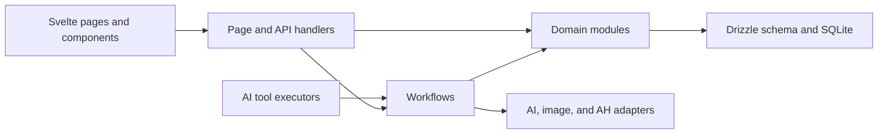

# Architecture

Keukenbrein is one SvelteKit application and one Node process. SQLite is the system of record; recipe
images and the Albert Heijn token are the only other persistent files.

## Dependency direction

- `src/routes/` handles HTTP input, validation, status codes, redirects, and response shapes. Core
  inventory, recipe, meal-plan, and shopping handlers delegate business work instead of querying the
  schema directly.
- `src/lib/server/domains/` owns reusable domain-local reads, writes, preconditions, and projections.
  Domain modules may use the schema and the shared `Db` / `DbOrTx` types from
  `src/lib/server/db/types.ts`; they do not open transactions or import another domain.
- `src/lib/server/workflows/` composes domains. A workflow owns cross-domain transactions and the
  ordering around external effects. Direct schema access is reserved for genuinely cross-domain
  composition; page read models use domain queries.
- `src/lib/server/ai/executors/` keeps confirmation and tool contracts at the AI boundary, then calls
  the same workflows used by HTTP routes.

This split is deliberately small. There is no generic repository layer, event bus, or separate backend
service.

## Domain boundaries

| Area      | Domain responsibility                                  | Workflow responsibility                                                         |
| --------- | ------------------------------------------------------ | ------------------------------------------------------------------------------- |
| Inventory | Item writes, merge rules, history, freezer projections | Logged services, guardian sweep, page composition, recipe-linked consume/freeze |
| Recipes   | Recipe records, composition, images, projections       | Import, editing, page composition, image processing, stock effects              |
| Meal plan | Planned-meal commands and queries                      | Cooking, shopping reconciliation, suggestions, page composition                 |
| Shopping  | Entries, recurring rules, bought state, read models    | Meal-derived reconciliation, source choices, AH preview and push                |

The Albert Heijn boundary only accepts Dutch recipe ingredient fields. English recipe fields are display
and cache data and must never become AH search terms. An AH push does not retry uncertain external writes
automatically; the workflow preserves the existing preview-freshness, history, and local bought-state
ordering.

The LLM provider remains swappable behind `src/lib/server/ai/client.ts`, the only server module allowed to
import an LLM SDK as a runtime value.

## UI state

The Stock, Meal Plan, Shopping, and Cook Mode surfaces create per-component controllers from
`*.svelte.ts` modules. Controllers own state transitions, optimistic updates, rollback, undo, URL or
session persistence, and request sequencing. Svelte components keep markup, accessibility, browser
adapters, and user-facing copy.

Controllers must be instantiated inside a component. Do not add module-global rune state: it can leak
between component instances or server-rendered requests.

## Enforcement and verification

`src/lib/server/architecture_boundaries.test.ts` fails when:

- core routes or AI executors import the database or schema directly;
- `DbOrTx` or the Drizzle database type is re-declared outside the canonical DB type module;
- a domain imports a sibling domain, or a migrated page/write workflow bypasses domain persistence;
- AH basket transport is imported outside the shopping push workflow;
- a runtime LLM SDK import appears outside the AI client; or
- English recipe display fields enter the AH lookup or write boundary.

Run `npm test` before opening a pull request. It checks Svelte, runs Vitest, builds the production bundle,
and exercises the primary isolated browser account. `npm run test:e2e:secondary` repeats the browser
journeys with the second account.
