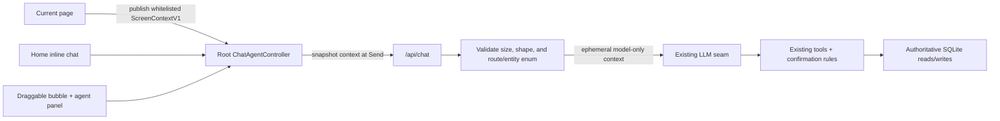

# Feature List: Contextual Floating AI Agent
_Status: Shipped — 2026-07-18_

## Completion note

AGENT-1 through AGENT-12 shipped as part of the full-app UI execution: a root-scoped controller, lazy authenticated history, strict ephemeral screen-context validation, desktop/mobile agent surfaces, route publishers, recipe-role handoff, dirty-edit protection, localized copy, and focused tests. Browser testing exposed and drove a final focus/reopen fix; the original failure remains documented in `.context/ui-test-report.html` because the one-pass browser budget did not permit re-running the agent group.

## Problem framing

Kitchenbrain’s AI chat is currently a Home-only component. Recipe actions such as “set ingredient roles with AI” render a tiny one-line editor elsewhere in the page, then navigate to Home with a query-string prompt. That breaks route context, scroll position, focus, and the user’s mental model of editing a recipe in place.

The outcome is one authenticated agent that lives for the root-layout session, preserves conversation and draft state across navigation, opens from a draggable edge bubble, and receives a small, explicit semantic snapshot of the current screen for each turn. It must not scrape the DOM, persist screen context into chat history, leak settings/secrets, or bypass existing tool confirmations.

## Intent brief

- **Objective:** make AI help available from any authenticated page without leaving the task or losing page context.
- **Primary UX:** draggable edge bubble; large non-modal side panel on desktop; full-viewport accessible chat on mobile.
- **Constraints:** Svelte 5/SvelteKit 2; existing OpenRouter seam; existing SQLite chat history; no new service or package; single household; no paid calls in automated tests.
- **Success:** recipe role CTA opens the full agent in place with a prefilled prompt and recipe context; the same transcript survives route changes; writes/Undo refresh the underlying page; malformed or forged context cannot change authorization.
- **Boundary:** context describes what is visible; authoritative data and all mutations still come from existing server tools and DB reads.

## Existing system inventory

- Root authenticated lifetime and overlay mount point: `src/routes/+layout.svelte:71-78`.
- Home-only chat mount and initial data: `src/routes/+page.svelte:70`; `src/routes/+page.server.ts:17-26,49-52`.
- `ChatView` owns transcript, draft, attachments, streaming, retry, Undo, and confirmation locally: `src/lib/components/ChatView.svelte:43-48,273-324`.
- Chat API authenticates, stores only user text, reconstructs tool history, executes tools, and persists the assistant turn: `src/routes/api/chat/+server.ts:88-113,153-211,303,328-341`.
- Chat rows are already user-scoped; no conversation/session/context column exists: `src/lib/server/db/schema.ts:182-190`.
- Existing executor and confirmation safety remains authoritative: `src/lib/server/ai/executors/index.ts:26-74`; `pending_actions.ts:26-55`; chat confirm route `:21-44`.
- Recipe lookup/edit tools already exist: `src/lib/server/ai/tools.ts:243,350-397`.
- Proven drag primitive: installed `@neodrag/svelte` plus body bounds, multitouch guard, and edge snap in `src/lib/components/cook-mode/Timer.svelte:85-125`.
- Overlay layers: nav 50, sheet 60, toast 70, timer 75 in `src/app.css:132-135` and `Timer.svelte:125`.

## Chosen architecture



There is exactly one controller instance per authenticated root layout. Home and the floating surface are two renderers over that controller, never two conversations. Pages publish typed semantic context; the server validates it and appends it only to the current in-memory model message. The database continues storing only what the human typed.

## Option comparison

| Choice | Scope and upside | Tradeoff/risk | Sustainability | Decision |
|---|---|---|---|---|
| A. Global wrapper around current `ChatView` + visible route prefix | Smallest apparent change | Duplicates/resets local state, persists machine context visibly, keeps the 839-line mixed controller/view component | Low; compounds current seams | Rejected |
| B. Root controller + typed semantic screen context | One transcript, route persistence, explicit privacy boundary, reuses tools and drag package | Requires a behavior-preserving extraction before new UI | High; clean seam for later agent capabilities | **Chosen** |
| C. Route/entity references resolved entirely server-side | Strongest authority boundary | Duplicates existing tool reads and cannot represent visible filters/edit mode without a resolver per route | Medium; useful for select sensitive contexts later | Deferred alternative |

## Contracts

### `ScreenContextV1`

```ts
type ScreenContextV1 = {
  v: 1;
  routeId: string;
  label: string;
  entity?: {
    kind: 'recipe' | 'inventory' | 'meal-plan' | 'shopping' | 'settings' | 'other';
    id?: string;
    label?: string;
  };
  facts?: Array<{ key: string; value: string | number | boolean }>;
  interaction?: { mode: 'view' | 'edit'; dirty: boolean };
};
```

Rules:

- Strict schema; reject unknown fields; approximately 4 KiB total and 12 facts maximum.
- Snapshot on Send. Navigation during a stream cannot mutate that turn.
- JSON request adds `screenContext?`; multipart adds JSON-string `screenContext` beside `message` and `images[]`.
- Persist only human `userText`. Inject serialized context after history reconstruction and before provider invocation.
- Context is untrusted display data, never authorization or a write instruction. Tools re-read authoritative state.
- Never publish DOM text, passwords, tokens, settings field values, full notes, or unsaved draft contents.
- Edit pages publish identity plus `dirty`; when dirty, entity writes are blocked until save/discard.
- Composer displays a removable “Using context: …” chip; opening the agent does not send or incur cost.

### Controller surface

```ts
hydrateOnce(initial): void;
open(options?: { draft?: string }): void;
close(): void;
publishScreen(snapshot: ScreenContextV1): () => void;
send(): Promise<void>;
abort(): void;
destroy(): void;
```

The controller owns transcript, draft, attachments/object URLs, stream/abort state, spend-cap state, confirmations, Undo state, and unread state. It is instantiated inside the authenticated layout; it must never be a module singleton because SSR state could leak between users.

## Phase plan

### Phase 1 — Behavior-preserving controller extraction (R2, multi-window)

- [x] **AGENT-1: Characterize current chat behavior**
  - Scope: lock down history hydration, streaming, retry, image attachment cleanup, cap errors, confirmation, and Undo before extraction.
  - Targets: existing chat tests plus focused pure controller seams.
  - Verification: no paid request; mocked stream/events only.
  - Rollback: tests are additive.
- [x] **AGENT-2: Extract root-safe controller**
  - Scope: move behavior from `ChatView.svelte` into `src/lib/stores/chat-agent.svelte.ts`; `ChatView` becomes a rendering surface.
  - Targets: `ChatView.svelte`, new store/controller, `src/lib/chat/` context accessors.
  - Verification: Home remains behavior-identical; remounting a renderer does not duplicate history or revoke live attachment URLs.
  - Rollback: keep the prior `ChatView` commit as a clean revert point.
- [x] **AGENT-3: Hydrate lazily outside Home**
  - Scope: shared recent-history query and authenticated `api/chat/history` endpoint; hydrate once on first agent open.
  - Verification: 401 unauthenticated; one fetch across repeated opens/navigation.
  - Rollback: Home initial data can remain the temporary hydration source.

Exit: one controller can render on Home, unmount, and remount without losing or duplicating state.

### Phase 2 — Ephemeral screen-context server seam (R2, single window per ticket)

- [x] **AGENT-4: Context schema and privacy guard**
  - Targets: new `src/lib/server/ai/screen_context.ts` and unit tests.
  - Verification: valid, oversized, malformed, unknown-field, forbidden-key, and forged-entity cases.
  - Rollback: remove optional request field; existing chat contract remains valid.
- [x] **AGENT-5: Request parsing and model-only injection**
  - Targets: `src/routes/api/chat/+server.ts`; optional `chat_request.ts`; `prompts/system.md`.
  - Verification: JSON, multipart/image, retry, persisted text, history replay, and snapshot-at-send behavior.
  - Invariant: only `src/lib/server/ai/client.ts` imports an LLM SDK as a runtime value.
  - Rollback: disable context decoration while retaining controller extraction.

Exit: the model receives validated current-turn context; SQLite contains no context envelope.

### Phase 3 — Bubble and full chat surface (R2, multi-window)

- [x] **AGENT-6: Global shell and layering**
  - Add `src/lib/components/chat/ChatAgent.svelte`; mount in `+layout.svelte` for authenticated users.
  - Desktop: non-modal side panel large enough for full history and composer while preserving page visibility.
  - Mobile: full-viewport dialog/sheet, safe-area composer, focus trap, Escape/Back close, focus return.
- [x] **AGENT-7: Accessible draggable bubble**
  - Reuse `@neodrag/svelte`: body bounds, multitouch guard, edge snap, normalized vertical position in `localStorage`, resize/orientation clamping.
  - Provide keyboard/click operation; dragging is never the only way to reposition/open.
- [x] **AGENT-8: Chat resilience inside the new surface**
  - Fix accidental horizontal scrolling with `min-w-0`, x clipping, and arbitrary-word wrapping.
  - Introduce an agent z-token and verify collisions with sheets, toasts, nav, and active cook timers.

Exit: no duplicate renderer/transcript, no overflow at 320/390/768/1440 px, and bubble/panel remain operable without dragging.

### Phase 4 — Route context and recipe handoff (R2, multi-window)

- [x] **AGENT-9: Context publishers**
  - Rich providers: Inventory, Meal plan, Shopping, Recipes list/detail/edit.
  - Safe route-label fallback: Settings and other routes.
  - Each provider returns cleanup on unmount and exposes no broad DOM/state dump.
- [x] **AGENT-10: Replace recipe AI entry points**
  - `agent.open({ draft })` from recipe actions; remove `AiEditBar.svelte` and obsolete `?msg` plumbing only after parity.
  - Ingredient-role CTA opens in place with entity context and a prefilled, unsent prompt.
- [x] **AGENT-11: Underlying-page reconciliation**
  - Debounce `invalidateAll()` once after a streamed write batch; refresh immediately after successful Undo/approval.
  - Dirty entity state blocks conflicting writes.
- [x] **AGENT-12: English/Dutch product copy and browser pack**
  - Add agent/context/focus/error strings to both message catalogs.
  - Add cost-free browser smoke for route persistence, context chip, long content, focus, drag bounds, and underlying-page refresh.

Exit: the reported recipe role journey completes without navigation, lost scroll, clipped composer, or manual refresh.

## UX and UI calls

- The bubble is draggable; the open desktop conversation is an anchored large panel, not a freely floating mini-window. This keeps reading/writing stable and avoids collision-heavy window management.
- Home remains an inline full chat renderer. Its bubble action focuses/opens the same controller rather than creating another transcript.
- Mobile uses a true modal/full-viewport surface because a side panel plus on-screen keyboard would be too small.
- The visible context chip makes screen-reading legible and removable; context is never silently broad.
- Opening only prepares the draft. The user must press Send.

## Harden audit

- No new dependency/service is introduced; `@neodrag/svelte` is already installed and proven. Stack-discipline research is therefore not triggered.
- Screen context is an untrusted prompt input. Strict validation, bounded size, an explicit system rule, authoritative tool rereads, and existing confirmation gates contain prompt-injection and forged-context risk.
- Root state is layout-instantiated, not module-global, preventing SSR/user leakage.
- No secrets or raw settings fields are exposed; no context is persisted.
- Token overhead is bounded and included in existing spend-cap accounting.

## Failure-mode critique

| Failure mode | Trigger | Impact | Detectability | Mitigation | Residual risk |
|---|---|---|---|---|---|
| SSR/user state leak | Controller implemented as module singleton | One user could see another session’s chat | High in concurrent SSR test, low manually | Instantiate in authenticated layout; concurrency test | Low |
| Duplicate hydration/transcripts | Home and panel both initialize | Duplicate rows/retries and confusing state | High | `hydrateOnce`, one controller, renderer-only views | Low |
| Stream/object URL destroyed on navigation | Renderer owns lifecycle | Lost response or broken attachment preview | Medium | Controller owns abort and URL cleanup until root destroy | Low |
| Prompt injection through screen context | Page publishes broad/free text | Model follows hostile content | Medium | Typed facts, length limits, explicit untrusted marker, tools re-read DB | Medium |
| Secret leakage | DOM/settings serialization | Credentials/tokens sent to provider | Low after unit tests, severe impact | No DOM scraping; allowlist route providers; forbidden-key tests | Low |
| AI write races unsaved form | Dirty edit screen opens agent | User draft overwritten or page becomes inconsistent | High | Publish `dirty`; block entity writes until save/discard | Low |
| Invalidation storm | Multi-tool turn refreshes per event | Jank, state loss, extra DB work | High in browser trace | Batch/debounce once; immediate only for approval/Undo | Low |
| Layer/focus collision | Agent opens with sheet/timer/toast | Covered controls or keyboard trap | High in smoke | Layer token, one modal surface, Escape/return-focus tests | Low |
| Drag-only operation | Bubble placement needs pointer drag | Keyboard/touch accessibility failure | High | Click/keyboard open; reset/reposition alternative | Low |
| Context token creep | Pages publish too many facts | Spend cap and latency regress | High via request metrics | 4 KiB/12-fact hard cap; compact serialization | Low |

### Steelman

The strongest alternative is server-side route/entity resolution because it minimizes client-supplied context. The chosen typed semantic snapshot is still the better fit: the server already has authoritative tools for durable data, while only the client knows transient but useful UI facts such as active filters and dirty edit mode. By bounding and treating those facts as untrusted, then requiring tools to reread the database, the plan keeps the authority benefit without building a resolver for every route or losing current-screen usefulness.

Critique result: **GO**. The extraction-first sequence prevents the visible agent shell from cementing current `ChatView` lifecycle debt, and every high-risk failure mode has an observable verification seam and rollback boundary.

## Acceptance matrix

| Behavior | Required proof |
|---|---|
| In-place recipe help | Role CTA opens the large agent on the same URL/scroll position with recipe context and an unsent draft. |
| Ephemeral context | Stored row contains only user text; captured provider input contains the validated current-turn snapshot. |
| Route persistence | Transcript, draft, attachment, and active stream survive navigation; next send uses new context. |
| Existing chat parity | JSON, image multipart, retry, cap, Undo, confirmation, and history hydration remain intact. |
| Underlying refresh | Tool write/approval/Undo updates the page behind the agent without manual reload. |
| Dirty form safety | No draft values are exposed and conflicting writes are blocked. |
| Security | 401 unauthenticated; malformed/oversized/unknown context 400; forged context cannot bypass tool checks. |
| Responsive | No x-scroll; composer clears keyboard/safe areas; bubble remains in bounds at 320/390/768/1440 px. |
| Accessibility | Keyboard open/reposition alternative, focus trap/return, Escape, reduced motion, timer/toast/sheet layering. |
| Cost | Pure Vitest and mocked browser smoke issue no paid model call. |

## Rollout and rollback

- Land each phase behind behavior-preserving commits; do not delete Home initialization or `AiEditBar` until the replacement passes parity.
- Server context remains optional, so Phase 2 can be disabled without breaking old clients.
- If the global shell regresses, unmount it while retaining the extracted Home controller renderer.
- If route context causes model-quality problems, disable individual publishers and fall back to route label/entity identity only.
- No schema migration is required, so rollback does not require database repair.

## Open Questions

None block execution. The gold-standard defaults are selected: draggable bubble plus anchored desktop panel, full-screen mobile modal, semantic allowlisted context, no persistence of context, and no new dependency.

## Resume pack

Next: execute Phase 1 only, prove behavior parity, and do not begin the global shell until one root-safe controller survives renderer remounts.
