# The Household Butler: Assistant Capability Inventory and Product Roadmap

_Status: In flight - Phase 10 of 10 (R2 correction live; replacement drafts verified; R3 promotion blocked 2026-07-29)_

Closed baseline delivery:
`docs/feature-lists/archive/FEATURE_LIST_ASSISTANT_RECIPE_OPTIONS_AND_CHAT_DENSITY.md`

## Recommendation

Turn the Assistant from a large collection of individual tools into a layered household service.
The first implementation slice is **Plan → Shop**:

1. after a person asks for an outcome, perform the safe preparation needed to finish it—including
   reads, comparisons, list reconciliation, and AH lookup/preview—without repeatedly asking
   permission to continue;
2. present one understandable, adjustable review with the recommendation plus only the grounded,
   decision-useful evidence, uncertainty, consequences, and alternatives available for that result;
3. apply only the reviewed choices, then return a truthful receipt and Undo where supported;
4. always stop separately before destructive, ambiguous, paid, or external AH effects;
5. leave every other Wave 1, Next, Later, Park, and Exclude idea inert until it is explicitly
   promoted.

Correction accepted on 2026-07-29: **assertive is request-driven, never standing Notice UI.**
Opening `/` shows the conversation and composer, not a household scan, cue, tray, digest,
initiative dial, or prepared job. Once a person asks, the Assistant quietly completes the safe
implied work and returns an **Outcome Docket** inside that conversation: one recommendation,
adjustable operations, alternatives, exact consequences, and the required review controls.

Design feedback accepted on 2026-07-29:

- **Outcome Docket is a flexible display treatment, not a response template.** Existing typed
  results keep their bespoke shapes. The shared shell renders only grounded fields the current
  result actually has; it never asks the model to invent evidence, alternatives, or filler to
  satisfy a fixed layout.
- **Working state is client-owned and has optional “See process”.** The collapsed state names the
  outcome being prepared. The disclosure may summarize real tool/activity events already emitted
  by the turn, but the model does not narrate or manufacture a plan.
- User note (verbatim): “looks good, but make sure it's not too prescriptive (that usually
  generates slop because the model will try to force the format and invent content to fill that
  format instead of making something bespoke).”
- User note (verbatim): “I like working state with optional 'see process' option.”

This is deliberately not a new agent framework, vector-memory system, or autonomous background
worker. The existing tool loop, domain services, SQLite database, review cards, and safety ledger
are strong foundations. The missing product layer is orchestration: finishing recognizable
household jobs from beginning to end while showing why a suggestion appeared and what will change.

Recipe timers were retired on 2026-07-30. The Assistant must not propose, start, or manage them.

## Problem framing

The baseline Assistant had 28 exposed tools and could already perform a striking amount of
household work. The First slice now exposes 27: it retired the direct `plan_meal` and
`remove_meal` model tools and added one reviewed `propose_meal_plan` tool. The experience had
felt symptom-driven because its powers lined up with database operations rather than the moments
a person naturally describes:

- “We are out of milk” spans stock and Shopping, but the Assistant can only change stock or
  regenerate the derived list.
- “Sort dinners for next week” needs a comparable week proposal, day and serving edits, Shopping
  reconciliation, and eventually an AH preview. Today those are separate turns and screens.
- “We cooked the curry” should close the loop across the plan, cook log, freezer portions, and
  consumed stock. Today the user must remember the follow-up steps.
- The app contains useful signals—expiry, stale freezer stock, repeat rotation, low freezer
  targets, recipe review flags, and shopping conflicts. Those signals should improve an answer
  only when the current request makes them relevant; they should not compete for attention merely
  because the app opened.

The goal is an assertive but trustworthy household butler. **Assertive** means it finishes all
safe preparatory work implied by a user-requested goal and returns with a considered proposal
instead of asking “should I look that up?” at every intermediate step. It does not initiate work,
write data, spend provider money in the background, or create an AH side effect on its own.
Initiation outside a user request is reserved for a future explicitly configured routine. It
should become more useful through explicit choices, not covert memory.

## Intent brief

- **Primary users:** Freek and Ylfa in one shared household, often on a phone and sometimes while
  cooking or handling children.
- **Objective:** reduce repeated household coordination and cross-screen bookkeeping without
  creating an unpredictable autonomous system.
- **Product feeling:** attentive once addressed, concise, ready with a recommendation, honest
  about uncertainty, and conservative with external or hard-to-reverse actions.
- **Success criteria:**
  - a natural household request maps to one visible outcome, even when several domains are
    involved;
  - every proposal shows the grounded facts and consequences needed for its decision, while
    omitting absent context instead of inventing it;
  - all writes remain reviewed one-tap actions until a future explicit routine contract exists;
    destructive, ambiguous, paid, and external work remains separately reviewed;
  - durable preferences are explicit, scoped, reviewable, and forgettable;
  - triggered preparation happens in the current request and appears as one review, not a chain
    of permission-seeking questions;
  - opening `/` performs no Butler candidate scan and shows no unsolicited household cue;
  - no new Assistant entry point competes with `/`;
  - Dutch recipe ingredient names remain the only AH lookup source;
  - spend stays bounded by deterministic local reads/ranking plus the existing AI caps;
  - the selected first wave passes provider-free unit/API/browser tests and the complete
    repository gate before beta promotion.

## Scope

### In

- A complete inventory of current Assistant abilities and safety behavior.
- A globally ranked portfolio of next-step product ideas.
- A reusable capability/risk registry for present and future agent tools.
- Reviewed multi-domain action bundles with exact preconditions and truthful partial/blocked
  states.
- The shipped First slice plus the request-driven ideas still ranked **Next**.
- The smallest Wave 1 dependency set required to make those Next behaviors real rather than
  decorative: BTL-001, BTL-002, BTL-007, BTL-008, BTL-013, and BTL-015.
- Explicit scoped preference proposal contracts where the First slice needs them; the full
  preference center and initiative controls remain outside this run.
- Reuse of existing domain services, push infrastructure, model seam, tool displays, and
  authenticated browser fixtures.
- English and Dutch copy, phone-first interactions, keyboard behavior, and reduced-motion-safe
  feedback.
- Additive migrations only when durable domain data or explicit preference receipts require them;
  no schema is created for noticing, dismissing, snoozing, initiative, or last-seen state.

### Out

- Implementing all 75 ideas in one run.
- Restoring the retired floating/contextual Assistant bubble.
- Automatic memory extraction from chat history.
- Vector databases, embeddings, an external agent framework, or a second backend service.
- Silent preference inference, silent external basket pushes, silent destructive actions, or
  background LLM turns without an explicit product surface and cap.
- Butler Briefs, trays, initiative dials, opt-in digests, home-load candidate ranking, and any
  other unsolicited noticing surface.
- Multi-tenancy, SaaS roles, household signup, or general-purpose task management.
- Replacing the current OpenRouter/Anthropic-compatible client seam.
- Making non-AH retailer support part of the first wave.

The user promoted every row explicitly ranked **Next** on 2026-07-29. **Later**, **Park**, and
**Exclude** remain inert and create no callers, schemas, tools, or migrations. Wave 1 ideas are
active only where named above as direct dependencies of the promoted Next portfolio.

## Existing-system inventory

### Conversation and model behavior

| Current ability | Evidence | Practical boundary |
| --- | --- | --- |
| One persistent per-user Assistant conversation at `/` | `src/routes/+page.svelte`; `src/lib/stores/chat-agent.svelte.ts` | `/` is intentionally the only Assistant surface; the floating/contextual bubble was retired. |
| Stream replies, stop a turn, retry an interrupted final turn, and retain a draft across route changes | `src/routes/api/chat/+server.ts`; `src/lib/stores/chat-agent.svelte.ts` | A failed multi-step household job is not yet a durable resumable task. |
| Reply in the active English or Dutch UI locale | `src/lib/server/ai/prompts/system.md`; locale-aware tool copy | Ingredient names remain Dutch even in English UI because AH depends on them. |
| Accept text plus up to two downscaled photos | chat controller and `/api/chat` | Photos are one-turn and intentionally not retained in history. |
| Read an explicit shared household profile | `src/routes/settings/ai/+page.svelte`; `household_prefs` | This is manually edited context, not learned memory. |
| Configure chat, fallback, vision, and background model roles | `src/lib/server/ai/config.ts`; Settings AI | The chat tool set is shared across models and must stay provider-neutral. |
| Fall back once when the primary provider fails | `src/routes/api/chat/+server.ts` | Failed partial prose is discarded; a whole unfinished household job is not queued. |
| Enforce daily chat/background caps and show seven-day spend | AI Settings and pricing/config modules | A cap stops provider work; request-scoped local reads may still support native pages, but `/` performs no Butler scan. |
| Show three editable sentence starters | `src/lib/chat/prompt_starters.ts` | Starters are general, not an unsolicited household state summary. |

### Inventory and freezer

| Current ability | Tool | Safety and nuance |
| --- | --- | --- |
| Query freezer or pantry by category, age, expiry, and sort | `get_inventory` | Reads authoritative current data. |
| Add stock, including recipe-linked frozen leftovers | `add_to_inventory` | Searches first and merges duplicates; merging pre-existing stock requires confirmation. |
| Remove stock | `remove_from_inventory` | Existing items require confirmation; same-turn additions can be removed immediately. |
| Change quantity, dates, classification, or storage section | `update_inventory_item` | Requires a current-turn read of the exact target. |
| Review and atomically apply 2–10 inventory edits | `bulk_update_inventory` | Always confirms, commits all or none, and supports Undo all. |
| Classify ingredient/leftover/processed and food class | add/update tools plus guardian workflow | Uncertain items may be flagged rather than blocked. |
| Link a leftover to its recipe or record no-recipe/plan-to-add | `link_leftover_recipe` | The agent is told to suggest a match before linking. |
| Set pantry staples and freezer keep-stocked targets | `set_staple`, `set_freezer_staple` | Pantry staples have no target quantity; freezer staples do. |
| Read freezer staples against target | `get_freezer_staples` | Can suggest batch cooking but cannot stage a whole refill plan. |
| Raise or resolve inventory review flags | `set_review_flag` | Explicit user action; deterministic guardian can also flag. |
| Explain inventory changes and who made them | `get_inventory_history` | History coverage is inventory-only. |
| Undo one inventory operation or an approved atomic batch | `undo_op` | Refuses stale undo; other domains do not share this undo model. |

### Meal planning

| Current ability | Tool | Practical boundary |
| --- | --- | --- |
| Read current and upcoming meal plans | `get_meal_plan` | Supports a target week but not a compact comparison proposal. |
| Add a meal with recipe, servings, source, and note | `plan_meal` (legacy internal executor) | No longer exposed to the model; chat stages the change through `propose_meal_plan`. |
| Remove a planned meal | `remove_meal` (legacy internal executor) | No longer exposed to the model; chat stages the destructive change through `propose_meal_plan`. |
| Mark a meal cooked | `mark_meal_cooked` | Reminds the model to deduct freezer portions but does not complete that follow-up itself. |
| Suggest meals | `suggest_meals` | Uses stock overlap, stale items, rotation, recent meals, freezer portions, and fresh-side roles. |
| Log a cooked meal and optional rating/notes | `log_meal` | Separate from the planned-meal and leftover flows. |

### Recipes and cooking knowledge

| Current ability | Tool or service | Practical boundary |
| --- | --- | --- |
| Find a recipe by slug/name and search title/category/ingredient | `get_recipe`, `search_recipes` | Read results can ground cooking answers. |
| Save a recipe from dictated/pasted text | `add_recipe` | Uncertain content can be review-flagged. |
| Save a recipe from one-turn photos/screenshots | `add_recipe` with vision | The image itself is not retained. |
| Import a recipe URL | `add_recipe_from_url` | Uses structured data or AI extraction and may flag missing fields. |
| Combine existing recipes into one meal recipe | `create_meal_recipe` | Parts must already exist. |
| Stage typed recipe corrections for selective review | `propose_recipe_patch` | Revision-, user-, and time-bound; only selected rows apply. |
| Offer 3–9 distinct current AH product forms per ingredient | `search_ah_products` + recipe proposal | Current branch adds scoped choice persistence and conflict-safe shopping precedence. |
| Set cook-in versus serve-fresh roles by stable ingredient ID | `edit_recipe` | This is the only direct recipe-content edit exposed to chat. |
| Generate translated recipe/cook-mode caches in background | existing recipe workflows | The chat does not control cook-mode steps. |

### Shopping and Albert Heijn

| Current ability | Tool or service | Practical boundary |
| --- | --- | --- |
| Derive a week list from planned recipes minus inventory | `generate_shopping_list` | The Assistant cannot directly add, remove, check, or edit ordinary list rows. |
| Preserve recipe source provenance and fresh-side rules | shopping workflows | The agent cannot yet explain or resolve every source conflict conversationally. |
| Search live AH products by bounded Dutch queries | `search_ah_products` | Read-only, sanitized, cached within a turn, capped at 15 unique queries. |
| Stage recipe-scoped AH product choices | current recipe-options work | Does not yet expose the final Shopping AH preview or push in chat. |
| Preview and push the shopping list to AH in the app UI | Shopping routes/workflows | Not an agent tool; push is external and should remain explicitly confirmed. |
| Store recurring manual shopping items and push history | shopping schema/workflows | No natural-language agent controls exist for them. |

### Trust and presentation

| Current control | Behavior |
| --- | --- |
| Current-turn provenance | Persistent tools require an authoritative read of the exact inventory, meal, recipe, or history target. |
| Stale-write protection | Captured snapshots/revisions are rechecked at commit; stale targets fail. |
| Write latch | A contract/provenance failure blocks later persistent writes in that turn. |
| Human gates | Existing deletion/merge, bulk inventory, and recipe content changes have explicit review paths. |
| Tool truth | The final prose may claim completion only after a committed successful result. |
| Compact activity | Routine reads/searches aggregate; writes, confirmations, proposals, and terminal failures remain visible. |
| Working and process state | One generic client-owned working label may disclose real compact activity from the triggering turn. The model does not narrate a plan and no progress state persists. |
| Browser evidence | The dense persisted recipe decision story passes at 320–1280 px with keyboard controls and no overflow. |

## The product gap: operations versus household outcomes

| Natural request | What works now | Missing finish line |
| --- | --- | --- |
| “Add milk to the list.” | The Shopping UI can add a row. | No agent Shopping write/read tools. |
| “We used the last rice.” | Inventory can be updated; Shopping can be edited manually. | No atomic stock-to-list bundle. |
| “Plan next week.” | Suggestions and individual `plan_meal` calls exist. | No compare/select/reorder week proposal or one-review apply. |
| “Get us ready to shop.” | List derivation and AH UI push exist. | No end-to-end plan → list → conflict review → AH preview in Assistant. |
| “We made four portions and froze two.” | Each underlying write mostly exists. | No after-cook checkout that closes every related domain. |
| “What should I deal with?” | All underlying signals exist. | The Assistant should inspect them only after this request, rank the answer, and explain its evidence without creating a standing feed. |
| “Remember we prefer blocks of Parmesan for this recipe.” | Recipe-scoped product preference is being added. | No general explicit preference proposal/management contract. |

## Butler contract

Every new service follows seven rules:

1. **Wait for a trigger.** Start from a user request or an explicitly configured future routine.
   Merely opening `/` performs no Butler scan, ranking, job, or provider turn.
2. **Prepare assertively.** Once asked for an outcome, complete safe reads, searches, comparisons,
   reconciliation, and preview work without asking permission for each intermediate step.
3. **Explain the recommendation.** Show the grounded why-now facts, evidence, uncertainty, exact
   consequence, or alternatives that materially help this decision; omit slots with no support.
4. **Recommend one default.** Keep alternatives, adjust, reject, and “not now” available.
5. **Bundle the outcome.** Stage all related domain changes together; never leave the user to
   remember the assistant’s own follow-up.
6. **Match permission to consequence.** First-slice writes are reviewed one-tap actions.
   Destructive, ambiguous, paid, and external AH actions always stop for review, even when a
   future routine prepared them.
7. **Learn only by agreement.** Durable preferences come from a visible scoped choice with an
   edit/forget path. Ordinary conversation does not become automatic memory.

### Trigger and initiative model

| Mode | Meaning | First-slice behavior |
| --- | --- | --- |
| Asked | A person states the household outcome they want. | **Default trigger.** Prepare the full safe chain and show one adjustable review. |
| Routine | The household explicitly configures a reusable trigger and scope. | Nice-to-have later; may prepare a card, never silently broaden scope. |
| Act | Apply explicitly designated reversible actions and leave an Undo receipt. | Off; no First-slice auto-apply and never available for external/destructive work. |

There is no initiative dial. Until a separately planned routine system exists, **Asked** is the
only enabled trigger and **Act** remains off.

## Option comparison

| Option | Benefit | Cost/failure | Decision |
| --- | --- | --- | --- |
| Keep adding one tool or prompt rule per symptom | Small individual diffs. | Repeats the current fragmentation; every natural request creates another cross-screen follow-up. | Rejected |
| Make the current model broadly autonomous | Fastest path to apparent magic. | Weak rollback, preference presumption, chat spam, external-action risk, and model-dependent behavior. | Rejected |
| Adopt an external agent framework plus vector memory | Rich orchestration vocabulary. | New service/dependency, duplicated state authority, automatic-memory pressure, and migration away from proven safety seams. | Rejected |
| **Layer request-driven Butler contracts over current domain services** | Completes asked-for jobs, reuses safety infrastructure, and earns authority through explicit review. | Requires shared action-bundle and recommendation contracts before feature velocity resumes. | **Chosen** |

## Corrective diagnosis and design shotgun — request-driven assertiveness

### Reproduction and root cause

The regression is deterministic. On current `main`, the focused authenticated command
`$env:E2E_PORT='4195'; npx playwright test tests/e2e/assistant-safety.e2e.ts
--project=chromium-primary --grep "Butler brief stays"` passes because `/` renders the unwanted
Brief above chat at both phone and desktop sizes. The browser story is therefore protecting the
wrong product contract.

| Hypothesis | Evidence for | Evidence against | Confidence |
| --- | --- | --- | --- |
| Standing Notice UI was mistaken for assertiveness | `ButlerBrief.svelte`, the home loader, deterministic snapshot/brief modules, and the passing browser story all run before a request. | The surface is read-only and zero-spend, but attention initiation—not mutation—is the reported problem. | High; confirmed |
| Contextual preparation needs the Brief | The Brief and request proposals share household facts and recommendation language. | The system prompt already says “Assertive preparation, not autonomous initiation”; existing plan, stock, recipe, and cooking proposal tools prepare reviewed outcomes after a request. | High confidence this is false |
| The durable state draft has already created production cleanup work | PR #35 adds dismiss/snooze/initiative/last-seen tables and callers. | PR #35 is still a draft based on `main`; migration 0026 has not shipped. | High confidence no production data cleanup is required |

The correct seam is the Assistant route and its authenticated browser story: home load must remain
request-driven, while the same test file continues through an explicit user request into a fully
prepared review.

### Three comparable directions

All directions use the approved **Ledger Compact** house style: flat sections, compact 8 px
controls, terra committed action, olive outline secondary, serif section titles, tight 4/8/12
rhythm, and no decorative leading stripe.

| Direction | Layout and interaction | Strength | Trade-off | Decision |
| --- | --- | --- | --- | --- |
| **A — Quiet Conversation** | A short assistant answer followed by a small embedded proposal; evidence and alternatives sit in disclosure rows. | Feels most like ordinary chat and adds the least visual furniture. | Multi-domain consequences can become too easy to skim past. | Rejected |
| **B — Outcome Docket** | One compact ledger sheet appears inside the requested turn: outcome first, “prepared from” evidence, recommended default selected, adjustable operations, alternatives, then reject/apply. | Best match for “just do the preparation and bring me the work”; trustworthy without narrating every tool call. | The card can become dense unless only the current decision is expanded. | **Recommended** |
| **C — Turn Workbench** | A temporary rail above the composer shows preparation stages and opens a contextual decision drawer. | Strong progress visibility for long jobs and keeps the transcript compact. | Recreates a second service surface, hides history context, and risks feeling like the removed Brief in miniature. | Rejected |

### Chosen interaction contract

1. `/` opens directly to the existing conversation and composer. No snapshot, card, count, cue,
   badge, digest, initiative control, or personal last-seen marker appears.
2. The user names an outcome. The Assistant performs safe reads, comparisons, list
   reconciliation, and read-only AH preview without asking whether to continue and without
   narrating each tool call.
3. A generic working state may say what outcome is being prepared, but it is client-owned; an
   optional “See process” disclosure is assembled only from real turn/tool activity. Retire the
   model-visible `present_plan` narration tool instead of replacing it with another tool.
4. A result that benefits from structured review renders an Outcome Docket. It leads with the
   bespoke result and recommended default, then progressively discloses only grounded evidence,
   uncertainty, exact consequence, and alternatives supplied by that result type. Plain answers
   and simple client actions remain plain; there is no universal form for the model to fill.
5. Questions and read-only recommendations finish immediately. Writes remain reviewed. AH push,
   destructive, ambiguous, and paid effects retain a separate final confirmation.
6. The Docket belongs to the conversation that triggered it. Historical Dockets remain readable;
   only the latest compatible revision remains actionable.

### How it should feel in common requests

| User asks | Assistant prepares without another permission question | What returns |
| --- | --- | --- |
| “Sort dinners for next week.” | Reads current plan, relevant recipes, stock/freezer coverage, conflicts, Shopping consequences, and connected AH preview evidence. | One week Docket with a recommended schedule, selectable meals, servings/source choices, alternatives, one local Apply, then separate AH confirmation. |
| “We’re out of milk.” | Checks known fridge/pantry stock and the authoritative Shopping row before staging changes. | One reviewed Stock + Shopping bundle; it does not ask whether to look up or add milk. |
| “What should we eat tonight?” | Compares time, stock coverage, age pressure, repeat distance, and freezer readiness. | One recommendation plus two comparable alternatives; no write card until the user chooses an action. |
| “We cooked the curry.” | Reads the planned meal and linked stock, then stages cook log, portions eaten, deductions, leftovers, and Shopping reconciliation. | One after-cook Docket with exact atomicity, consequence, apply, and Undo. |

The comparison workspace is
`docs/artifacts/2026-07-29-design-shotgun-request-driven-assistant.html`.

## Chosen architecture

```mermaid
flowchart LR
  T["User request<br/>or explicit future routine"] --> S["Authoritative household reads<br/>SQLite + domain services"]
  S --> P["Assertive safe preparation<br/>compare · reconcile · AH lookup/preview"]
  P --> R["Recommendation envelope<br/>why now · evidence · confidence<br/>consequence · alternatives"]
  R --> A["Server-staged action bundle<br/>exact targets + preconditions"]
  A --> G{"Consequence gate"}
  G -->|"read / approved reversible"| C["Commit through domain services"]
  G -->|"ambiguous / destructive / paid / external"| H["Human review"]
  H --> C
  C --> L["Receipt + cross-domain audit + rollback"]
  L --> E["Explicit preference proposal<br/>only when useful"]
```

### Core contracts

- **Capability registry:** tool name, domain, read/write class, current-read requirement, risk,
  confirmation rule, undo class, external effect, and display type. Tests fail when a persistent
  tool is unregistered.
- **Request-scoped household reads:** bounded authoritative reads selected on demand by the
  current flow; no household snapshot is derived on home load.
- **Recommendation envelope:** stable ID, reason, evidence references, confidence, consequence,
  alternatives, expiry, and suggested next action.
- **Action bundle:** typed operations across supported domains, preconditions captured server-side,
  dry-run result, confirmation requirements, atomicity class, and compensating rollback.
- **Preference proposal:** explicit scope (`one occasion`, `recipe`, `ingredient`, `person`, or
  `household`), value, reason, source action, and edit/forget control.
- **Outcome Docket:** a flexible client display treatment inside the conversation that asked for
  the work. Existing typed proposal/result components opt into relevant slots and keep their
  bespoke content; absent or ungrounded slots are omitted rather than generated as filler. It
  appears only after safe preparation, and only the latest compatible Docket remains actionable.
- **Grounded process disclosure:** a client-owned summary of real turn/tool activity beneath the
  generic working state. It adds no model-visible tool, accepts no model-authored stages, and
  disappears when the turn has no useful process to show.

## Ranked opportunity portfolio

Ranking weighs likely weekly value, minutes and decisions saved, fit with existing data/services,
trustworthiness, and implementation leverage. It does not pretend to measure user demand. The
completed HTML workspace informed the dispositions below but is not plan state; this Markdown
file is authoritative.

Selected lanes:

- **First slice:** shipped Plan → Shop baseline.
- **Wave 1:** active only for the seven named dependency enablers.
- **Next:** ranks 18–35; all eighteen remain request-driven in the current portfolio.
- **Later:** ranks 36–65; retain as inert opportunities.
- **Park:** ranks 66–75; interesting but lower evidence, new integration, or weaker fit.
- **Exclude:** deliberately removed from the intended product.

| Rank | ID | Service idea | Household moment and layered behavior | Domain | Effort / risk | Default |
| ---: | --- | --- | --- | --- | --- | --- |
| 1 | BTL-001 | Conversational Shopping control | “Add milk,” “remove coriander,” “make it two,” and “mark bread bought” operate on the authoritative week list with source-aware confirmations. | Shopping | M / R2 | Wave 1 |
| 2 | BTL-002 | “We’re out of…” bundle | One request updates known stock when appropriate and adds the missing item to Shopping; ambiguous quantity produces one review card. | Stock + Shopping | M / R2 | Wave 1 |
| 3 | BTL-003 | Whole-week meal proposal | Show a selectable week with meal reasons, days, servings, fresh/freezer source, and conflicts before one apply. | Planning | L / R2 | First slice |
| 4 | BTL-004 | Finish-the-week pipeline | Continue an approved plan through list reconciliation, missing-role review, AH preview, and an explicit ready-to-push state. | Planning + Shopping + AH | L / R2 | First slice |
| 5 | BTL-005 | “What should we eat tonight?” | Recommend one default plus two alternatives using time, on-hand coverage, stale stock, repeat rotation, and freezer readiness. | Planning | M / R1 | First slice |
| 6 | BTL-006 | Conversational meal-plan edits | Move a meal, set its day, change servings/batch, switch fresh/freezer, add a note, or replace it without remove-and-recreate drift. | Planning | M / R2 | First slice |
| 7 | BTL-007 | After-cook checkout | “We cooked this” stages mark-cooked, rating, actual portions, stock deductions, frozen leftovers, and Shopping reconciliation as one finish. | Cooking + Stock + Planning | L / R2 | Wave 1 |
| 8 | BTL-008 | Exact cook-from-stock answers | Compare recipes by complete/near-complete coverage and show the exact missing items, not a generic suggestion. | Recipes + Stock | M / R1 | Wave 1 |
| 9 | BTL-009 | Butler Brief | On opening `/`, show household cues before a person asks. This contradicts the accepted request-driven contract and must be removed. | Cross-domain | M / R2 | Exclude |
| 10 | BTL-010 | Use-it-up rescue | Turn expiring or long-frozen ingredients into a ranked rescue meal or recipe adjustment, with the item and urgency visible. | Stock + Recipes | M / R1 | Exclude |
| 11 | BTL-011 | AH preview and push from Assistant | Render the existing product/conflict preview in chat and require a final external-action confirmation before pushing exactly that revision. | Shopping + AH | L / R2 | First slice |
| 13 | BTL-013 | “I bought…” reconciliation | Mark list rows bought and offer a reviewed stock intake with quantities/storage instead of making the user re-enter groceries. | Shopping + Stock | L / R2 | Wave 1 |
| 14 | BTL-014 | Cross-domain action bundle + Undo | Replace a descriptive checklist with exact staged operations, preconditions, consequence summary, commit receipt, and all-or-none/compensating rollback. | Trust foundation | L / R3 | First slice |
| 15 | BTL-015 | Fridge as first-class stock | Add fridge alongside freezer/pantry so milk, produce, open packs, and near-term expiry can participate in the same grounded Assistant flows. | Stock | L / R3 | Wave 1 |
| 16 | BTL-016 | Butler tray with dismiss/snooze/act | A standing triage surface still initiates attention before a request and creates durable state for work the household did not ask for. | Cross-domain | L / R3 | Exclude |
| 17 | BTL-017 | Per-domain initiative dial | Quiet/Notice/Prepare controls legitimize unsolicited behavior instead of keeping the trigger contract simple. | Trust | M / R3 | Exclude |
| 18 | BTL-018 | Why/confidence/consequence on proposals | Every suggestion exposes the grounded facts and consequences needed for its decision in one consistent but optional disclosure; absent context stays absent. | Trust | M / R2 | Next |
| 19 | BTL-019 | Asked change summary | When a person asks what changed, summarize only actor-attributed Stock, plan, recipe, Shopping, and AH history that the app can prove; do not track or surface a personal last-seen feed. | Household | M / R2 | Next |
| 20 | BTL-020 | Shopping source explanations | Answer “Why is this here?” and show the meals, recipe ingredients, manual entry, recurring rule, or substitution that produced a row. | Shopping | M / R1 | Next |
| 21 | BTL-021 | Grocery unpack from photo or voice | Parse a bag/counter photo or dictated haul into a reviewed bulk stock intake, merging existing items safely. | Stock + Vision | L / R2 | Next |
| 22 | BTL-022 | “I used the last…” bundle | Decrement/remove stock and add a replacement to Shopping in one reversible, source-aware action. | Stock + Shopping | M / R2 | Next |
| 23 | BTL-023 | Freezer refill proposal | Compare keep-stocked targets with current portions and stage a batch-cook plan that fits the coming week. | Freezer + Planning | M / R1 | Next |
| 24 | BTL-024 | Pantry par levels | Extend “staple” from a boolean to explicit target quantities and have the Butler prepare refill suggestions only when below target. | Stock + Shopping | L / R3 | Next |
| 25 | BTL-025 | Leftover follow-through | After a freezer meal is marked cooked, immediately ask eaten portions and close the oldest linked stock without a second remembered request. | Freezer + Planning | M / R2 | Next |
| 26 | BTL-026 | Comparable meal-choice cards | Present three meal options with on-hand items, missing items, age pressure, effort, repeat distance, and freezer effect. | Planning | M / R1 | Next |
| 27 | BTL-027 | One-time versus saved substitutions | When swapping an ingredient, choose this cook, this week, this recipe, or durable household preference before anything persists. | Recipes + Preferences | L / R3 | Next |
| 28 | BTL-028 | One-time versus saved AH choice | Reuse the recipe-product work but make scope explicit when choosing a product from Shopping: this push, this ingredient, this recipe, or household-wide. | AH + Preferences | M / R2 | Next |
| 29 | BTL-029 | Quantity and duplicate conflict resolver | Detect incompatible units, duplicate manual/recipe sources, and suspicious totals; propose merge/keep-separate decisions before AH preview. | Shopping | L / R2 | Next |
| 30 | BTL-030 | Missed-meal rollover | When a planning request touches a week with uncooked past meals, include explicit move, drop, or keep options and reconcile their Shopping sources. | Planning + Shopping | M / R2 | Next |
| 31 | BTL-031 | “Cook this” handoff | Turn a meal suggestion into an opened recipe/cook mode with chosen servings, source, and any needed pre-cook actions ready. | Planning + Cooking | M / R1 | Next |
| 32 | BTL-032 | Hands-busy voice mode | Large, minimal controls for read-next, repeat, and “what now?” while cooking; no free-running microphone. | Cooking | L / R2 | Next |
| 34 | BTL-034 | Cooking rescue | Ground “too salty,” “too thin,” or “not browning” help in the active recipe, ingredients, step, and elapsed context, with food-safety cautions. | Cooking | M / R1 | Next |
| 35 | BTL-035 | Defrost planner | When a requested plan or cook action uses freezer stock, prepare a timed “move to fridge” cue with an explicit completion check. | Freezer + Cooking | M / R2 | Next |
| 36 | BTL-036 | Prep-ahead splitter | Turn a recipe/week into “do tonight / finish tomorrow” steps and optionally prepare reminder cards. | Cooking | M / R1 | Later |
| 37 | BTL-037 | Learn actual cook time explicitly | After cooking, compare predicted and actual duration and offer a recipe metadata correction for review. | Recipes + Feedback | M / R2 | Later |
| 38 | BTL-038 | Tiny post-meal feedback | Capture liked, effort, kid response, and “make again” with one-tap answers that inform later ranking only after explicit save. | Preferences | M / R3 | Later |
| 39 | BTL-039 | Preference proposals | When repeated explicit choices suggest a useful rule, ask “Save this?” with scope and evidence instead of silently learning it. | Preferences | L / R3 | Later |
| 40 | BTL-040 | Preference center | List what the Butler is allowed to use, where it came from, its scope, and controls to edit/forget it. | Trust + Preferences | M / R3 | Later |
| 41 | BTL-041 | Attendance-aware portions | Say who is eating a planned meal and derive portions without turning household members into tenants or roles. | Planning | L / R3 | Later |
| 42 | BTL-042 | Adult/kid serving variations | Store explicit serving notes or optional variants without polluting ingredient taxonomy or silently changing the canonical recipe. | Recipes + Household | L / R3 | Later |
| 43 | BTL-043 | Dietary/allergen guardrails | Use explicitly entered per-person constraints to flag conflicts before suggestion/apply; never infer allergies from chat. | Safety + Planning | L / R3 | Later |
| 44 | BTL-044 | Guest/crowd planning | One-off occasion flow for headcount, scaled food, components, make-ahead work, and Shopping; no durable preference unless saved. | Planning | M / R2 | Later |
| 45 | BTL-045 | Effort/energy-aware meals | Let “very little energy,” “20 minutes,” or “one pan” shape ranking with clear evidence and no permanent assumption. | Planning | M / R1 | Later |
| 46 | BTL-046 | Variety balance | Explain a week’s protein/category/repeat balance and offer swaps without treating diversity rules as household preferences until accepted. | Planning | M / R1 | Later |
| 47 | BTL-047 | Budget-aware week | Use current AH evidence where available to compare plan cost ranges and propose cheaper swaps under an explicit budget/quality rule. | Planning + AH | L / R2 | Later |
| 48 | BTL-048 | Package-waste optimizer | Coordinate recipes so opened packs and package sizes are reused during the week, while preserving Dutch recipe quantities and showing assumptions. | Planning + Shopping | L / R2 | Later |
| 49 | BTL-049 | AH bonus check on demand | For saved staples or a planned week, show current relevant bonus evidence when asked; no background price surveillance by default. | AH | M / R1 | Later |
| 50 | BTL-050 | Receipt/photo reconciliation | Review a receipt photo against pushed/bought list rows and propose stock additions or unresolved mismatches. | Shopping + Vision | L / R2 | Later |
| 51 | BTL-051 | Expiry confidence | Distinguish known dates, rough estimates, opened-on dates, and unknowns; ask only when the uncertainty changes a recommendation. | Stock | L / R3 | Later |
| 52 | BTL-052 | Freezer label capture | Dictate or photograph freezer labels to capture dish, portions, cooked/frozen date, and recipe link in one reviewed intake. | Freezer + Vision | M / R2 | Later |
| 53 | BTL-053 | Resolve the stock review queue | Batch similar unclassified/uncertain items into concise proposals instead of one red dot at a time. | Stock | M / R2 | Later |
| 54 | BTL-054 | Orphan-leftover repair | Suggest likely recipe links, “no recipe,” or “add recipe later” for unresolved leftovers with explicit confidence. | Freezer + Recipes | M / R2 | Later |
| 55 | BTL-055 | Recipe health review | Surface missing roles, uncertain quantities, absent servings, weak directions, or stale review flags as one selective recipe-maintenance queue. | Recipes | L / R2 | Later |
| 56 | BTL-056 | Source-page update diff | Re-fetch an imported recipe on demand and stage meaningful source changes without overwriting household edits. | Recipes | L / R2 | Later |
| 57 | BTL-057 | Recipe transformation modes | “Make it faster/cheaper/less cleanup/freezer-friendly” produces a typed proposal with trade-offs and unchanged canonical source snapshot. | Recipes | M / R2 | Later |
| 58 | BTL-058 | On-hand substitution proposal | Compare saved/plausible substitutes with stock and stage a one-cook swap with allergen, timing, texture, and doneness cautions. | Recipes + Stock | M / R2 | Later |
| 59 | BTL-059 | Meal component composer | Detect that a main lacks a useful side/sauce and compose an existing or new sub-recipe only after selection. | Recipes | M / R2 | Later |
| 60 | BTL-060 | Smart scaling for guests and batches | Explain linear/whole/fixed ingredient effects, package consequences, and freezer yield before applying servings/batch choices. | Recipes + Shopping | M / R2 | Later |
| 61 | BTL-061 | Low-energy or sick-day rescue | Prioritize ready freezer meals, pantry-safe options, and the fewest actions for a one-off “survival mode.” | Planning | S / R1 | Later |
| 62 | BTL-062 | Away mode | Explicitly mark a date range away, pause relevant suggestions, clear/roll meal plans, and avoid generating refill pressure. | Household + Planning | M / R3 | Later |
| 63 | BTL-063 | Pantry emergency plan | Build meals from durable pantry/freezer stock during illness, weather disruption, or no-shopping days. | Stock + Planning | S / R1 | Later |
| 64 | BTL-064 | Manually triggered household routines | Save explicit templates such as Taco night, freezer top-up, or weekday breakfast and invoke them on demand; no automatic schedule. | Cross-domain | L / R3 | Later |
| 65 | BTL-065 | Repeat a successful week | Copy a past plan with fresh dates, current stock, servings, and conflict review rather than replaying old writes. | Planning | M / R2 | Later |
| 66 | BTL-066 | Explain household state | Answer “Why are we low on portions?” or “What is blocking Shopping?” from provenance and action history, separating facts from inference. | Cross-domain | M / R1 | Park |
| 67 | BTL-067 | Cross-domain action history | Extend the inventory timeline into a privacy-bounded household ledger of plan, recipe, Shopping, preference, and Assistant changes. | Trust | L / R3 | Park |
| 68 | BTL-068 | Durable unfinished-task recovery | Preserve a failed or interrupted multi-step job as a resumable task with completed, blocked, and not-started operations. | Reliability | L / R3 | Park |
| 69 | BTL-069 | Anomaly scout | Deterministically flag impossible quantities, duplicate links, stale plans, missing roles, or suspicious Assistant outcomes and offer reviewed repairs. | Integrity | L / R2 | Park |
| 70 | BTL-070 | What-if sandbox | Ask “What if we cook double?” or “What if we skip Tuesday?” and see stock/list/AH consequences with zero writes. | Planning | L / R2 | Park |
| 71 | BTL-071 | Opt-in digest | Push a standing household-noticing feed. This remains outside the intended product even if notifications are technically available. | Notifications | L / R3 | Exclude |
| 72 | BTL-072 | Prep/defrost reminders | Turn approved prep or defrost steps into durable notifications with completion and stale-state handling. | Cooking + Notifications | L / R3 | Park |
| 73 | BTL-073 | Household handoff note | Leave a bounded in-app note tied to a meal/list/action for the other seeded user and show when it was acknowledged. | Household | L / R3 | Park |
| 74 | BTL-074 | Occasion signals | With explicit opt-in, use calendar or weather signals to shape one-off suggestions without making either source authoritative. | Integrations | XL / R3 | Park |
| 75 | BTL-075 | Retailer-neutral shopping adapter | Generalize preview/push behind the existing AH seam only when a second real retailer is needed; keep Dutch AH behavior intact. | Architecture | XL / R3 | Park |

## Selected product shape

The selected First slice is one complete **Plan → Shop** loop sharing a reusable trust foundation:

1. answer “what should we eat tonight?” with one recommendation and two genuinely comparable
   alternatives;
2. prepare a selectable whole week with reasons, days, servings, source, missing evidence, and
   conflicts;
3. edit existing planned meals in place;
4. apply the reviewed plan through one declared-atomicity bundle with a truthful receipt and Undo;
5. reconcile Shopping, resolve missing roles/conflicts, and prepare the existing AH preview
   without asking whether to do each safe intermediate step;
6. stop for a separate explicit confirmation before pushing the exact preview revision to AH.

Stock → Shopping, Cook → Close, and fridge remain Wave 1 dependencies. The named
enablers ship only where a request-driven Next behavior requires them. BTL-009, BTL-010, BTL-016,
BTL-017, and BTL-071 are excluded. Later and Park remain inert.

## Active Next portfolio run

The run removed the shipped unsolicited surface, then recut BTL-018 through BTL-035 as
request-driven vertical draft waves. It also closes the seven named Wave 1 enablers where a
promoted behavior cannot work without them. No Later or Park idea was silently pulled forward,
and the R3 stack remains unmerged.

### Assistant performance guard

New product behavior must not become a flat pile of model-visible database tools:

1. capture a provider-free baseline across representative household intents before exposing a
   new capability;
2. prefer deep proposal/read modules and existing tools over one new tool per idea;
3. keep a hard checked budget for model-visible schemas and their serialized description size;
4. after every exposure change, rerun selection, required-read, confirmation, and truthful-finish
   cases for old and new intents;
5. run a bounded live-model sample only with explicit paid-test authority and synthetic household
   fixtures; do not use production household content;
6. if an exposure wave lowers the accepted selection/safety baseline, consolidate or route the
   tools before implementing the next wave.

### Next portfolio phases

### Phase 5 — capability baseline and routing budget

_Completed 2026-07-29._

- Add a public, provider-free Assistant behavior suite covering the existing 27-tool surface,
  ambiguous requests, cross-domain preparation, required review, and no-tool answers.
- Record a checked tool count/description-size budget.
- Add the smallest routing/consolidation seam needed to keep later capabilities from flattening
  into twenty additional model-visible tools.

### Phase 6 — remove standing Notice; keep contextual trust

_Completed 2026-07-29. R2 is live; the schema-clean R3 replacement stack is open and blocked
before merge._

- Roll back BTL-009 on shipped `main`: remove the Brief UI, home-load household snapshot,
  deterministic candidate ranking, Brief copy, and the browser contract that requires them.
- Cancel BTL-016/017 and close draft PR #35 without merge. Do not merge its migration 0026 or
  create replacement dismiss/snooze/initiative/last-seen state.
- Keep BTL-018 on every request-driven Docket. Reframe BTL-019 as an explicitly asked, provable
  change summary without a last-seen marker. Keep BTL-020 behind its Assistant performance gate.
- Retire model-visible `present_plan`; use one client-owned working state with optional grounded
  “See process” and a flexible final Docket instead of model-authored process narration.
- Recut the useful PR #36/#39/#40 work onto corrected `main` without PR #35. Replacement drafts
  #43/#44/#45 are open; obsolete #35/#36/#39/#40 are closed without merge.

### Phase 7 — stock and Shopping loops

_Draft verified in PR #43; R3 promotion blocked._

- Deliver BTL-001/002/008/013/015/021/022/023/024: authoritative Shopping controls, out/used/bought
  bundles, exact stock coverage, reviewed visual/voice intake, freezer refill, fridge, and pantry
  par levels.
- Keep every cross-domain write reviewed and transactional where both services share SQLite.
- Route fridge/par-level schema through isolated append-only migrations with populated-upgrade
  rehearsal before production approval.

### Phase 8 — meal decisions and scoped choices

_Draft verified in PR #44, stacked on #43; R3 promotion blocked._

- Deliver BTL-025/026/027/028/029/030/031: leftover follow-through, comparable meal cards,
  one-time/saved substitutions and AH choices, conflict resolution, missed-meal rollover, and
  Cook-this handoff.
- Reuse the shipped plan proposal, recommendation envelope, exact fingerprint, and scoped recipe
  product-preference seams.

### Phase 9 — cooking assistance

_Draft verified in PR #45, stacked on #44; R3 promotion blocked._

- Deliver BTL-007/032/034/035: reviewed after-cook checkout, hands-busy cook mode,
  active-recipe rescue, and defrost preparation.
- Keep microphone use explicit, food-safety uncertainty visible, and notifications/routines
  outside scope.

### Phase 10 — simplify, verify, and deliver

_In progress. Local and provider-free gates are complete; the bounded live-model sample is
unavailable because the configured provider failed before returning any tokens or tool choices._

- Require the Assistant behavior suite after every exposure change and the full repository gate
  after every vertical wave.
- Exercise both household test accounts at phone and desktop sizes without retaining household
  evidence.
- Deliver code-only waves ordinarily; deliver each schema wide sweep through
  `wide-sweep/schema-<topic>` and stop before an irreversible production migration if beta stage
  evidence or approval is missing.

## Phase plan

### Phase 1 — close the baseline and establish trust contracts

_Completed 2026-07-29._

- Reconcile the selected feedback in this Markdown source; the HTML is historical input only.
- Close the merged recipe-options delivery with exact remote-main/deployment evidence and its
  authenticated no-mutation canary before branching the new work.
- Add an exhaustive capability registry for every persistent tool.
- Add the recommendation envelope and a server-staged, schema-free action-bundle contract.
  First-slice bundles use one SQLite transaction where possible; non-transactional work is
  preflighted and reports compensation/partial/blocked truthfully.
- Add one shared review/receipt surface while preserving current confirmation and proposal
  behavior.

### Phase 2 — make planning comparable and editable

_Completed 2026-07-29._

- Add exact meal-plan edit commands and a selectable week proposal.
- Make “tonight” a deterministic comparison envelope with one default and two alternatives using
  existing suggestion evidence.
- Apply selected week operations atomically, rechecking the plan fingerprint, and leave an Undo
  receipt.

### Phase 3 — finish Plan → Shopping → AH

_Completed 2026-07-29._

- Continue the user-approved plan through existing Shopping reconciliation automatically.
- Surface missing-role and source/product conflicts in the same adjustable review.
- Reuse the existing AH preview and push workflows in Assistant; bind approval to the exact
  preview fingerprint and require a separate final external-effect confirmation.
- Preserve the Dutch-recipe-ingredient-only lookup seam.

### Phase 4 — verify and deliver the First slice

_Completed 2026-07-29._

- Run focused provider-free unit/API tests after each vertical behavior, then the complete
  repository gate.
- Exercise the one-turn Plan → Shop review/apply/Undo journey and the separate AH confirmation on
  phone and desktop in English and Dutch without retaining household content.
- Prove no schema migration was added by this slice; if execution reveals durable schema is
  required, stop and re-plan through the beta R3 split/stage gate.
- Promote the exact pushed revision, supervise Railway, and run the authenticated no-basket
  canary. The external AH push itself is never part of an automated canary.

## Execution tickets

BTL-00, BTL-01, BTL-02, BTL-05, BTL-06, and BTL-12 record the shipped First slice. The remaining
Wave 1 tickets below become active only where the Next portfolio phases name them as dependencies.
The five N-series tickets are the execution authority for the current run.

### BTL-00 — Close the active Assistant baseline

**Status: Completed 2026-07-29.**

- **Observable behavior:** merged recipe-options PR #21 is live at exact remote `main` with its
  authenticated no-mutation canary passed; this plan branches from that known commit and migration
  journal.
- **Scope in:** branch/deployment truth and active feature-list state read; selected-roadmap
  feedback merge.
- **Scope out:** new feature implementation.
- **Targets:** active recipe-options feature list; git/Railway names-only revision evidence; this
  feature list.
- **Impact / effort / confidence:** 5 / S / high.
- **Risk:** R2 for baseline and deployment verification; no household or AH data write is
  authorized by this ticket.
- **Verification:** remote-main/deployed revision evidence when applicable; `git status`; focused
  Assistant browser story.
- **Rollback:** none; read-only orientation plus plan text.
- **Dependencies:** none.

### BTL-01 — Register every capability and consequence

**Status: Completed 2026-07-29.**

- **Observable behavior:** every exposed tool declares domain, read/write class, current-read
  requirement, confirmation rule, undo class, external effect, and display type; tests reject an
  unregistered persistent tool.
- **Scope in:** typed registry, adapters from current tool schemas/executors, tests, and retiring
  legacy direct add/remove planning tools from model exposure.
- **Scope out:** removing the legacy executors required by existing internal callers/tests.
- **Targets:** `src/lib/server/ai/tools.ts`; `executors/index.ts`; `turn_safety.ts`;
  `commit_risk.ts`; new registry module/tests.
- **Impact / effort / confidence:** 5 / M / high.
- **Risk:** R2 shared agent boundary.
- **Verification:** registry exhaustiveness, persistent/read-only classification, current safety
  suite, architecture-boundary test, unit gate.
- **Rollback:** revert the registry adapter and re-expose the legacy tools; no data rollback.
- **Dependencies:** BTL-00.

### BTL-02 — Stage and receipt one action bundle

**Status: Completed 2026-07-29.**

- **Observable behavior:** the Assistant can show one typed multi-domain proposal with exact
  operations, evidence, consequences, confirmation requirements, and commit receipt; unsupported
  atomicity is named before approval.
- **Scope in:** recommendation/action-bundle contract, server-side ephemeral staging, expiry/user
  scope, precondition capture, review and receipt UI, adapter for current single-domain
  confirmations, atomic plan apply/Undo.
- **Scope out:** claiming arbitrary cross-domain SQL is automatically atomic.
- **Targets:** new `src/lib/server/ai/action_bundle*`; domain workflow adapter; chat API/display;
  `ChatView.svelte` or a shared review component; messages/tests.
- **Impact / effort / confidence:** 5 / L / medium-high.
- **Risk:** R2 shared write/review boundary. The First slice deliberately adds no durable bundle
  table; process restart expires uncommitted proposals and committed receipts state that limit.
- **Verification:** cross-user/token replay/expiry/stale target, transaction rollback, Undo
  precondition conflict, external-action split, no-write preview, long phone review, keyboard,
  and EN/NL.
- **Rollback:** disable action-bundle exposure and retain current individual tools/cards; no
  schema or data rollback is required.
- **Dependencies:** BTL-01.

### BTL-03 — Give the Assistant authoritative Shopping controls

- **Observable behavior:** chat can read the exact week list and add, edit, include/exclude,
  bought/unbought, and remove manual/recurring rows with truthful source-aware displays.
- **Scope in:** Shopping read/write tools over the existing shopping service; exact week/revision
  target; source conflict rules; tool copy and undo/compensation where feasible.
- **Scope out:** AH push and plan generation.
- **Targets:** shopping domain/workflow service; `/api/shopping` parity; AI tool/executor/display;
  focused tests.
- **Impact / effort / confidence:** 5 / M / high.
- **Risk:** R2 shared data logic.
- **Verification:** manual, recurring, recipe-derived, bought, excluded, stale week, duplicate,
  source-protected removal, current Dutch-name invariant.
- **Rollback:** remove the Shopping tools; existing UI/API remain unchanged.
- **Dependencies:** BTL-01; BTL-02 for multi-operation review.

### BTL-04 — Finish “out of / used last / bought”

- **Observable behavior:** each phrase produces one reviewed bundle across stock and Shopping,
  with explicit assumptions and one receipt instead of follow-up instructions.
- **Scope in:** three intent-specific bundle builders, exact item/list reads, ambiguity handling,
  compensating rollback.
- **Scope out:** general natural-language workflow generation.
- **Targets:** new Butler workflow modules; inventory/shopping services; AI prompt/tool display;
  browser fixtures.
- **Impact / effort / confidence:** 5 / M / high.
- **Risk:** R2.
- **Verification:** item present/absent, unknown quantity, duplicate manual row, staple, bought
  state, stale target, cancellation, single-side failure, retry idempotency.
- **Rollback:** remove the bundled intents; individual inventory/Shopping tools remain.
- **Dependencies:** BTL-02, BTL-03.

### BTL-05 — Add exact meal-plan edits and week proposals

**Status: Completed 2026-07-29.**

- **Observable behavior:** the Assistant recommends tonight as one default plus two comparable
  alternatives, stages a comparable whole week, and can move, replace, rescale, annotate, or
  switch an existing meal source without remove/recreate behavior.
- **Scope in:** comparable recommendation envelope, plan update command, week proposal schema/UI,
  selection/reordering, source/serving validation, current plan revision/fingerprint, atomic
  apply, and Undo.
- **Scope out:** preference learning and calendar integration.
- **Targets:** meal-plan domain service/API; AI tools/executor/display; shared week proposal
  component; shopping reconciliation tests.
- **Impact / effort / confidence:** 5 / L / high.
- **Risk:** R2.
- **Verification:** day collisions, unpinned meals, fresh/freezer availability, servings/batch,
  stale plan, partial selection, no recipe, role gaps, phone/desktop/keyboard.
- **Rollback:** disable proposal exposure/apply; the native meal-plan UI and legacy internal
  services remain available.
- **Dependencies:** BTL-02.

### BTL-06 — Complete Plan → Shopping → AH

**Status: Completed 2026-07-29.**

- **Observable behavior:** an approved week can continue to an exact Shopping reconciliation,
  unresolved-source review, AH preview, and one explicit push confirmation for that preview.
- **Scope in:** assertive finish-the-week state machine, automatic safe Shopping reconciliation
  and AH lookup/preview preparation after the user requests the outcome, existing Shopping/AH
  workflow reuse, preview fingerprint, duplicate-push protection using push history, separate
  external confirmation.
- **Scope out:** background or silent push; English AH queries; new AH transport.
- **Targets:** shopping/AH workflows and routes; AI tools/executors/display; Dutch-source invariant
  tests; browser story.
- **Impact / effort / confidence:** 5 / L / medium-high.
- **Risk:** R2 code and external side effect; the push itself always requires confirmation.
- **Verification:** conflict/unavailable product, changed list after preview, retry after partial
  push, last-push comparison, disconnected AH, zero push before confirmation, Dutch query lineage.
- **Rollback:** remove Assistant AH preview/push entry; standalone Shopping flow stays
  authoritative.
- **Dependencies:** BTL-01, BTL-02, BTL-05. Conversational Shopping control (BTL-001/BTL-03) is
  not required and remains outside this run.

### BTL-08 — Close the cooking loop

- **Observable behavior:** one after-cook review commits the selected plan/log/stock/freezer
  changes, identifies anything blocked, and leaves a coherent recovery or rollback receipt.
- **Scope in:** after-cook action builder, linked plan/recipe/leftover reads, actual servings and
  frozen/eaten portions, Shopping reconciliation, rating.
- **Scope out:** inferring portions or ratings without asking.
- **Targets:** meal-plan, inventory, freeze/consume, cook-log, shopping services; action bundle;
  review UI/tests.
- **Impact / effort / confidence:** 5 / L / medium.
- **Risk:** R2 if compensated across existing logs; R3 if schema-backed atomic receipt changes.
- **requires_stage_gate:** true if implementation adds or changes persistent receipt schema.
- **wide_sweep:** true if schema-backed receipt work is selected.
- **Verification:** fresh/freezer plan, partial stock, multiple leftover rows, no plan entry,
  stale quantities, transaction injection, cancel/retry, all downstream counts.
- **Rollback:** disable bundled checkout and retain existing individual cook/freeze/consume flows.
- **Dependencies:** BTL-02 and BTL-05.

### BTL-09 — Add fridge only as one complete inventory-zone migration

- **Observable behavior:** fridge items work everywhere freezer/pantry items do where semantically
  valid: add/edit/filter/history/undo/expiry/search/Assistant/Shopping subtraction/export/import.
- **Scope in:** additive/rebuild-safe SQLite migration as required, every section union and query,
  UI filters/forms, Assistant schema/copy, fixtures, compatibility.
- **Scope out:** special fridge sensors, automatic expiry guesses, or a fourth location.
- **Targets:** Drizzle append-only migration/journal; inventory schema/domain/UI/API/AI; shopping
  matching; settings data; tests.
- **Impact / effort / confidence:** 4 / L / high.
- **Risk:** R3 schema and real data.
- **requires_stage_gate:** true.
- **wide_sweep:** true.
- **Verification:** populated upgrade, old-app rollback readability if feasible, foreign/integrity
  checks, export/import, full inventory write matrix, Shopping subtraction, EN/NL browser flows.
- **Rollback:** code rollback keeps existing freezer/pantry readable; fridge rows require a
  rehearsed forward-fix/export path rather than destructive downgrade.
- **Dependencies:** BTL-00; selection in HTML.

### BTL-10 — Remove the standing Butler Brief

**Status: Shipped and canary-verified 2026-07-29.**

- **Observable behavior:** opening `/` shows the existing conversation and composer with no
  household cue, candidate count, tray, initiative control, last-seen summary, or provider call.
- **Scope in:** invert the authenticated Brief browser story first; remove `ButlerBrief`, its
  home-loader snapshot/derivation, unused messages, candidate/snapshot tests, and all main-branch
  callers.
- **Scope out:** proposal cards created by an explicit request; chat history; domain-native stock,
  plan, Shopping, recipe, and cooking surfaces.
- **Targets:** `src/routes/+page.server.ts`; `src/routes/+page.svelte`;
  `src/lib/components/butler/`; `src/lib/server/butler/`; `messages/en.json`;
  `messages/nl.json`; `tests/e2e/assistant-safety.e2e.ts`; architecture-boundary tests.
- **Impact / effort / confidence:** 5 / M / high.
- **Risk:** R2 shared Assistant entry surface; no schema change on shipped `main`.
- **Verification:** red/green home contract under 30 seconds; no Butler region/data on 320, 375,
  768, and 1280 px; chat remains usable; zero `/api/chat` request before submit; both users;
  EN/NL; full repository gate.
- **Rollback:** revert the code-only corrective commit if chat layout regresses. Do not restore
  unsolicited noticing as a fallback for a request-flow defect.
- **Dependencies:** BTL-N1; issue
  `docs/known_issues/solved/ISSUE_ASSISTANT_PROACTIVE_NOTICING_20260729-1637.md`.

### BTL-11 — Render request-scoped Outcome Dockets

**Status: Shipped and canary-verified 2026-07-29.**

- **Observable behavior:** after an explicit request, the Assistant quietly completes the safe
  implied work and, when structured review helps, returns one compact, adjustable Docket inside
  that turn; simple or bespoke answers are not forced into it.
- **Scope in:** optional shared Docket treatment around existing typed proposal displays;
  result-first composition; typed slots for only the grounded evidence, uncertainty, consequence,
  alternatives, and actions each result already owns; latest compatible card stays active.
- **Scope out:** a universal model response schema, required filler sections, new model tools,
  standing UI, process narration, automatic writes, implicit preferences, routine scheduling,
  and external AH confirmation changes.
- **Targets:** `src/lib/components/ChatView.svelte`; existing
  `src/lib/components/chat/*Review.svelte` displays; `src/lib/server/ai/tool_display.ts`;
  `src/lib/server/ai/prompts/system.md`; `src/lib/server/ai/tools.ts`; capability registry and
  selection evaluator; English/Dutch messages; authenticated browser fixtures.
- **Impact / effort / confidence:** 5 / M / high.
- **Risk:** R2 shared Assistant boundary.
- **Verification:** provider-free requested-versus-unasked cases; plain answers and typed actions
  remain bespoke; sparse proposal fixtures render no invented/empty sections; no
  permission-seeking intermediate response; all proposal types retain preconditions,
  confirmation, receipt, and Undo; 320–1280 px; 200%; keyboard; long EN/NL copy; both household
  accounts.
- **Rollback:** retain the existing individual typed review components and revert only the shared
  Docket shell. The request trigger and safety contracts remain binding either way.
- **Dependencies:** BTL-10 and the existing recommendation/action contracts.

### BTL-11B — Replace model planning narration with grounded working progress

**Status: Shipped and canary-verified 2026-07-29.**

- **Observable behavior:** while a requested outcome is running, the composer area shows one
  generic client-owned working label. “See process” is optional and contains only actual
  tool/activity events from that turn; no model-authored stages or standing task surface appear.
- **Scope in:** remove `present_plan` from model exposure, executor/display/registry/prompt copy;
  reuse the existing compact activity stream as the factual process source; collapsed-by-default
  disclosure; accessible live-state semantics.
- **Scope out:** a new progress tool, chain-of-thought, raw model reasoning, synthetic stage
  percentages, durable task state, or process UI before a request.
- **Targets:** `src/lib/components/ChatView.svelte`; compact tool activity components/store;
  `src/lib/server/ai/tools.ts`; executors; capability registry; `system.md`; EN/NL messages;
  behavior-budget and browser tests.
- **Impact / effort / confidence:** 4 / M / medium-high.
- **Risk:** R2 shared turn-state and model capability boundary.
- **Verification:** exact tool count and serialized-size delta; old/new intent-selection suite;
  no `present_plan` symbol in exposed schemas; disclosure events equal committed tool-display
  events; empty/one/many/failure cases; keyboard/screen-reader state; 320–1280 px and 200%.
- **Rollback:** keep the generic working label and remove only the disclosure; do not re-expose
  `present_plan`.
- **Dependencies:** BTL-10. It can ship independently of BTL-11’s visual treatment.

### BTL-11A — Recut the draft stack without Butler service state

**Status: Completed 2026-07-29; replacement stack is verified and stopped before R3 merge.**

- **Observable behavior:** the useful Stock/Shopping, meal-decision, and cooking-assistance drafts
  remain reviewable, but none contains Butler candidate, dismiss/snooze, initiative, last-seen,
  home Brief, or migration-0026 service-state code.
- **Scope in:** ship the code-only correction from current `main`; create replacement branches/PRs
  for #36, #39, and #40 on top of corrected `main`; regenerate the inventory-zone migration as
  the first unshipped migration with only fridge/par changes; compare old/new trees and commit
  ranges; close obsolete #35/#36/#39/#40 only after replacements exist and pass.
- **Scope out:** force-pushing old draft branches, down migrations, production migration, merging
  the R3 inventory schema, or changing the already accepted domain behavior.
- **Targets:** draft PR metadata/branches; Drizzle migration and journal on the replacement
  inventory branch; roadmap references; tests that currently mention Butler service state.
- **Impact / effort / confidence:** 5 / L / medium-high.
- **Risk:** R3 because the replacement inventory branch still changes the beta schema.
- **requires_stage_gate:** true.
- **wide_sweep:** true.
- **Verification:** PR base/head truth; `git range-diff` and tree comparison for each replacement;
  no Butler tables/modules/routes/messages in the replacement tip; fresh and populated inventory
  migration rehearsal; exact catalog budget; focused and full gates; both household accounts.
- **Rollback:** do not close an old draft until its replacement is open and verified. If recutting
  one wave fails, leave the old draft unmerged and stop at that boundary; production remains on
  corrected `main`.
- **Dependencies:** BTL-10 before any replacement base; BTL-11 before the final cooking tip.

Replacement evidence:

- PR #43 (`wide-sweep/schema-inventory-zones-targets-request-driven` → `main`) contains migration
  `0026_bent_fabian_cortez.sql` with only nullable `inventory_items.par_target_qty` and
  `inventory_items.par_target_unit`; it contains no Butler table, route, setting, or durable
  suggestion state.
- PR #44 stacks request-driven meal decisions on #43. PR #45 stacks request-driven cooking
  assistance on #44.
- PRs #35/#36/#39/#40 are closed without merge. PRs #43/#44/#45 remain draft and explicitly say
  **DO NOT MERGE** until the beta R3 go/no-go.
- Inventory verification passed 126 files / 707 unit tests and both 26-story household-account
  browser suites, each with one expected fake-AH skip. Meal verification passed 127 files / 716
  unit tests and both 28-story suites, each with one expected skip. Cooking verification passed
  132 files / 741 unit tests before the evaluator-only fix, both 30-story account suites with one
  expected skip, and the production build; after the evaluator fix, 132 files / 742 unit tests,
  clean Svelte diagnostics, the production build, and the two transiently failed browser paths
  passed in a fresh isolated 3/3 run.

### BTL-12 — Verify and promote one loop at a time

**Status: Completed 2026-07-29.**

- **Observable behavior:** each selected loop passes its focused fast loop, full repository gate,
  additive migration rehearsal where applicable, exact-revision deployment, and authenticated
  canary without public household evidence.
- **Scope in:** provider-free tests, `npm test`, rollback rehearsal, production-lineage truth,
  safe canary.
- **Scope out:** live provider/AH spend without explicit action-time authority.
- **Targets:** tests, migration rehearsal scripts where needed, deploy log, feature-list state.
- **Impact / effort / confidence:** 5 / M / high.
- **Risk:** R2 delivery plus R3 stage gate for selected schema tickets.
- **Verification:** the repository gate; names-only Railway truth; canary probes matching the
  selected loop; no authenticated artifacts retained publicly.
- **Rollback:** redeploy the previous known-good exact commit; use the rehearsed additive-schema
  forward/rollback strategy; never overwrite newer household data wholesale.
- **Dependencies:** completed selected implementation tickets.

### BTL-N1 — Protect Assistant capability selection

**Status: Completed 2026-07-29.**

- **Observable behavior:** old and new representative requests retain accepted capability
  selection, required-read, review, external-effect, and final-truth behavior as the portfolio
  grows.
- **Scope in:** provider-free behavior fixtures, serialized-tool budget, domain routing or
  consolidation seam, bounded synthetic live-model evaluation when authorized.
- **Scope out:** scoring prose style, production household prompts, model-specific business logic,
  or silently changing the configured model.
- **Risk:** R2 shared Assistant boundary.
- **Verification:** baseline before exposure; regression after every tool change; hard failure on
  unregistered tools, budget growth, missed review, or false completion.
- **Rollback:** disable the newest capability pack and retain the previous passing exposure set.

Baseline evidence: the shipped surface is 27 tools / 23,125 serialized bytes, with a checked
ceiling of 28 / 26,000. Fifteen synthetic EN/NL live-model cases cost six reported USD cents and
found one explicit known gap: “we are out of rice” selected `add_to_inventory`. That collision is
now a required failure until BTL-N3 replaces it with the reviewed Stock → Shopping proposal.

Post-correction evidence: retiring `present_plan` reduces the exposed surface to 26 tools / 22,407
serialized bytes, with a checked ceiling of 27 / 26,000. Provider-free selection, required-read,
review, external-effect, and truthful-finish cases remain green.

Replacement-wave evidence keeps one consolidated proposal capability instead of adding a tool per
idea: inventory is 27 / 24,220; meal is 27 / 24,500; cooking is 27 / 24,737. Ordinary fallback
turns on the cooking tip receive 25 tools, while rescue, defrost, and after-cook requests
receive small staged packs. The portfolio contains 25 unique bilingual/cross-domain synthetic
cases. The live evaluator now validates every actionable tool reference while allowing explicitly
forbidden retired-tool names as regression sentinels.

The authorized bounded live-model sample reached all 25 scenarios with the intended routed
catalogs, but configured model `z-ai/glm-5` returned `PROVIDER_CALL_FAILED` for every call before
any token or tool choice: 25 calls, 0 tokens, 0 reported cents. This is unavailable evidence, not
a selection-quality pass. R3 promotion therefore requires a successful bounded sample or an
explicit waiver after reviewing the provider-free evidence.

### BTL-N2 — Restore request-driven trust

**Status: R2 correction shipped and canary-verified 2026-07-29; R3 draft recut completed and
blocked before merge.**

- **Ideas:** retain BTL-018; reframe BTL-019/020 as explicit answers; exclude BTL-009/016/017.
- **Risk:** R2 code-only correction on `main`; R3 only for recutting the separate inventory-zone
  branch.
- **Verification:** no home-load candidate derivation or unsolicited region; complete safe
  preparation after explicit requests; recommendation envelope; exact Shopping provenance when
  asked; no new model tool; lower catalog exposure after retiring `present_plan`.
- **Rollback:** revert only presentation changes if needed; never restore standing Notice as a
  fallback.
- **Dependencies:** BTL-N1 and the shipped recommendation/action contracts.

Regression evidence: commit `88835b3` shipped the passive Brief to `main`; PR #41 removed it and
retired `present_plan`. Draft PR #35 added precisely the state that the corrected product no
longer needs: candidate dismiss/snooze, per-domain initiative, and last-seen
tables/routes/settings coverage. PR #35 is now closed without merge, and replacement PRs
#43/#44/#45 contain none of that state. Existing request-driven proposal tools and the current
system prompt satisfy the desired assertive trigger contract.

### BTL-N3 — Deliver stock and Shopping loops

**Status: Draft verified in PR #43; R3 promotion blocked.**

- **Ideas:** BTL-001, BTL-002, BTL-008, BTL-013, BTL-015, BTL-021, BTL-022, BTL-023, BTL-024.
- **Risk:** R3 fridge/par-level schema; remaining behavior R1/R2.
- **Wide sweep:** `wide-sweep/schema-inventory-zones-targets`; append-only migration, every caller,
  populated upgrade, export/import, and rollback rehearsal.
- **Verification:** current-read and source protection; atomic stock/list bundles; duplicate and
  unit conflicts; reviewed intake; Dutch Shopping lineage; fridge in every semantically valid
  inventory path.
- **Rollback:** hide fridge/par controls while leaving additive rows readable; disable compound
  proposals and retain native Stock/Shopping flows.
- **Dependencies:** BTL-N1 and BTL-N2 recommendation/review primitives.

### BTL-N4 — Deliver meal decisions and scoped choices

**Status: Draft verified in PR #44; R3 promotion blocked.**

- **Ideas:** BTL-025, BTL-026, BTL-027, BTL-028, BTL-029, BTL-030, BTL-031.
- **Risk:** R3 only if a new durable substitution scope is required; otherwise R1/R2.
- **Verification:** comparable facts; one-time choices leave no durable state; explicit saved
  scope/edit/forget; stale plan/list fingerprint; missed-meal source reconciliation; validated
  Cook-this navigation.
- **Rollback:** disable new proposal kinds and keep shipped Plan → Shop plus native recipe/cook
  routes.
- **Dependencies:** BTL-N1, BTL-N3, and the shipped plan/AH preference seams.

### BTL-N5 — Deliver cooking assistance

**Status: Draft verified in PR #45; R3 promotion blocked.**

- **Ideas:** BTL-007, BTL-032, BTL-034, BTL-035.
- **Risk:** R2 unless durable reminder/session schema becomes necessary, which is a stop-and-replan
  R3 gate.
- **Verification:** after-cook all-or-none/compensated truth; explicit voice activation;
  active-recipe grounding; food-safety cautions; defrost completion; no global bubble or automatic
  notification.
- **Rollback:** render client actions as inert suggestions and keep native Cook Mode authoritative.
- **Dependencies:** BTL-N1, BTL-N3, and BTL-N4.

## Request-driven replacement record

| Wave | Draft | Base | Catalog | Delivery state |
| --- | --- | --- | --- | --- |
| Stock + Shopping | [PR #43](https://github.com/freekmetsch/kitchenbrain/pull/43) | corrected `main` | 27 tools / 24,220 bytes | Verified draft; append-only R3 inventory migration; do not merge |
| Meal decisions | [PR #44](https://github.com/freekmetsch/kitchenbrain/pull/44) | PR #43 | 27 tools / 24,500 bytes | Verified draft; no additional schema; do not merge |
| Cooking assistance | [PR #45](https://github.com/freekmetsch/kitchenbrain/pull/45) | PR #44 | 27 tools / 24,737 bytes; fallback 25 | Verified draft; no reminder/Butler schema; do not merge |

The stack is intentionally cumulative so the final gate exercises the combined tool catalog and
cross-domain contracts. It is not a production rollout sequence yet. The explicit beta R3
inventory decision controls the entire stack.

## First-slice implementation record

The implementation remained code-only R2: no schema, migration, automatic memory, routine,
background provider turn, Butler Brief, notification, or second Assistant surface was added.

| Contract | Implemented evidence |
| --- | --- |
| Capability registry | `capability_registry.ts` registers every exposed tool and preserves legacy internal persistence classification; exhaustiveness tests fail closed. |
| Reviewed planning only | `propose_meal_plan` is the sole model-exposed plan mutation path; legacy direct add/remove executors are not in the tool schema. |
| Recommendation envelope | Meal-plan cards accept why now, evidence, confidence, uncertainty, consequence, and alternatives, but render only the grounded fields present for that proposal. |
| Tonight ranking | Deterministic comparison uses freezer readiness, on-hand coverage, stock age pressure, listed time, rating, and repeat rotation to return one default plus two alternatives. |
| Exact edits | One update command changes day, dinner, recipe, servings, fresh/freezer source, and note without replacing the row ID. |
| Atomic bundle | Selected plan operations and Shopping reconciliation share one SQLite transaction; injected later-operation failure rolls everything back. |
| Undo | The entire committed plan/Shopping bundle reverses in one transaction only while every written meal still matches its receipt. |
| Plan → Shop finish | Apply continues through Shopping and prepares an AH review without another question; a failed/disconnected preview leaves a truthful committed/blocked receipt. |
| AH boundary | The preview reuses Dutch Shopping-source lineage and the existing fingerprinted push route; no push occurs until the separate `Send to AH` button. AH is explicitly outside local Undo. |
| Responsive behavior | The authenticated Playwright story passes at 375 and 1280 px for both isolated users with selectable rows and no horizontal overflow. |
| Verification | `npm test`: 659 Vitest tests, 21 primary authenticated browser tests, clean Svelte diagnostics, and production build; `npm run test:e2e:secondary`: 21 passed. |
| Delivery | PR #29 merged as remote `main` `99cadd6a441c4ed2ddfcb836f3f6ed10c0f49785`; Railway deployment `7221b445-3258-46ca-bc14-88c89166193a` reported `SUCCESS` for that exact revision, and both household authentication canaries passed without a provider turn, household mutation, AH lookup, or AH push. |

## Failure-mode critique

| Failure mode | Trigger | Impact | Detectability | Mitigation | Residual risk |
| --- | --- | --- | --- | --- | --- |
| “Assertive” becomes autonomous | The Assistant starts a job without a request/routine, or asks permission before every safe read/search | Either trust is lost or the flow remains tedious | Trigger-contract tests and one-turn browser story | Asked-by-default trigger; safe preparation proceeds inside that request; writes and external effects stay reviewed | Low |
| “Helpful” becomes nagging | Any household cue appears before a request | Assistant feels presumptuous and gets ignored | Home contract asserts no Butler region/data before submit | Delete home-load candidate derivation and exclude Brief/tray/digest/initiative ideas | Low |
| Preference becomes covert memory | Repeated choices are written automatically | Trust loss and hard-to-debug recommendations | Preference-center/source audit | Only explicit save proposals; scope and forget path required | Low |
| Multi-domain action partially commits | One later domain fails after earlier writes | Household state disagrees with receipt | Injected-failure and operation-log tests | Declare atomicity class; one transaction where services share DB; otherwise preflight plus compensating operations and truthful blocked state | Low-medium where compensation is unavoidable |
| Model names a target it did not read | New tools bypass the current safety ledger | Wrong item/meal/list row changes | Registry and provenance tests | Persistent registry is exhaustive; server resolves all targets and captures preconditions | Low |
| External AH push repeats or uses stale list | User reviews one preview, data changes, retry occurs | Duplicate/wrong basket additions | Preview fingerprint and push history | Exact preview revision, stale rejection, last-push diff, explicit final confirmation | Low |
| Fridge migration misses a section union | Existing freezer/pantry assumption survives in one caller | Fridge item disappears or is ignored | Exhaustive symbol/type/test sweep | One wide-sweep ticket updates every caller, export/import, and shopping path together | Low after full gate |
| Removed Brief logic survives invisibly | UI is removed but the home loader still derives household candidates | Unwanted coupling and work remain; a later caller can resurrect the feature | Architecture-boundary test and no-Butler symbol sweep | Delete component, loader path, snapshot/ranking modules, messages, and tests together | Low |
| Outcome Docket becomes a new standing surface | Shared Docket is mounted above the composer without a triggering turn | The same regression returns under a new name | Unasked/asked browser pair at every priority viewport | Render Dockets only from persisted tool displays belonging to a user turn | Low |
| Docket contract produces model slop | A prompt or universal schema requires every result to fill evidence/uncertainty/alternatives fields | The model invents content to satisfy presentation instead of answering naturally | Sparse and bespoke result fixtures; exposed-schema snapshot; prompt review | Keep the shell optional and client-side; typed result owners provide grounded slots; omit absent slots | Low |
| “See process” invents progress | Working stages come from model text or guessed percentages | False transparency and another tool-selection burden | Activity-to-disclosure equality test and exposed-tool budget | Derive disclosure solely from actual turn/tool display events; no new model tool or durable state | Low |
| Two household users act on stale shared state | One reviews while the other changes data | Conflict or overwritten intent | Revision/precondition conflict | User-bound proposal plus household-state preconditions and a rebase/regenerate path | Low |
| Chat tool schemas become unmaintainable | Every portfolio item adds ad hoc tools | Model reliability falls and safety sets drift | Registry size/tests and prompt-contract review | Favor a few typed proposal/build/apply tools over exposing every database operation; retire superseded tools in the same change | Medium |
| Large roadmap becomes permanent half-scope | “Next” ideas leak into active implementation | Caller/schema debt and endless branch | Scope diff against selected Wave 1 IDs | Non-Wave ideas stay inert; promotion requires editing this source before `/run` | Low |
| Phone review becomes too dense | One bundle contains many unrelated choices | User approves without understanding | 320/375 px browser fixtures and apply behavior | Split by household outcome, progressive disclosure, summary before consequence, no hidden selected defaults | Low |
| Draft stack reintroduces cancelled state | Replacement work remains based on PR #35 or copies migration 0026 | Unwanted tables/routes ship despite the UI rollback | PR base truth, schema snapshot inspection, and no-Butler symbol sweep | Recut new branches from corrected `main`; close old drafts only after verified replacements exist | Low after replacement review |
| Recut inventory migration drifts | Removing unshipped Butler migration changes the next migration snapshot or omits fridge callers | Upgrade failure or lost inventory-zone coverage | Fresh/populated rehearsal plus old/new range/tree comparison | Regenerate the inventory migration on the corrected base; keep the R3 stage gate | Medium until rehearsal |
| Model failure strands a job | Turn stops after some safe work | User repeats work or loses orientation | Interrupted-turn browser/API tests | Bundle receipt records completed/blocked/not-started; no false completion; resumable task is promoted only if needed | Medium until BTL-068 |

### Persona lenses

- **Scope/value:** if the roadmap were halved, keep the shared trust foundation plus one complete
  Plan → Shop loop; scattered tools would recreate the original problem.
- **Architecture/integrity:** every new mutation must still pass domain services, current-read
  provenance, stale checks, and the Dutch AH seam; the registry proves no tool bypasses them.
- **Design/mobile:** the Outcome Docket must reduce cross-screen memory without turning one phone
  screen into a 15-decision form or a model fill-in-the-blanks exercise; only grounded content
  relevant to the current choice is rendered and expanded.
- **Developer loop:** removing candidate derivation and `present_plan` should shrink both the home
  path and model-visible surface; each household request keeps one focused browser story.

### Steelman

The strongest corrective alternative is to delete only `ButlerBrief.svelte` and leave its loader,
candidate modules, draft state PR, process-narration tool, and stacked bases alone. That would make
the symptom disappear fastest, but it would preserve every path that can resurrect the same
product mistake and would merge an unneeded R3 schema into later useful work. The Outcome Docket
approach is still the sustainable choice because it deletes unsolicited state at the source,
reduces model tool exposure, keeps preparation attached to the request that caused it, and recuts
the useful stack before any unshipped migration becomes public history.

**Plan critique recommendation: GO for the request-driven correction, then resume the reduced Next
portfolio in gated vertical waves.** The main P1 risks are accidentally carrying PR #35 into the
replacement stack and weakening contextual follow-through while removing standing Notice. The
branch-base/schema sweep and the paired unasked/asked Assistant tests block both failures.

## Risk and verification matrix

The corrective Assistant change is **R2** and code-only. The replacement portfolio remains **R3**
only because fridge/par targets change the inventory schema; there is no durable Butler
service-state migration. Schema changes stay split from code-only waves, append-only once public,
rehearsed on populated data, and subject to the beta wide-sweep/stage gate.

| Boundary | Risk | Required proof |
| --- | --- | --- |
| Existing tools | R2 | Registry exhaustiveness; all current safety/tool tests unchanged before migrations; exact count/serialized budget after removing `present_plan` |
| LLM output crossing writes | R2/R3 | Server-owned schema validation, target resolution, preconditions, consequence gates, write latch |
| Multi-domain bundle | R3 when durable | Atomicity-class tests, transaction/compensation injection, token/user/expiry/replay tests |
| Fridge | R3 | Append-only migration, populated upgrade, compatibility/export/import, every section caller |
| Request trigger/preferences | R2 | No home scan; Asked-only default; explicit save/scope/forget; no chat extraction or initiative state |
| AH preview/push | R2 + external | Dutch-source lineage, exact preview fingerprint, no push before confirmation, duplicate protection |
| UI/UX | R2 | One `/` surface; optional non-prescriptive Dockets; grounded process disclosure; 320/375/768/1280 px, 200%, keyboard/touch, EN/NL |
| Spend | R1 | No background provider turns; existing caps; paid canary only with action-time approval |
| Auth/household | R2 | Per-user chat/proposals, shared household data, stale cross-user conflict, no tenant/RBAC expansion |
| Privacy/evidence | R2 | No household contents in public logs/artifacts/screenshots; authenticated canary records structure only |
| Repository | R2 | Focused tests throughout; final `npm test`; production build; architecture-boundary tests |
| Beta delivery | R3 tickets | Stage-first advisory, explicit live-data go/no-go, exact remote-main deployment truth, rollback drill |

### Audit record

| Audit | Result |
| --- | --- |
| UI | Runtime evidence at 375/1280 px confirms the current Brief occupies a distinct region above chat. The corrective design keeps the approved Ledger Compact system and compares three equivalent post-request phone compositions; no production UI was changed during planning. |
| UX | The current successful browser story proves the wrong entry journey: household work appears before intent. The selected journey is `/` → user request → quiet safe preparation → one adjustable Outcome Docket → reviewed apply/receipt/Undo. |
| Harden | Scoped Assistant integrity review: existing provenance, write latch, recipe review, and inventory confirmation are strong. New privileged boundaries require an exhaustive registry, server validation, exact preconditions, external confirmation, and first-class reset/export/rollback. |
| Stack discipline | No new dependency or service selected. Existing SvelteKit, SQLite, domain services, OpenRouter seam, and push infrastructure are reused. |
| Context7 | Not required for option selection: the plan makes no new version-specific framework or third-party API claim. Exact implementation syntax must be checked during `$run` when tickets touch current Svelte/Drizzle APIs. |
| Independent critique | `opus` was requested in safe mode before the recut and retried during `$run`. The retry timed out after 240 seconds and returned no review; no independent findings were accepted or silently substituted. The recut proceeded conservatively as draft-only work, and the R3 merge gate remains closed. |
| R2 delivery | PR #41 merged as code revision `8b4ded624be2d570916e4dc9c7f742fde7d5a7a5`; docs PR #42 then moved remote `main` to `fccef5757b071c83a581b2ac2cf82195bde08159`. Railway code deployment `3825498d-7aac-4a1e-889b-e961e6bec35d` reached `SUCCESS`. Both household auth guards, the public health route, phone/desktop logged-out boundary, console, application-error, and HTTP-5xx checks passed without a provider turn or household mutation. |
| R3 replacement stack | Draft PRs #43/#44/#45 are verified on corrected ancestry. The inventory migration contains only fridge/par domain fields, and no replacement contains Butler candidate, initiative, dismiss/snooze, last-seen, Brief, routine, notification, or automatic-memory state. Superseded #35/#36/#39/#40 are closed without merge. |
| Live-model routing sample | The static gate found and fixed a validator bug before publication. The subsequent 25-scenario sample used intended routed catalog sizes but every `z-ai/glm-5` call failed before returning tokens or choices. Result: unavailable evidence, 0 tokens, 0 reported cents; not accepted as a model-quality pass. |

## Rollout and rollback

- Complete one dependency-ordered wave per branch/PR; do not expose the next capability pack until
  the previous wave passes the Assistant behavior baseline.
- Schema/auth wide-sweep work in beta follows the required `wide-sweep/schema-<topic>` split and
  PR path. Code-only loop work stays on the ordinary route.
- Additive migrations remain append-only and are rehearsed against fresh and populated databases.
- Correct current `main` first. Do not make later drafts the vehicle for removing a production
  Brief.
- Draft PR #35 never merges. Verified replacements #43/#44/#45 now supersede #36/#39/#40; all
  four old drafts are closed without merge.
- New behavior starts from **Asked** and prepares safe downstream work assertively.
  Nothing auto-applies; no migration enables Act.
- AH push stays behind exact-preview confirmation.
- Feature-level rollback reverts the shared Docket shell without restoring standing Notice. Data
  rollback never restores an old whole database over newer household changes.
- Promote Next/Later ideas only by editing this authoritative plan (or a clearly named successor
  if this program is terminal), with new tickets and verification. No `V2` chain.

## Open Questions

No product decision remains open for the corrective R2 implementation. The selected treatment is
an optional, non-prescriptive Outcome Docket inside the triggering turn plus one generic
client-owned working state with a collapsed, grounded “See process” disclosure.

> **Q: How should the R3 inventory branch be promoted after its replacement is verified?** -
> Default: keep it as a draft `wide-sweep/schema-inventory-zones-targets` PR and stop before merge
> or production migration. Reason: beta permits development and rehearsal, while real-data schema
> promotion remains an explicit go/no-go after populated upgrade and rollback evidence. Because
> the configured live provider returned no tool choices, the default also requires one successful
> bounded synthetic routing sample—or an explicit evidence-based waiver—before merge.

## Resume pack

- **Goal:** remove unsolicited household noticing, make `/` request-driven again, and preserve
  assertive end-to-end preparation only inside the current user request.
- **Current state:** PR #41 is live on remote `main`: the passive Brief and candidate path are
  gone, `present_plan` is retired, working/process disclosure is client-owned, and recommendation
  slots are optional and grounded. Replacement drafts #43/#44/#45 are verified, contain no Butler
  service state, and remain unmerged. Superseded #35/#36/#39/#40 are closed.
- **First command:** `$run`.
- **First files:** this feature list; PR #43 migration and inventory sweep; PR #44 meal decisions;
  PR #45 cooking assistance; `src/lib/server/ai/assistant_capability_eval.ts`.
- **First implementation move:** review the R3 evidence and either approve or defer promotion of
  PR #43. Default to defer; do not merge any replacement draft merely to continue the workflow.
- **Pending verification:** one successful bounded synthetic live-model routing sample, unless
  explicitly waived; explicit beta R3 go/no-go; exact-main deployment/canary only after approval.
- **Open questions:** no R2 product choice remains. Default the R3 replacement inventory branch
  and its dependent stack to verified draft PRs and stop before merge/production migration.
- **Beta wide-sweep note:** the schema/auth split applies only while recutting the fridge/par
  inventory branch. No Butler service-state migration is selected or present in the replacement
  stack.
