# The Household Butler: Assistant Capability Inventory and Product Roadmap

_Status: In flight - Plan → Shop First slice shipped 2026-07-29; remaining Wave 1 ideas are
unpromoted_

Closed baseline delivery:
`docs/feature-lists/archive/FEATURE_LIST_ASSISTANT_RECIPE_OPTIONS_AND_CHAT_DENSITY.md`

## Recommendation

Turn the Assistant from a large collection of individual tools into a layered household service.
The first implementation slice is **Plan → Shop**:

1. after a person asks for an outcome, perform the safe preparation needed to finish it—including
   reads, comparisons, list reconciliation, and AH lookup/preview—without repeatedly asking
   permission to continue;
2. present one understandable, adjustable review with the recommendation, why now, evidence,
   confidence or uncertainty, consequences, and alternatives;
3. apply only the reviewed choices, then return a truthful receipt and Undo where supported;
4. always stop separately before destructive, ambiguous, paid, or external AH effects;
5. leave every other Wave 1, Next, Later, Park, and Exclude idea inert until it is explicitly
   promoted.

This is deliberately not a new agent framework, vector-memory system, or autonomous background
worker. The existing tool loop, domain services, SQLite database, review cards, and safety ledger
are strong foundations. The missing product layer is orchestration: finishing recognizable
household jobs from beginning to end while showing why a suggestion appeared and what will change.

## Problem framing

The baseline Assistant had 28 exposed tools and could already perform a striking amount of
household work. The First slice now exposes 27: it retired the direct `plan_meal` and
`remove_meal` model tools and added one reviewed `propose_meal_plan` tool. The experience had
felt symptom-driven because its powers lined up with database operations rather than the moments
a person naturally describes:

- “We are out of milk” spans stock and Shopping, but the Assistant can only change stock or
  regenerate the derived list.
- “Sort dinners for next week” needs a comparable week proposal, day and serving edits, Shopping
  reconciliation, and eventually an AH preview. Today those are separate turns and screens.
- “We cooked the curry” should close the loop across the plan, cook log, freezer portions, and
  consumed stock. Today the user must remember the follow-up steps.
- “Start a ten-minute timer” is natural while cooking, but the chat agent cannot reach the
  persistent timer coordinator already present in the app.
- The app contains useful signals—expiry, stale freezer stock, repeat rotation, low freezer
  targets, recipe review flags, and shopping conflicts—but the Assistant waits to be asked and
  has no calm place to surface them.

The goal is an assertive but trustworthy household butler. **Assertive** means it finishes all
safe preparatory work implied by a user-requested goal and returns with a considered proposal
instead of asking “should I look that up?” at every intermediate step. It does not initiate work,
write data, spend provider money in the background, or create an AH side effect on its own.
Initiation outside a user request is reserved for a future explicitly configured routine. It
should become more useful through explicit choices, not covert memory.

## Intent brief

- **Primary users:** Freek and Ylfa in one shared household, often on a phone and sometimes while
  cooking or handling children.
- **Objective:** reduce repeated household coordination and cross-screen bookkeeping without
  creating an unpredictable autonomous system.
- **Product feeling:** observant, concise, ready with a recommendation, honest about uncertainty,
  and conservative with external or hard-to-reverse actions.
- **Success criteria:**
  - a natural household request maps to one visible outcome, even when several domains are
    involved;
  - every proposal says why it appeared, what evidence it used, and what will change;
  - low-risk work can become one-tap or explicitly auto-applied per domain, while destructive,
    ambiguous, paid, and external work remains reviewed;
  - durable preferences are explicit, scoped, reviewable, and forgettable;
  - triggered preparation happens in the current request and appears as one review, not a chain
    of permission-seeking questions;
  - a future Butler Brief may show deterministic cues above chat on `/`, but it cannot initiate
    work or write anything; automatically prepared work requires an explicit routine;
  - no new Assistant entry point competes with `/`;
  - Dutch recipe ingredient names remain the only AH lookup source;
  - spend stays bounded by deterministic local reads/ranking plus the existing AI caps;
  - the selected first wave passes provider-free unit/API/browser tests and the complete
    repository gate before beta promotion.

## Scope

### In

- A complete inventory of current Assistant abilities and safety behavior.
- A globally ranked portfolio of 75 next-step product ideas.
- A reusable capability/risk registry for present and future agent tools.
- Reviewed multi-domain action bundles with exact preconditions and truthful partial/blocked
  states.
- The six selected First-slice ideas only: BTL-003, BTL-004, BTL-005, BTL-006, BTL-011, and
  BTL-014, plus the shared registry and review contracts required to implement them truthfully.
- Explicit scoped preference proposal contracts where the First slice needs them; the full
  preference center and initiative controls remain outside this run.
- Reuse of existing domain services, push infrastructure, model seam, tool displays, and
  authenticated browser fixtures.
- English and Dutch copy, phone-first interactions, keyboard behavior, and reduced-motion-safe
  feedback.
- Additive migrations only when durable proposals, dismissals, or permission receipts actually
  require them.

### Out

- Implementing all 75 ideas in one run.
- Restoring the retired floating/contextual Assistant bubble.
- Automatic memory extraction from chat history.
- Vector databases, embeddings, an external agent framework, or a second backend service.
- Silent preference inference, silent external basket pushes, silent destructive actions, or
  background LLM turns without an explicit product surface and cap.
- Multi-tenancy, SaaS roles, household signup, or general-purpose task management.
- Replacing the current OpenRouter/Anthropic-compatible client seam.
- Making non-AH retailer support part of the first wave.

The ranked ideas outside **Wave 1** are an inert opportunity queue: they create no schema,
callers, tool contracts, or migration pressure until explicitly promoted into execution scope.
Wave 1 itself is also not current execution scope: only rows marked **First slice** may be
implemented by this `$run`.

## Existing-system inventory

### Conversation and model behavior

| Current ability | Evidence | Practical boundary |
| --- | --- | --- |
| One persistent per-user Assistant conversation at `/` | `src/routes/+page.svelte`; `src/lib/stores/chat-agent.svelte.ts` | `/` is intentionally the only Assistant surface; the floating/contextual bubble was retired. |
| Stream replies, stop a turn, retry an interrupted final turn, and retain a draft across route changes | `src/routes/api/chat/+server.ts`; `src/lib/stores/chat-agent.svelte.ts` | A failed multi-step household job is not yet a durable resumable task. |
| Reply in the active English or Dutch UI locale | `src/lib/server/ai/prompts/system.md`; locale-aware tool copy | Ingredient names remain Dutch even in English UI because AH depends on them. |
| Accept text plus up to two downscaled photos | chat controller and `/api/chat` | Photos are one-turn and intentionally not retained in history. |
| Read an explicit shared household profile | `src/routes/settings/ai/+page.svelte`; `household_prefs` | This is manually edited context, not learned memory. |
| Configure chat, fallback, vision, and background model roles | `src/lib/server/ai/config.ts`; Settings AI | The chat tool set is shared across models and must stay provider-neutral. |
| Fall back once when the primary provider fails | `src/routes/api/chat/+server.ts` | Failed partial prose is discarded; a whole unfinished household job is not queued. |
| Enforce daily chat/background caps and show seven-day spend | AI Settings and pricing/config modules | A cap stops AI work; deterministic local brief generation can still work. |
| Show three editable sentence starters | `src/lib/chat/prompt_starters.ts` | Starters are general, not a proactive household state summary. |

### Inventory and freezer

| Current ability | Tool | Safety and nuance |
| --- | --- | --- |
| Query freezer or pantry by category, age, expiry, and sort | `get_inventory` | Reads authoritative current data. |
| Add stock, including recipe-linked frozen leftovers | `add_to_inventory` | Searches first and merges duplicates; merging pre-existing stock requires confirmation. |
| Remove stock | `remove_from_inventory` | Existing items require confirmation; same-turn additions can be removed immediately. |
| Change quantity, dates, classification, or storage section | `update_inventory_item` | Requires a current-turn read of the exact target. |
| Review and atomically apply 2–10 inventory edits | `bulk_update_inventory` | Always confirms, commits all or none, and supports Undo all. |
| Classify ingredient/leftover/processed and food class | add/update tools plus guardian workflow | Uncertain items may be flagged rather than blocked. |
| Link a leftover to its recipe or record no-recipe/plan-to-add | `link_leftover_recipe` | The agent is told to suggest a match before linking. |
| Set pantry staples and freezer keep-stocked targets | `set_staple`, `set_freezer_staple` | Pantry staples have no target quantity; freezer staples do. |
| Read freezer staples against target | `get_freezer_staples` | Can suggest batch cooking but cannot stage a whole refill plan. |
| Raise or resolve inventory review flags | `set_review_flag` | Explicit user action; deterministic guardian can also flag. |
| Explain inventory changes and who made them | `get_inventory_history` | History coverage is inventory-only. |
| Undo one inventory operation or an approved atomic batch | `undo_op` | Refuses stale undo; other domains do not share this undo model. |

### Meal planning

| Current ability | Tool | Practical boundary |
| --- | --- | --- |
| Read current and upcoming meal plans | `get_meal_plan` | Supports a target week but not a compact comparison proposal. |
| Add a meal with recipe, servings, source, and note | `plan_meal` (legacy internal executor) | No longer exposed to the model; chat stages the change through `propose_meal_plan`. |
| Remove a planned meal | `remove_meal` (legacy internal executor) | No longer exposed to the model; chat stages the destructive change through `propose_meal_plan`. |
| Mark a meal cooked | `mark_meal_cooked` | Reminds the model to deduct freezer portions but does not complete that follow-up itself. |
| Suggest meals | `suggest_meals` | Uses stock overlap, stale items, rotation, recent meals, freezer portions, and fresh-side roles. |
| Log a cooked meal and optional rating/notes | `log_meal` | Separate from the planned-meal and leftover flows. |

### Recipes and cooking knowledge

| Current ability | Tool or service | Practical boundary |
| --- | --- | --- |
| Find a recipe by slug/name and search title/category/ingredient | `get_recipe`, `search_recipes` | Read results can ground cooking answers. |
| Save a recipe from dictated/pasted text | `add_recipe` | Uncertain content can be review-flagged. |
| Save a recipe from one-turn photos/screenshots | `add_recipe` with vision | The image itself is not retained. |
| Import a recipe URL | `add_recipe_from_url` | Uses structured data or AI extraction and may flag missing fields. |
| Combine existing recipes into one meal recipe | `create_meal_recipe` | Parts must already exist. |
| Stage typed recipe corrections for selective review | `propose_recipe_patch` | Revision-, user-, and time-bound; only selected rows apply. |
| Offer 3–9 distinct current AH product forms per ingredient | `search_ah_products` + recipe proposal | Current branch adds scoped choice persistence and conflict-safe shopping precedence. |
| Set cook-in versus serve-fresh roles by stable ingredient ID | `edit_recipe` | This is the only direct recipe-content edit exposed to chat. |
| Generate translated recipe/cook-mode caches in background | existing recipe workflows | The chat does not control cook-mode steps or timers. |

### Shopping and Albert Heijn

| Current ability | Tool or service | Practical boundary |
| --- | --- | --- |
| Derive a week list from planned recipes minus inventory | `generate_shopping_list` | The Assistant cannot directly add, remove, check, or edit ordinary list rows. |
| Preserve recipe source provenance and fresh-side rules | shopping workflows | The agent cannot yet explain or resolve every source conflict conversationally. |
| Search live AH products by bounded Dutch queries | `search_ah_products` | Read-only, sanitized, cached within a turn, capped at 15 unique queries. |
| Stage recipe-scoped AH product choices | current recipe-options work | Does not yet expose the final Shopping AH preview or push in chat. |
| Preview and push the shopping list to AH in the app UI | Shopping routes/workflows | Not an agent tool; push is external and should remain explicitly confirmed. |
| Store recurring manual shopping items and push history | shopping schema/workflows | No natural-language agent controls exist for them. |

### Trust and presentation

| Current control | Behavior |
| --- | --- |
| Current-turn provenance | Persistent tools require an authoritative read of the exact inventory, meal, recipe, or history target. |
| Stale-write protection | Captured snapshots/revisions are rechecked at commit; stale targets fail. |
| Write latch | A contract/provenance failure blocks later persistent writes in that turn. |
| Human gates | Existing deletion/merge, bulk inventory, and recipe content changes have explicit review paths. |
| Tool truth | The final prose may claim completion only after a committed successful result. |
| Compact activity | Routine reads/searches aggregate; writes, confirmations, proposals, and terminal failures remain visible. |
| Plan card | `present_plan` shows and best-effort checks off multi-step work. It is descriptive, not an atomic cross-domain transaction. |
| Browser evidence | The dense persisted recipe decision story passes at 320–1280 px with keyboard controls and no overflow. |

## The product gap: operations versus household outcomes

| Natural request | What works now | Missing finish line |
| --- | --- | --- |
| “Add milk to the list.” | The Shopping UI can add a row. | No agent Shopping write/read tools. |
| “We used the last rice.” | Inventory can be updated; Shopping can be edited manually. | No atomic stock-to-list bundle. |
| “Plan next week.” | Suggestions and individual `plan_meal` calls exist. | No compare/select/reorder week proposal or one-review apply. |
| “Get us ready to shop.” | List derivation and AH UI push exist. | No end-to-end plan → list → conflict review → AH preview in Assistant. |
| “We made four portions and froze two.” | Each underlying write mostly exists. | No after-cook checkout that closes every related domain. |
| “Start the pasta timer.” | A persistent timer system exists elsewhere in the app. | No safe client-action card from Assistant or cooking steps. |
| “What should I deal with?” | All underlying signals exist. | No bounded brief, dismissal, or explanation surface. |
| “Remember we prefer blocks of Parmesan for this recipe.” | Recipe-scoped product preference is being added. | No general explicit preference proposal/management contract. |

## Butler contract

Every new service follows seven rules:

1. **Wait for a trigger.** Start from a user request or an explicitly configured routine. Merely
   opening `/` may derive future brief candidates locally, but must not start a job or provider
   turn.
2. **Prepare assertively.** Once asked for an outcome, complete safe reads, searches, comparisons,
   reconciliation, and preview work without asking permission for each intermediate step.
3. **Explain the recommendation.** Show why now, evidence, confidence or uncertainty, exact
   consequence, and alternatives.
4. **Recommend one default.** Keep alternatives, adjust, reject, and “not now” available.
5. **Bundle the outcome.** Stage all related domain changes together; never leave the user to
   remember the assistant’s own follow-up.
6. **Match permission to consequence.** First-slice writes are reviewed one-tap actions.
   Destructive, ambiguous, paid, and external AH actions always stop for review, even when a
   future routine prepared them.
7. **Learn only by agreement.** Durable preferences come from a visible scoped choice with an
   edit/forget path. Ordinary conversation does not become automatic memory.

### Trigger and initiative model

| Mode | Meaning | First-slice behavior |
| --- | --- | --- |
| Asked | A person states the household outcome they want. | **Default trigger.** Prepare the full safe chain and show one adjustable review. |
| Routine | The household explicitly configures a reusable trigger and scope. | Nice-to-have later; may prepare a card, never silently broaden scope. |
| Notice | A deterministic cue is visible above chat on `/`. | Wave 1, not First slice; it is not a started job or a write. |
| Act | Apply explicitly designated reversible actions and leave an Undo receipt. | Off; no First-slice auto-apply and never available for external/destructive work. |

The first slice has no initiative dial. Future controls are per domain (Shopping, planning, stock,
cooking) rather than one dangerous global “autonomy” switch.

## Option comparison

| Option | Benefit | Cost/failure | Decision |
| --- | --- | --- | --- |
| Keep adding one tool or prompt rule per symptom | Small individual diffs. | Repeats the current fragmentation; every natural request creates another cross-screen follow-up. | Rejected |
| Make the current model broadly autonomous | Fastest path to apparent magic. | Weak rollback, preference presumption, chat spam, external-action risk, and model-dependent behavior. | Rejected |
| Adopt an external agent framework plus vector memory | Rich orchestration vocabulary. | New service/dependency, duplicated state authority, automatic-memory pressure, and migration away from proven safety seams. | Rejected |
| **Layer a Butler service model over current domain services** | Completes jobs, reuses safety infrastructure, and grows autonomy through explicit trust. | Requires shared action-bundle and suggestion contracts before feature velocity resumes. | **Chosen** |

## Chosen architecture

```mermaid
flowchart LR
  T["User request<br/>or explicit future routine"] --> S["Authoritative household reads<br/>SQLite + domain services"]
  S --> P["Assertive safe preparation<br/>compare · reconcile · AH lookup/preview"]
  P --> R["Recommendation envelope<br/>why now · evidence · confidence<br/>consequence · alternatives"]
  R --> A["Server-staged action bundle<br/>exact targets + preconditions"]
  A --> G{"Consequence gate"}
  G -->|"read / approved reversible"| C["Commit through domain services"]
  G -->|"ambiguous / destructive / paid / external"| H["Human review"]
  H --> C
  C --> L["Receipt + cross-domain audit + rollback"]
  L --> E["Explicit preference proposal<br/>only when useful"]
```

### Core contracts

- **Capability registry:** tool name, domain, read/write class, current-read requirement, risk,
  confirmation rule, undo class, external effect, and display type. Tests fail when a persistent
  tool is unregistered.
- **Household state snapshot:** a bounded server read model used on demand by the selected flow.
  Future Brief candidates remain deterministic and zero-spend on home load; they do not start
  work.
- **Recommendation envelope:** stable ID, reason, evidence references, confidence, consequence,
  alternatives, expiry, and suggested next action.
- **Action bundle:** typed operations across supported domains, preconditions captured server-side,
  dry-run result, confirmation requirements, atomicity class, and compensating rollback.
- **Preference proposal:** explicit scope (`one occasion`, `recipe`, `ingredient`, `person`, or
  `household`), value, reason, source action, and edit/forget control.
- **Butler Brief:** future Wave 1 work above chat on `/`, separate from transcript history. It may
  show deterministic cues; only an explicit routine may automatically prepare work. Merely
  viewing it is neither a trigger nor a preference signal.

## Ranked opportunity portfolio

Ranking weighs likely weekly value, minutes and decisions saved, fit with existing data/services,
trustworthiness, and implementation leverage. It does not pretend to measure user demand. The
completed HTML workspace informed the dispositions below but is not plan state; this Markdown
file is authoritative.

Selected lanes:

- **First slice:** the only implementation scope in this `$run`.
- **Wave 1:** retained for the next implementation decision; not executable now.
- **Next:** ranks 16–35; keep shaped, do not implement until promoted.
- **Later:** ranks 36–65; retain as inert opportunities.
- **Park:** ranks 66–75; interesting but lower evidence, new integration, or weaker fit.
- **Exclude:** deliberately removed from the intended product.

| Rank | ID | Service idea | Household moment and layered behavior | Domain | Effort / risk | Default |
| ---: | --- | --- | --- | --- | --- | --- |
| 1 | BTL-001 | Conversational Shopping control | “Add milk,” “remove coriander,” “make it two,” and “mark bread bought” operate on the authoritative week list with source-aware confirmations. | Shopping | M / R2 | Wave 1 |
| 2 | BTL-002 | “We’re out of…” bundle | One request updates known stock when appropriate and adds the missing item to Shopping; ambiguous quantity produces one review card. | Stock + Shopping | M / R2 | Wave 1 |
| 3 | BTL-003 | Whole-week meal proposal | Show a selectable week with meal reasons, days, servings, fresh/freezer source, and conflicts before one apply. | Planning | L / R2 | First slice |
| 4 | BTL-004 | Finish-the-week pipeline | Continue an approved plan through list reconciliation, missing-role review, AH preview, and an explicit ready-to-push state. | Planning + Shopping + AH | L / R2 | First slice |
| 5 | BTL-005 | “What should we eat tonight?” | Recommend one default plus two alternatives using time, on-hand coverage, stale stock, repeat rotation, and freezer readiness. | Planning | M / R1 | First slice |
| 6 | BTL-006 | Conversational meal-plan edits | Move a meal, set its day, change servings/batch, switch fresh/freezer, add a note, or replace it without remove-and-recreate drift. | Planning | M / R2 | First slice |
| 7 | BTL-007 | After-cook checkout | “We cooked this” stages mark-cooked, rating, actual portions, stock deductions, frozen leftovers, and Shopping reconciliation as one finish. | Cooking + Stock + Planning | L / R2 | Wave 1 |
| 8 | BTL-008 | Exact cook-from-stock answers | Compare recipes by complete/near-complete coverage and show the exact missing items, not a generic suggestion. | Recipes + Stock | M / R1 | Wave 1 |
| 9 | BTL-009 | Butler Brief | On opening `/`, show at most a few high-value cues: expiring food, plan gaps, low freezer targets, unresolved Shopping, and unfinished actions. | Cross-domain | L / R3 | Wave 1 |
| 10 | BTL-010 | Use-it-up rescue | Turn expiring or long-frozen ingredients into a ranked rescue meal or recipe adjustment, with the item and urgency visible. | Stock + Recipes | M / R1 | Exclude |
| 11 | BTL-011 | AH preview and push from Assistant | Render the existing product/conflict preview in chat and require a final external-action confirmation before pushing exactly that revision. | Shopping + AH | L / R2 | First slice |
| 12 | BTL-012 | Assistant timer controls | “Start ten minutes for pasta,” extend, rename, or cancel via a client-action card connected to the existing persistent timer coordinator. | Cooking | M / R2 | Wave 1 |
| 13 | BTL-013 | “I bought…” reconciliation | Mark list rows bought and offer a reviewed stock intake with quantities/storage instead of making the user re-enter groceries. | Shopping + Stock | L / R2 | Wave 1 |
| 14 | BTL-014 | Cross-domain action bundle + Undo | Replace a descriptive checklist with exact staged operations, preconditions, consequence summary, commit receipt, and all-or-none/compensating rollback. | Trust foundation | L / R3 | First slice |
| 15 | BTL-015 | Fridge as first-class stock | Add fridge alongside freezer/pantry so milk, produce, open packs, and near-term expiry can participate in the same grounded Assistant flows. | Stock | L / R3 | Wave 1 |
| 16 | BTL-016 | Butler tray with dismiss/snooze/act | Keep proactive suggestions and unfinished jobs out of transcript history while preserving deliberate triage and return paths. | Cross-domain | L / R3 | Next |
| 17 | BTL-017 | Per-domain initiative dial | Set Quiet, Notice, Prepare, or approved Act separately for Shopping, planning, stock, and cooking. | Trust | M / R3 | Next |
| 18 | BTL-018 | Why/confidence/consequence on proposals | Every suggestion exposes the facts used, missing evidence, confidence, and exact consequence in one consistent disclosure. | Trust | M / R2 | Next |
| 19 | BTL-019 | “What changed since I last looked?” | Summarize household changes since this user’s last visit across stock, plans, recipes, and Shopping, attributed to the real actor. | Household | L / R3 | Next |
| 20 | BTL-020 | Shopping source explanations | Answer “Why is this here?” and show the meals, recipe ingredients, manual entry, recurring rule, or substitution that produced a row. | Shopping | M / R1 | Next |
| 21 | BTL-021 | Grocery unpack from photo or voice | Parse a bag/counter photo or dictated haul into a reviewed bulk stock intake, merging existing items safely. | Stock + Vision | L / R2 | Next |
| 22 | BTL-022 | “I used the last…” bundle | Decrement/remove stock and add a replacement to Shopping in one reversible, source-aware action. | Stock + Shopping | M / R2 | Next |
| 23 | BTL-023 | Freezer refill proposal | Compare keep-stocked targets with current portions and stage a batch-cook plan that fits the coming week. | Freezer + Planning | M / R1 | Next |
| 24 | BTL-024 | Pantry par levels | Extend “staple” from a boolean to explicit target quantities and have the Butler prepare refill suggestions only when below target. | Stock + Shopping | L / R3 | Next |
| 25 | BTL-025 | Leftover follow-through | After a freezer meal is marked cooked, immediately ask eaten portions and close the oldest linked stock without a second remembered request. | Freezer + Planning | M / R2 | Next |
| 26 | BTL-026 | Comparable meal-choice cards | Present three meal options with on-hand items, missing items, age pressure, effort, repeat distance, and freezer effect. | Planning | M / R1 | Next |
| 27 | BTL-027 | One-time versus saved substitutions | When swapping an ingredient, choose this cook, this week, this recipe, or durable household preference before anything persists. | Recipes + Preferences | L / R3 | Next |
| 28 | BTL-028 | One-time versus saved AH choice | Reuse the recipe-product work but make scope explicit when choosing a product from Shopping: this push, this ingredient, this recipe, or household-wide. | AH + Preferences | M / R2 | Next |
| 29 | BTL-029 | Quantity and duplicate conflict resolver | Detect incompatible units, duplicate manual/recipe sources, and suspicious totals; propose merge/keep-separate decisions before AH preview. | Shopping | L / R2 | Next |
| 30 | BTL-030 | Missed-meal rollover | Notice uncooked past meals and offer move, drop, or keep; reconcile their Shopping sources without silent leftovers. | Planning + Shopping | M / R2 | Next |
| 31 | BTL-031 | “Cook this” handoff | Turn a meal suggestion into an opened recipe/cook mode with chosen servings, source, and any needed pre-cook actions ready. | Planning + Cooking | M / R1 | Next |
| 32 | BTL-032 | Hands-busy voice mode | Large, minimal controls for read-next, repeat, timer, and “what now?” while cooking; no free-running microphone. | Cooking | L / R2 | Next |
| 33 | BTL-033 | Step-aware timer suggestions | Parse timed recipe steps and offer named timers at the right step, requiring one tap to start. | Cooking | M / R1 | Next |
| 34 | BTL-034 | Cooking rescue | Ground “too salty,” “too thin,” or “not browning” help in the active recipe, ingredients, step, and elapsed context, with food-safety cautions. | Cooking | M / R1 | Next |
| 35 | BTL-035 | Defrost planner | Notice freezer meals or ingredients needed soon and prepare a timed “move to fridge” cue with an explicit completion check. | Freezer + Cooking | M / R2 | Next |
| 36 | BTL-036 | Prep-ahead splitter | Turn a recipe/week into “do tonight / finish tomorrow” steps and optionally prepare reminder cards. | Cooking | M / R1 | Later |
| 37 | BTL-037 | Learn actual cook time explicitly | After cooking, compare predicted and actual duration and offer a recipe metadata correction for review. | Recipes + Feedback | M / R2 | Later |
| 38 | BTL-038 | Tiny post-meal feedback | Capture liked, effort, kid response, and “make again” with one-tap answers that inform later ranking only after explicit save. | Preferences | M / R3 | Later |
| 39 | BTL-039 | Preference proposals | When repeated explicit choices suggest a useful rule, ask “Save this?” with scope and evidence instead of silently learning it. | Preferences | L / R3 | Later |
| 40 | BTL-040 | Preference center | List what the Butler is allowed to use, where it came from, its scope, and controls to edit/forget it. | Trust + Preferences | M / R3 | Later |
| 41 | BTL-041 | Attendance-aware portions | Say who is eating a planned meal and derive portions without turning household members into tenants or roles. | Planning | L / R3 | Later |
| 42 | BTL-042 | Adult/kid serving variations | Store explicit serving notes or optional variants without polluting ingredient taxonomy or silently changing the canonical recipe. | Recipes + Household | L / R3 | Later |
| 43 | BTL-043 | Dietary/allergen guardrails | Use explicitly entered per-person constraints to flag conflicts before suggestion/apply; never infer allergies from chat. | Safety + Planning | L / R3 | Later |
| 44 | BTL-044 | Guest/crowd planning | One-off occasion flow for headcount, scaled food, components, make-ahead work, and Shopping; no durable preference unless saved. | Planning | M / R2 | Later |
| 45 | BTL-045 | Effort/energy-aware meals | Let “very little energy,” “20 minutes,” or “one pan” shape ranking with clear evidence and no permanent assumption. | Planning | M / R1 | Later |
| 46 | BTL-046 | Variety balance | Explain a week’s protein/category/repeat balance and offer swaps without treating diversity rules as household preferences until accepted. | Planning | M / R1 | Later |
| 47 | BTL-047 | Budget-aware week | Use current AH evidence where available to compare plan cost ranges and propose cheaper swaps under an explicit budget/quality rule. | Planning + AH | L / R2 | Later |
| 48 | BTL-048 | Package-waste optimizer | Coordinate recipes so opened packs and package sizes are reused during the week, while preserving Dutch recipe quantities and showing assumptions. | Planning + Shopping | L / R2 | Later |
| 49 | BTL-049 | AH bonus check on demand | For saved staples or a planned week, show current relevant bonus evidence when asked; no background price surveillance by default. | AH | M / R1 | Later |
| 50 | BTL-050 | Receipt/photo reconciliation | Review a receipt photo against pushed/bought list rows and propose stock additions or unresolved mismatches. | Shopping + Vision | L / R2 | Later |
| 51 | BTL-051 | Expiry confidence | Distinguish known dates, rough estimates, opened-on dates, and unknowns; ask only when the uncertainty changes a recommendation. | Stock | L / R3 | Later |
| 52 | BTL-052 | Freezer label capture | Dictate or photograph freezer labels to capture dish, portions, cooked/frozen date, and recipe link in one reviewed intake. | Freezer + Vision | M / R2 | Later |
| 53 | BTL-053 | Resolve the stock review queue | Batch similar unclassified/uncertain items into concise proposals instead of one red dot at a time. | Stock | M / R2 | Later |
| 54 | BTL-054 | Orphan-leftover repair | Suggest likely recipe links, “no recipe,” or “add recipe later” for unresolved leftovers with explicit confidence. | Freezer + Recipes | M / R2 | Later |
| 55 | BTL-055 | Recipe health review | Surface missing roles, uncertain quantities, absent servings, weak directions, or stale review flags as one selective recipe-maintenance queue. | Recipes | L / R2 | Later |
| 56 | BTL-056 | Source-page update diff | Re-fetch an imported recipe on demand and stage meaningful source changes without overwriting household edits. | Recipes | L / R2 | Later |
| 57 | BTL-057 | Recipe transformation modes | “Make it faster/cheaper/less cleanup/freezer-friendly” produces a typed proposal with trade-offs and unchanged canonical source snapshot. | Recipes | M / R2 | Later |
| 58 | BTL-058 | On-hand substitution proposal | Compare saved/plausible substitutes with stock and stage a one-cook swap with allergen, timing, texture, and doneness cautions. | Recipes + Stock | M / R2 | Later |
| 59 | BTL-059 | Meal component composer | Detect that a main lacks a useful side/sauce and compose an existing or new sub-recipe only after selection. | Recipes | M / R2 | Later |
| 60 | BTL-060 | Smart scaling for guests and batches | Explain linear/whole/fixed ingredient effects, package consequences, and freezer yield before applying servings/batch choices. | Recipes + Shopping | M / R2 | Later |
| 61 | BTL-061 | Low-energy or sick-day rescue | Prioritize ready freezer meals, pantry-safe options, and the fewest actions for a one-off “survival mode.” | Planning | S / R1 | Later |
| 62 | BTL-062 | Away mode | Explicitly mark a date range away, pause relevant suggestions, clear/roll meal plans, and avoid generating refill pressure. | Household + Planning | M / R3 | Later |
| 63 | BTL-063 | Pantry emergency plan | Build meals from durable pantry/freezer stock during illness, weather disruption, or no-shopping days. | Stock + Planning | S / R1 | Later |
| 64 | BTL-064 | Manually triggered household routines | Save explicit templates such as Taco night, freezer top-up, or weekday breakfast and invoke them on demand; no automatic schedule. | Cross-domain | L / R3 | Later |
| 65 | BTL-065 | Repeat a successful week | Copy a past plan with fresh dates, current stock, servings, and conflict review rather than replaying old writes. | Planning | M / R2 | Later |
| 66 | BTL-066 | Explain household state | Answer “Why are we low on portions?” or “What is blocking Shopping?” from provenance and action history, separating facts from inference. | Cross-domain | M / R1 | Park |
| 67 | BTL-067 | Cross-domain action history | Extend the inventory timeline into a privacy-bounded household ledger of plan, recipe, Shopping, preference, and Assistant changes. | Trust | L / R3 | Park |
| 68 | BTL-068 | Durable unfinished-task recovery | Preserve a failed or interrupted multi-step job as a resumable task with completed, blocked, and not-started operations. | Reliability | L / R3 | Park |
| 69 | BTL-069 | Anomaly scout | Deterministically flag impossible quantities, duplicate links, stale plans, missing roles, or suspicious Assistant outcomes and offer reviewed repairs. | Integrity | L / R2 | Park |
| 70 | BTL-070 | What-if sandbox | Ask “What if we cook double?” or “What if we skip Tuesday?” and see stock/list/AH consequences with zero writes. | Planning | L / R2 | Park |
| 71 | BTL-071 | Opt-in digest | Summarize the Butler Brief through existing push infrastructure at a household-chosen cadence; default remains in-app only. | Notifications | L / R3 | Park |
| 72 | BTL-072 | Prep/defrost reminders | Turn approved prep or defrost steps into durable notifications with completion and stale-state handling. | Cooking + Notifications | L / R3 | Park |
| 73 | BTL-073 | Household handoff note | Leave a bounded in-app note tied to a meal/list/action for the other seeded user and show when it was acknowledged. | Household | L / R3 | Park |
| 74 | BTL-074 | Occasion signals | With explicit opt-in, use calendar or weather signals to shape one-off suggestions without making either source authoritative. | Integrations | XL / R3 | Park |
| 75 | BTL-075 | Retailer-neutral shopping adapter | Generalize preview/push behind the existing AH seam only when a second real retailer is needed; keep Dutch AH behavior intact. | Architecture | XL / R3 | Park |

## Selected product shape

The selected First slice is one complete **Plan → Shop** loop sharing a reusable trust foundation:

1. answer “what should we eat tonight?” with one recommendation and two genuinely comparable
   alternatives;
2. prepare a selectable whole week with reasons, days, servings, source, missing evidence, and
   conflicts;
3. edit existing planned meals in place;
4. apply the reviewed plan through one declared-atomicity bundle with a truthful receipt and Undo;
5. reconcile Shopping, resolve missing roles/conflicts, and prepare the existing AH preview
   without asking whether to do each safe intermediate step;
6. stop for a separate explicit confirmation before pushing the exact preview revision to AH.

Stock → Shopping, Cook → Close, fridge, timers, and Butler Brief remain Wave 1 but are not
implemented by this run. BTL-010 is excluded. Next, Later, and Park remain inert.

## Phase plan

### Phase 1 — close the baseline and establish trust contracts

_Completed 2026-07-29._

- Reconcile the selected feedback in this Markdown source; the HTML is historical input only.
- Close the merged recipe-options delivery with exact remote-main/deployment evidence and its
  authenticated no-mutation canary before branching the new work.
- Add an exhaustive capability registry for every persistent tool.
- Add the recommendation envelope and a server-staged, schema-free action-bundle contract.
  First-slice bundles use one SQLite transaction where possible; non-transactional work is
  preflighted and reports compensation/partial/blocked truthfully.
- Add one shared review/receipt surface while preserving current confirmation and proposal
  behavior.

### Phase 2 — make planning comparable and editable

_Completed 2026-07-29._

- Add exact meal-plan edit commands and a selectable week proposal.
- Make “tonight” a deterministic comparison envelope with one default and two alternatives using
  existing suggestion evidence.
- Apply selected week operations atomically, rechecking the plan fingerprint, and leave an Undo
  receipt.

### Phase 3 — finish Plan → Shopping → AH

_Completed 2026-07-29._

- Continue the user-approved plan through existing Shopping reconciliation automatically.
- Surface missing-role and source/product conflicts in the same adjustable review.
- Reuse the existing AH preview and push workflows in Assistant; bind approval to the exact
  preview fingerprint and require a separate final external-effect confirmation.
- Preserve the Dutch-recipe-ingredient-only lookup seam.

### Phase 4 — verify and deliver the First slice

_Completed 2026-07-29._

- Run focused provider-free unit/API tests after each vertical behavior, then the complete
  repository gate.
- Exercise the one-turn Plan → Shop review/apply/Undo journey and the separate AH confirmation on
  phone and desktop in English and Dutch without retaining household content.
- Prove no schema migration was added by this slice; if execution reveals durable schema is
  required, stop and re-plan through the beta R3 split/stage gate.
- Promote the exact pushed revision, supervise Railway, and run the authenticated no-basket
  canary. The external AH push itself is never part of an automated canary.

## Execution tickets

Only BTL-00, BTL-01, BTL-02, BTL-05, BTL-06, and BTL-12 are active in this run. They implement
the six First-slice ideas and their required trust/delivery foundation. BTL-03, BTL-04, and
BTL-07 through BTL-11 are retained for later Wave 1 work and must not be touched now.

### BTL-00 — Close the active Assistant baseline

**Status: Completed 2026-07-29.**

- **Observable behavior:** merged recipe-options PR #21 is live at exact remote `main` with its
  authenticated no-mutation canary passed; this plan branches from that known commit and migration
  journal.
- **Scope in:** branch/deployment truth and active feature-list state read; selected-roadmap
  feedback merge.
- **Scope out:** new feature implementation.
- **Targets:** active recipe-options feature list; git/Railway names-only revision evidence; this
  feature list.
- **Impact / effort / confidence:** 5 / S / high.
- **Risk:** R2 for baseline and deployment verification; no household or AH data write is
  authorized by this ticket.
- **Verification:** remote-main/deployed revision evidence when applicable; `git status`; focused
  Assistant browser story.
- **Rollback:** none; read-only orientation plus plan text.
- **Dependencies:** none.

### BTL-01 — Register every capability and consequence

**Status: Completed 2026-07-29.**

- **Observable behavior:** every exposed tool declares domain, read/write class, current-read
  requirement, confirmation rule, undo class, external effect, and display type; tests reject an
  unregistered persistent tool.
- **Scope in:** typed registry, adapters from current tool schemas/executors, tests, and retiring
  legacy direct add/remove planning tools from model exposure.
- **Scope out:** removing the legacy executors required by existing internal callers/tests.
- **Targets:** `src/lib/server/ai/tools.ts`; `executors/index.ts`; `turn_safety.ts`;
  `commit_risk.ts`; new registry module/tests.
- **Impact / effort / confidence:** 5 / M / high.
- **Risk:** R2 shared agent boundary.
- **Verification:** registry exhaustiveness, persistent/read-only classification, current safety
  suite, architecture-boundary test, unit gate.
- **Rollback:** revert the registry adapter and re-expose the legacy tools; no data rollback.
- **Dependencies:** BTL-00.

### BTL-02 — Stage and receipt one action bundle

**Status: Completed 2026-07-29.**

- **Observable behavior:** the Assistant can show one typed multi-domain proposal with exact
  operations, evidence, consequences, confirmation requirements, and commit receipt; unsupported
  atomicity is named before approval.
- **Scope in:** recommendation/action-bundle contract, server-side ephemeral staging, expiry/user
  scope, precondition capture, review and receipt UI, adapter for current single-domain
  confirmations, atomic plan apply/Undo.
- **Scope out:** claiming arbitrary cross-domain SQL is automatically atomic.
- **Targets:** new `src/lib/server/ai/action_bundle*`; domain workflow adapter; chat API/display;
  `ChatView.svelte` or a shared review component; messages/tests.
- **Impact / effort / confidence:** 5 / L / medium-high.
- **Risk:** R2 shared write/review boundary. The First slice deliberately adds no durable bundle
  table; process restart expires uncommitted proposals and committed receipts state that limit.
- **Verification:** cross-user/token replay/expiry/stale target, transaction rollback, Undo
  precondition conflict, external-action split, no-write preview, long phone review, keyboard,
  and EN/NL.
- **Rollback:** disable action-bundle exposure and retain current individual tools/cards; no
  schema or data rollback is required.
- **Dependencies:** BTL-01.

### BTL-03 — Give the Assistant authoritative Shopping controls

- **Observable behavior:** chat can read the exact week list and add, edit, include/exclude,
  bought/unbought, and remove manual/recurring rows with truthful source-aware displays.
- **Scope in:** Shopping read/write tools over the existing shopping service; exact week/revision
  target; source conflict rules; tool copy and undo/compensation where feasible.
- **Scope out:** AH push and plan generation.
- **Targets:** shopping domain/workflow service; `/api/shopping` parity; AI tool/executor/display;
  focused tests.
- **Impact / effort / confidence:** 5 / M / high.
- **Risk:** R2 shared data logic.
- **Verification:** manual, recurring, recipe-derived, bought, excluded, stale week, duplicate,
  source-protected removal, current Dutch-name invariant.
- **Rollback:** remove the Shopping tools; existing UI/API remain unchanged.
- **Dependencies:** BTL-01; BTL-02 for multi-operation review.

### BTL-04 — Finish “out of / used last / bought”

- **Observable behavior:** each phrase produces one reviewed bundle across stock and Shopping,
  with explicit assumptions and one receipt instead of follow-up instructions.
- **Scope in:** three intent-specific bundle builders, exact item/list reads, ambiguity handling,
  compensating rollback.
- **Scope out:** general natural-language workflow generation.
- **Targets:** new Butler workflow modules; inventory/shopping services; AI prompt/tool display;
  browser fixtures.
- **Impact / effort / confidence:** 5 / M / high.
- **Risk:** R2.
- **Verification:** item present/absent, unknown quantity, duplicate manual row, staple, bought
  state, stale target, cancellation, single-side failure, retry idempotency.
- **Rollback:** remove the bundled intents; individual inventory/Shopping tools remain.
- **Dependencies:** BTL-02, BTL-03.

### BTL-05 — Add exact meal-plan edits and week proposals

**Status: Completed 2026-07-29.**

- **Observable behavior:** the Assistant recommends tonight as one default plus two comparable
  alternatives, stages a comparable whole week, and can move, replace, rescale, annotate, or
  switch an existing meal source without remove/recreate behavior.
- **Scope in:** comparable recommendation envelope, plan update command, week proposal schema/UI,
  selection/reordering, source/serving validation, current plan revision/fingerprint, atomic
  apply, and Undo.
- **Scope out:** preference learning and calendar integration.
- **Targets:** meal-plan domain service/API; AI tools/executor/display; shared week proposal
  component; shopping reconciliation tests.
- **Impact / effort / confidence:** 5 / L / high.
- **Risk:** R2.
- **Verification:** day collisions, unpinned meals, fresh/freezer availability, servings/batch,
  stale plan, partial selection, no recipe, role gaps, phone/desktop/keyboard.
- **Rollback:** disable proposal exposure/apply; the native meal-plan UI and legacy internal
  services remain available.
- **Dependencies:** BTL-02.

### BTL-06 — Complete Plan → Shopping → AH

**Status: Completed 2026-07-29.**

- **Observable behavior:** an approved week can continue to an exact Shopping reconciliation,
  unresolved-source review, AH preview, and one explicit push confirmation for that preview.
- **Scope in:** assertive finish-the-week state machine, automatic safe Shopping reconciliation
  and AH lookup/preview preparation after the user requests the outcome, existing Shopping/AH
  workflow reuse, preview fingerprint, duplicate-push protection using push history, separate
  external confirmation.
- **Scope out:** background or silent push; English AH queries; new AH transport.
- **Targets:** shopping/AH workflows and routes; AI tools/executors/display; Dutch-source invariant
  tests; browser story.
- **Impact / effort / confidence:** 5 / L / medium-high.
- **Risk:** R2 code and external side effect; the push itself always requires confirmation.
- **Verification:** conflict/unavailable product, changed list after preview, retry after partial
  push, last-push comparison, disconnected AH, zero push before confirmation, Dutch query lineage.
- **Rollback:** remove Assistant AH preview/push entry; standalone Shopping flow stays
  authoritative.
- **Dependencies:** BTL-01, BTL-02, BTL-05. Conversational Shopping control (BTL-001/BTL-03) is
  not required and remains outside this run.

### BTL-07 — Bridge timer proposals to the persistent client coordinator

- **Observable behavior:** a chat or cooking-step card can start, extend, rename, or cancel a
  timer only after a visible client action, and the timer survives navigation/reload as it does
  today.
- **Scope in:** client-action display contract, validated timer payload, coordinator adapter,
  status/receipt/recovery.
- **Scope out:** server pretending it started a browser timer; long-term reminders.
- **Targets:** timer coordinator/context; tool-display contract; ChatView/shared action card;
  timer tests/browser story.
- **Impact / effort / confidence:** 4 / M / medium-high.
- **Risk:** R2 shared client state.
- **Verification:** duplicate start, reload, navigation, notification permission unavailable,
  extend/cancel stale ID, multiple timers, mobile focus, reduced motion.
- **Rollback:** render timer suggestions as text-only; coordinator stays unchanged.
- **Dependencies:** BTL-01; BTL-02 if timer actions share bundle receipts.

### BTL-08 — Close the cooking loop

- **Observable behavior:** one after-cook review commits the selected plan/log/stock/freezer
  changes, identifies anything blocked, and leaves a coherent recovery or rollback receipt.
- **Scope in:** after-cook action builder, linked plan/recipe/leftover reads, actual servings and
  frozen/eaten portions, Shopping reconciliation, rating.
- **Scope out:** inferring portions or ratings without asking.
- **Targets:** meal-plan, inventory, freeze/consume, cook-log, shopping services; action bundle;
  review UI/tests.
- **Impact / effort / confidence:** 5 / L / medium.
- **Risk:** R2 if compensated across existing logs; R3 if schema-backed atomic receipt changes.
- **requires_stage_gate:** true if implementation adds or changes persistent receipt schema.
- **wide_sweep:** true if schema-backed receipt work is selected.
- **Verification:** fresh/freezer plan, partial stock, multiple leftover rows, no plan entry,
  stale quantities, transaction injection, cancel/retry, all downstream counts.
- **Rollback:** disable bundled checkout and retain existing individual cook/freeze/consume flows.
- **Dependencies:** BTL-02; BTL-05; BTL-07 optional.

### BTL-09 — Add fridge only as one complete inventory-zone migration

- **Observable behavior:** fridge items work everywhere freezer/pantry items do where semantically
  valid: add/edit/filter/history/undo/expiry/search/Assistant/Shopping subtraction/export/import.
- **Scope in:** additive/rebuild-safe SQLite migration as required, every section union and query,
  UI filters/forms, Assistant schema/copy, fixtures, compatibility.
- **Scope out:** special fridge sensors, automatic expiry guesses, or a fourth location.
- **Targets:** Drizzle append-only migration/journal; inventory schema/domain/UI/API/AI; shopping
  matching; settings data; tests.
- **Impact / effort / confidence:** 4 / L / high.
- **Risk:** R3 schema and real data.
- **requires_stage_gate:** true.
- **wide_sweep:** true.
- **Verification:** populated upgrade, old-app rollback readability if feasible, foreign/integrity
  checks, export/import, full inventory write matrix, Shopping subtraction, EN/NL browser flows.
- **Rollback:** code rollback keeps existing freezer/pantry readable; fridge rows require a
  rehearsed forward-fix/export path rather than destructive downgrade.
- **Dependencies:** BTL-00; selection in HTML.

### BTL-10 — Render the zero-spend Butler Brief

- **Observable behavior:** opening `/` shows a bounded, prioritized brief derived without an LLM;
  each cue has evidence and why-now, never starts a job merely by appearing, and never becomes
  chat history merely by appearing. Only an explicit future routine may prepare an action card.
- **Scope in:** household snapshot, deterministic candidate rules, ranking cap, brief UI,
  dismissal state, links/action envelopes, empty/error states.
- **Scope out:** push digest and autonomous background writes.
- **Targets:** new Butler snapshot/candidate modules; home loader/page; shared recommendation UI;
  optional additive suggestion-state table; tests.
- **Impact / effort / confidence:** 5 / L / medium-high.
- **Risk:** R3 if durable dismissal/initiative state adds schema; otherwise R2.
- **requires_stage_gate:** true when an additive state table is selected.
- **wide_sweep:** true when schema-backed brief state is selected.
- **Verification:** zero model/client calls and zero work initiation on load, priority cap, stable
  IDs, dismiss/snooze expiry, stale evidence, both users, empty state, 320–1280 px, 200%,
  keyboard, EN/NL.
- **Rollback:** hide the brief and leave its additive state inert; chat remains the sole Assistant
  interaction.
- **Dependencies:** BTL-02; selected source-domain tickets.

### BTL-11 — Add explicit initiative and preference receipts

- **Observable behavior:** each domain shows its initiative level and every durable Butler-used
  preference has scope, source, timestamp, edit, and forget controls.
- **Scope in:** per-domain controls; preference proposal/receipt contract; Settings trust center;
  enforcement in brief/action execution.
- **Scope out:** extracting preferences from ordinary chat, a generic memory database, or
  auto-escalating initiative from use.
- **Targets:** household prefs or additive typed table; Settings AI/trust UI; Butler contracts;
  tests/export/import/reset.
- **Impact / effort / confidence:** 5 / L / medium.
- **Risk:** R3 persistent behavior/permission boundary.
- **requires_stage_gate:** true.
- **wide_sweep:** true if a typed preference/permission table is selected.
- **Verification:** default Asked trigger, per-domain overrides only after explicit setup,
  cross-user household scope, explicit person scope where supported, reset/export/import,
  forgotten preference no longer influences output, no implicit writes.
- **Rollback:** force all domains to Notice/Quiet and ignore stored Act levels/preferences without
  deleting them.
- **Dependencies:** BTL-10.

### BTL-12 — Verify and promote one loop at a time

**Status: Completed 2026-07-29.**

- **Observable behavior:** each selected loop passes its focused fast loop, full repository gate,
  additive migration rehearsal where applicable, exact-revision deployment, and authenticated
  canary without public household evidence.
- **Scope in:** provider-free tests, `npm test`, rollback rehearsal, production-lineage truth,
  safe canary.
- **Scope out:** live provider/AH spend without explicit action-time authority.
- **Targets:** tests, migration rehearsal scripts where needed, deploy log, feature-list state.
- **Impact / effort / confidence:** 5 / M / high.
- **Risk:** R2 delivery plus R3 stage gate for selected schema tickets.
- **Verification:** the repository gate; names-only Railway truth; canary probes matching the
  selected loop; no authenticated artifacts retained publicly.
- **Rollback:** redeploy the previous known-good exact commit; use the rehearsed additive-schema
  forward/rollback strategy; never overwrite newer household data wholesale.
- **Dependencies:** completed selected implementation tickets.

## First-slice implementation record

The implementation remained code-only R2: no schema, migration, automatic memory, routine,
background provider turn, Butler Brief, notification, or second Assistant surface was added.

| Contract | Implemented evidence |
| --- | --- |
| Capability registry | `capability_registry.ts` registers every exposed tool and preserves legacy internal persistence classification; exhaustiveness tests fail closed. |
| Reviewed planning only | `propose_meal_plan` is the sole model-exposed plan mutation path; legacy direct add/remove executors are not in the tool schema. |
| Recommendation envelope | Every meal-plan card renders why now, evidence, confidence, uncertainty, consequence, and alternatives. |
| Tonight ranking | Deterministic comparison uses freezer readiness, on-hand coverage, stock age pressure, listed time, rating, and repeat rotation to return one default plus two alternatives. |
| Exact edits | One update command changes day, dinner, recipe, servings, fresh/freezer source, and note without replacing the row ID. |
| Atomic bundle | Selected plan operations and Shopping reconciliation share one SQLite transaction; injected later-operation failure rolls everything back. |
| Undo | The entire committed plan/Shopping bundle reverses in one transaction only while every written meal still matches its receipt. |
| Plan → Shop finish | Apply continues through Shopping and prepares an AH review without another question; a failed/disconnected preview leaves a truthful committed/blocked receipt. |
| AH boundary | The preview reuses Dutch Shopping-source lineage and the existing fingerprinted push route; no push occurs until the separate `Send to AH` button. AH is explicitly outside local Undo. |
| Responsive behavior | The authenticated Playwright story passes at 375 and 1280 px for both isolated users with selectable rows and no horizontal overflow. |
| Verification | `npm test`: 659 Vitest tests, 21 primary authenticated browser tests, clean Svelte diagnostics, and production build; `npm run test:e2e:secondary`: 21 passed. |
| Delivery | PR #29 merged as remote `main` `99cadd6a441c4ed2ddfcb836f3f6ed10c0f49785`; Railway deployment `7221b445-3258-46ca-bc14-88c89166193a` reported `SUCCESS` for that exact revision, and both household authentication canaries passed without a provider turn, household mutation, AH lookup, or AH push. |

## Failure-mode critique

| Failure mode | Trigger | Impact | Detectability | Mitigation | Residual risk |
| --- | --- | --- | --- | --- | --- |
| “Assertive” becomes autonomous | The Assistant starts a job without a request/routine, or asks permission before every safe read/search | Either trust is lost or the flow remains tedious | Trigger-contract tests and one-turn browser story | Asked-by-default trigger; safe preparation proceeds inside that request; writes and external effects stay reviewed | Low |
| “Helpful” becomes nagging | Too many deterministic candidates or chat-injected suggestions | Assistant feels presumptuous and gets ignored | Brief count/dismiss behavior in household use | Future Brief shows only a few deterministic cues above chat and starts no job; no notifications in the first delivery | Low-medium taste risk |
| Preference becomes covert memory | Repeated choices are written automatically | Trust loss and hard-to-debug recommendations | Preference-center/source audit | Only explicit save proposals; scope and forget path required | Low |
| Multi-domain action partially commits | One later domain fails after earlier writes | Household state disagrees with receipt | Injected-failure and operation-log tests | Declare atomicity class; one transaction where services share DB; otherwise preflight plus compensating operations and truthful blocked state | Low-medium where compensation is unavoidable |
| Model names a target it did not read | New tools bypass the current safety ledger | Wrong item/meal/list row changes | Registry and provenance tests | Persistent registry is exhaustive; server resolves all targets and captures preconditions | Low |
| External AH push repeats or uses stale list | User reviews one preview, data changes, retry occurs | Duplicate/wrong basket additions | Preview fingerprint and push history | Exact preview revision, stale rejection, last-push diff, explicit final confirmation | Low |
| Fridge migration misses a section union | Existing freezer/pantry assumption survives in one caller | Fridge item disappears or is ignored | Exhaustive symbol/type/test sweep | One wide-sweep ticket updates every caller, export/import, and shopping path together | Low after full gate |
| Brief costs money on every app open | Candidate generation invokes the model | Recurring spend and cap exhaustion | Network/spend test | Deterministic snapshot/ranking; AI only after user opens a request needing explanation/generation | Low |
| New proactive UI recreates retired bubble clutter | Suggestions appear across every page | Duplicate Assistant journey returns | Route browser sweep | Butler Brief exists only on `/`; domain pages keep their native flows | Low |
| Two household users act on stale shared state | One reviews while the other changes data | Conflict or overwritten intent | Revision/precondition conflict | User-bound proposal plus household-state preconditions and a rebase/regenerate path | Low |
| Chat tool schemas become unmaintainable | Every portfolio item adds ad hoc tools | Model reliability falls and safety sets drift | Registry size/tests and prompt-contract review | Favor a few typed proposal/build/apply tools over exposing every database operation; retire superseded tools in the same change | Medium |
| Large roadmap becomes permanent half-scope | “Next” ideas leak into active implementation | Caller/schema debt and endless branch | Scope diff against selected Wave 1 IDs | Non-Wave ideas stay inert; promotion requires editing this source before `/run` | Low |
| Phone review becomes too dense | One bundle contains many unrelated choices | User approves without understanding | 320/375 px browser fixtures and apply behavior | Split by household outcome, progressive disclosure, summary before consequence, no hidden selected defaults | Low |
| Preference/initiative reset is incomplete | New state is omitted from export/import/reset | Household cannot recover or understand behavior | Settings tests | Treat every durable Butler row as first-class data-control scope in the same migration | Low |
| Model failure strands a job | Turn stops after some safe work | User repeats work or loses orientation | Interrupted-turn browser/API tests | Bundle receipt records completed/blocked/not-started; no false completion; resumable task is promoted only if needed | Medium until BTL-068 |

### Persona lenses

- **Scope/value:** if the roadmap were halved, keep the shared trust foundation plus one complete
  Plan → Shop loop; scattered tools would recreate the original problem.
- **Architecture/integrity:** every new mutation must still pass domain services, current-read
  provenance, stale checks, and the Dutch AH seam; the registry proves no tool bypasses them.
- **Design/mobile:** action bundles must reduce cross-screen memory without turning one phone
  screen into a 15-decision form. The later Butler Brief remains outside this run.
- **Developer loop:** deterministic candidates and provider-free fixtures keep fast tests cheap;
  each household loop gets one focused browser story before the full gate.

### Steelman

The strongest alternative is to expose the missing Shopping, meal-edit, and timer tools one by one
and avoid a new action-bundle/brief layer. That would ship the first visible wins sooner. The
chosen foundation is still the sustainable option because nearly every top-ranked request crosses
two or more domains, and individual tools cannot truthfully express shared preconditions, total
consequence, external confirmation, or a coherent rollback. Building the bundle and recommendation
contracts once is what allows future features to feel simpler rather than making the prompt, chat,
and safety sets grow without bound.

**Plan critique recommendation: GO for the selected First slice.** The feedback resolves every
decision gate. No unresolved P0/P1 remains. The main P1 risk—partial cross-domain work—is a
foundation ticket and release gate, not deferred debt.

## Risk and verification matrix

The roadmap program remains **R3** because later selected ideas may add durable
suggestion/permission state and a fridge inventory location. This First slice is **R2**: it adds
shared write/review behavior and an external AH confirmation path, but no schema, auth, destructive
data operation, or automatic provider work. Discovering a schema need is a stop-and-replan gate.

| Boundary | Risk | Required proof |
| --- | --- | --- |
| Existing tools | R2 | Registry exhaustiveness; all current safety/tool tests unchanged before migrations |
| LLM output crossing writes | R2/R3 | Server-owned schema validation, target resolution, preconditions, consequence gates, write latch |
| Multi-domain bundle | R3 when durable | Atomicity-class tests, transaction/compensation injection, token/user/expiry/replay tests |
| Fridge | R3 | Append-only migration, populated upgrade, compatibility/export/import, every section caller |
| Initiative/preferences | R3 (later) | Asked-by-default; explicit routine/save/scope/forget, reset/export/import, no chat extraction |
| AH preview/push | R2 + external | Dutch-source lineage, exact preview fingerprint, no push before confirmation, duplicate protection |
| UI/UX | R2 | One `/` surface, progressive review, 320/375/768/1280 px, 200%, keyboard/touch, EN/NL |
| Spend | R1 | No background provider turns; existing caps; paid canary only with action-time approval |
| Auth/household | R2 | Per-user chat/proposals, shared household data, stale cross-user conflict, no tenant/RBAC expansion |
| Privacy/evidence | R2 | No household contents in public logs/artifacts/screenshots; authenticated canary records structure only |
| Repository | R2 | Focused tests throughout; final `npm test`; production build; architecture-boundary tests |
| Beta delivery | R3 tickets | Stage-first advisory, explicit live-data go/no-go, exact remote-main deployment truth, rollback drill |

### Audit record

| Audit | Result |
| --- | --- |
| UI | Source inventory plus the existing authenticated recipe-decision browser story. The story passed at the current responsive matrix; no new runtime defect is claimed. The plan preserves `/` as the sole Assistant surface and requires narrow-screen proposal coverage. |
| UX | The largest journey gap is end-to-end completion: natural requests cross domains but current tools stop at individual operations. The plan groups work by recognizable household loops and preserves reversible/editable paths. |
| Harden | Scoped Assistant integrity review: existing provenance, write latch, recipe review, and inventory confirmation are strong. New privileged boundaries require an exhaustive registry, server validation, exact preconditions, external confirmation, and first-class reset/export/rollback. |
| Stack discipline | No new dependency or service selected. Existing SvelteKit, SQLite, domain services, OpenRouter seam, and push infrastructure are reused. |
| Context7 | Not required for option selection: the plan makes no new version-specific framework or third-party API claim. Exact implementation syntax must be checked during `$run` when tickets touch current Svelte/Drizzle APIs. |
| Independent critique | Model `opus` [verify] was unavailable after a 120-second safe-mode timeout; no findings were accepted. The local failure-mode critique remains the accepted planning evidence. |

## Rollout and rollback

- Complete one household loop per branch/PR after the shared foundation, not one giant portfolio
  branch.
- Schema/auth wide-sweep work in beta follows the required `wide-sweep/schema-<topic>` split and
  PR path. Code-only loop work stays on the ordinary route.
- Additive migrations remain append-only and are rehearsed against fresh and populated databases.
- New First-slice behavior starts from **Asked** and prepares safe downstream work assertively.
  Nothing auto-applies; no migration enables Act.
- AH push stays behind exact-preview confirmation regardless of initiative level.
- Feature-level rollback disables the new tool/brief/action exposure and leaves additive rows
  inert. Data rollback never restores an old whole database over newer household changes.
- Promote Next/Later ideas only by editing this authoritative plan (or a clearly named successor
  if this program is terminal), with new tickets and verification. No `V2` chain.

## Open Questions

None. Feedback resolved every gate on 2026-07-28:

- First slice is Plan → Shop: BTL-003, BTL-004, BTL-005, BTL-006, BTL-011, and BTL-014 only.
- Assertive means completing safe preparation inside a user-requested goal, not initiating work.
- Fridge remains Wave 1 as its own R3 wide-sweep ticket, outside this run.
- Durable preferences require explicit scoped proposal cards with edit and forget.
- No First-slice action auto-applies; every write is a reviewed one-tap action.
- A future deterministic Butler Brief belongs above chat on `/`, but only explicit routines may
  automatically prepare work.
- The first delivery sends no Butler push notifications.
- BTL-010 is excluded.

## Resume pack

- **Goal:** keep evolving the 27-tool model surface into a layered, assertive, trustworthy
  household butler after the selected Plan → Shop First slice.
- **Current state:** the six First-slice ideas shipped through PR #29 and passed exact-main
  Railway delivery plus both authenticated no-mutation canaries. The slice is code-only R2 and
  adds no schema.
- **First command:** choose and promote a specific remaining Wave 1 ticket in this Markdown
  before starting another `$run`; do not infer the next slice from rank alone.
- **First files:** this feature list; `src/lib/server/ai/capability_registry.ts`;
  `src/lib/server/ai/meal_plan_proposal.ts`;
  `src/lib/components/chat/MealPlanReview.svelte`;
  `src/lib/server/workflows/meal-plan-proposal.ts`.
- **First implementation move:** none; do not expand beyond the six First-slice ideas.
- **Pending verification:** none for the shipped First slice. Any later promoted ticket gets its
  own risk-proportionate gate, exact-main deployment check, and safe canary.
- **Open questions:** none.
- **Beta wide-sweep note:** any selected schema-backed action-bundle, fridge, brief-state, or
  preference work must use the schema split and PR path from app-stage delivery guidance.
