# Assistant recipe product choices and dense chat

_Status: In flight - Phase 5 of 5 (implementation, mainline integration, and varied live-provider matrix verified; draft PR #21 open; production promotion pending)_

Related issue:
`docs/known_issues/current/ISSUE_ASSISTANT_RECIPE_OPTIONS_AND_CHAT_DENSITY_20260728-1459.md`

## Recommendation

Extend the existing revision-bound recipe proposal into one review surface with two independent
parts:

1. ordinary recipe corrections, still selected row by row;
2. recipe-ingredient AH product-choice groups, with three meaningfully different product forms
   shown first and up to six additional current-turn candidates available behind “Show more”.

No product is preselected when the household has not expressed a preference. Applying a selected
candidate saves an explicit household preference for that ingredient in that recipe only. A whole
block of Parmezaanse kaas selected for one recipe therefore does not change other recipes, the
canonical Dutch ingredient name, or the existing household-wide AH favorite.

Store that preference in a small additive table keyed by stable recipe and ingredient IDs. Do not
put an AH product ID into `recipes.ingredients`, overload `preparation`, or rewrite the Dutch
ingredient lookup field. Feed the recipe-scoped choice into the existing AH preview ranking with
an explicit conflict rule for shopping rows that combine multiple recipes.

At the same time, make the proposal the chat decision surface: use a wider responsive chat rail,
give assistant bubbles nearly all of that rail, collapse superseded proposals, aggregate routine
tool activity, drop text emitted during intermediate tool iterations, and keep the final response
to a short outcome line instead of repeating the card.

## Problem framing

The latest production exchange exposed a contract failure rather than a wording-only problem.

- The user asked for more than one option per ingredient.
- The assistant claimed it had staged multiple adjustable options.
- `RecipePatchDisplay.operations[]` can carry only one `after` value and one AH evidence item.
- `RecipeEnhancementReview.svelte` can only check or uncheck that fixed row.
- Alternatives appeared in 3,281 characters of prose but were absent from the proposal payload.
- The latest assistant turn made 13 calls: one rejected oversized AH search, three recipe reads,
  seven successful AH search batches, and two proposal attempts.
- Raw validation/evidence failures and model retry narration appeared in the visible response.
- A previous proposal for the same recipe stayed active-looking next to the new proposal.

The layout magnified the problem. Production measurements found a 672 px page rail, a 530 px
assistant bubble, and roughly 482 px review cards at the measured desktop size. At the measured
narrow size the assistant bubble was about 214 px and its review cards about 166 px, despite unused
horizontal space. The two latest assistant bubbles reached approximately 1,870/2,998 px and
2,764/4,650 px high at the measured wide/narrow sizes.

The desired behavior is now explicit:

- offer three distinct AH product forms, not three near-identical package sizes;
- for Parmesan, useful distinctions include whole block, fresh pre-grated, and shelf-stable
  grated powder;
- remember the accepted choice for this recipe only;
- offer “Show more” when additional searched candidates are already staged;
- offer “Find different options” when the staged pool is exhausted;
- use the available horizontal space for the chat and decision cards.

## Intent brief

- **Objective:** make assistant recipe refinement truthfully offer selectable, recipe-scoped AH
  product choices while making long tool-assisted turns substantially denser and calmer.
- **Primary user:** a household member reviewing AI suggestions on a phone, with desktop also
  supported.
- **Success criteria:**
  - each eligible ingredient choice group initially shows three unique, meaningfully labelled AH
    products from verified current-turn searches;
  - no product is silently selected when preference is unknown;
  - additional staged candidates can be revealed three at a time, and a scoped follow-up can ask
    for different products;
  - applying a candidate saves it for the exact recipe and stable ingredient ID only;
  - future AH previews pin that product for matching sources without changing another recipe or
    the household-wide favorite;
  - conflicting recipe preferences in one aggregated shopping row require review rather than a
    silent winner;
  - only the newest live proposal for a user/recipe is actionable;
  - intermediate retry prose and raw executor errors do not appear as ordinary chat content;
  - routine reads/searches collapse into one activity summary;
  - realistic seven-row proposal fixtures use almost all phone width, make productive use of
    desktop width, and have no horizontal overflow;
  - the full repository gate and an upgraded-database rehearsal pass before promotion.
- **Constraints:**
  - preserve Dutch `recipes.ingredients[].name` as the AH lookup source;
  - preserve the one-provider seam and current-turn evidence checks;
  - no new library, service, secret, automatic memory store, or client-bundled credential;
  - keep the Drizzle migration journal append-only;
  - automated tests remain provider-free and make no live AH calls;
  - preserve unrelated worktree changes.

## Scope

### In

- A typed product-choice group beside existing recipe patch operations.
- Opaque current-turn evidence keys as the only model-supplied product references.
- Three initially visible distinct choices and a bounded hidden candidate pool.
- Per-turn normalized AH-query caching and a hard unique-query budget.
- Recipe-scoped AH preferences keyed by recipe ID and stable ingredient ID.
- Atomic apply of selected recipe rows and product preferences.
- Proposal supersession, expiry/status checks after hydration, and inactive historical cards.
- A server-validated follow-up context that can replace one exhausted choice group without losing
  the rest of the proposal.
- Recipe-preference precedence in the existing AH shopping preview and basket-push workflow.
- Export/import and explicit reset semantics for both AH preference scopes.
- Responsive review-card layout, wider chat rail/bubbles, and compact proposal controls.
- Aggregated tool activity, localized safe errors, and final-only assistant prose.
- English and Dutch copy and accessible keyboard/touch behavior.
- Focused unit/API/browser regression coverage, migration rehearsal, beta stage gate, and canary
  plan.

### Out

- A household-wide or user-wide product-preference learner.
- Automatic preference inference from chat prose, past purchases, or model guesses.
- Replacing or removing the existing household-wide `ah_favorites` feature.
- Changing recipe cooking quantities merely because an AH package is larger or smaller.
- Rewriting Dutch ingredient names to contain brands, product forms, or AH IDs.
- Persisting temporary candidate lists after their proposal expires.
- Multi-tenancy, a recommendation service, vector memory, embeddings, or telemetry.
- A generic product-form ontology for the full AH catalogue.
- Redesigning the standalone Shopping AH bottom sheet beyond the preference/conflict states needed
  by this flow.
- Changing the configured model or adding provider spend to automated tests.

## Existing-system inventory

| Surface | Current behavior | Planning consequence |
| --- | --- | --- |
| Recipe ingredients | Stable ingredient IDs and canonical Dutch names live in recipe JSON. | Keep IDs as the recipe-preference key; never replace the Dutch name with a retailer SKU. |
| Recipe proposal | In-memory, user-bound, revision-bound token with one fixed value/evidence item per operation. | Extend the proposal contract; preserve server-side candidate validation and atomic apply. |
| Proposal lifetime | Tokens expire after ten minutes, but staging does not supersede an earlier token for the same user/recipe. | Add explicit active/superseded/applied/expired status and a status read for hydrated cards. |
| AH agent search | Accepts 1-5 Dutch queries and returns five sanitized products per query, including both `evidence_key` and `product_id`. | Keep the five-query call bound, cache repeated queries, cap the turn, and stop exposing the product ID to the model. |
| Turn evidence | `TurnSafetyState.ahEvidence` maps evidence keys to product display data but not the product ID. | Register the product ID internally when search results are created; the model returns only the opaque evidence key. |
| AH ranking | Shopping preview searches up to 24 products, ranks ten, and can fetch a missing pinned product by ID. | Reuse the fetch/pin path for recipe preferences rather than creating a second AH transport. |
| AH favorites | One household-wide product is stored per normalized Dutch ingredient name. | Preserve it as a lower-precedence fallback; it cannot represent recipe-only preference. |
| Shopping sources | Aggregated rows retain every `recipeId` and `ingredientId` source. | Resolve recipe preferences per source and detect conflicts before choosing a default product. |
| Data controls | AH favorites have their own reset group but are currently omitted from export/import. | Rename the user-facing group to cover both preference scopes and add backward-compatible optional export/import arrays. |
| Chat streaming | Text deltas from every agent-loop iteration are immediately streamed and concatenated. | Buffer iteration text; only the final no-tool iteration becomes assistant prose. |
| Tool rendering | Every read, error, write, confirmation, and proposal renders as a separate card. | Aggregate non-actionable activity while leaving writes, confirmations, and proposals first-class. |
| Chat width | Home rail is `max-w-2xl`; all bubbles share `max-w-[85%]`. | Use one wider rail and role-specific bubble widths. |
| Existing browser loop | `assistant-safety.e2e.ts` covers two fixed rows at 375 and 1280 px and asserts only no overflow. | Extend the correct seam with realistic choice groups, lifecycle, density, and width assertions. |
| Production delivery | Railway production deploys only from GitHub `main`; the repository has no GitHub CI gate, and deployment-lineage recovery restored names-only exact-revision proof. | Feature promotion still requires merge to `main`, terminal Railway success at that exact commit, and authenticated canary. |

## Diagnosis and feedback loop

### Repro classification

**Deterministic.** The capability mismatch is encoded in the server/client types and the layout
caps are static classes. The production tool trace and source contract agree.

### Fast loop

Current command:

```powershell
npx playwright test tests/e2e/assistant-safety.e2e.ts --project=chromium-primary
```

It passed in 24.8 seconds on 2026-07-28. It is the correct authenticated browser seam, but the
fixture is too small to fail on the production pattern: two operations, no multiple candidates, no
superseded proposal, and no density thresholds. The first `$run` ticket expands this test before
implementation so the current UI fails for the exact reason production does.

Provider-free unit seams already exist for `search_ah_products`, recipe patch staging/apply, tool
copy, shopping AH preview, settings reset, and architecture boundaries.

### Ranked hypotheses

| Rank | Hypothesis | Evidence | Falsifiable prediction | Confidence |
| --- | --- | --- | --- | --- |
| 1 | The proposal contract cannot represent multiple products. | One `after` and one `evidence`; checkbox-only renderer. | Adding a server-validated candidate group makes the alternatives appear in the payload and selectable without prose. | High, confirmed |
| 2 | Visible retry chatter comes from streaming every loop iteration. | `/api/chat` appends each text delta before it knows whether that iteration contains tool calls. | Buffering tool-iteration text removes “let me retry” fragments while preserving the final answer and tool cards. | High, confirmed |
| 3 | Proposal accumulation comes from missing supersession/status. | In-memory map is token-keyed only; hydrated cards receive no proposal state. | Keying active state by user/recipe and validating hydrated tokens makes older/restarted cards inactive. | High, confirmed |
| 4 | Width and height waste comes from stacked caps and always-expanded rows. | `max-w-2xl`, `max-w-[85%]`, nested padding, vertical articles. | A wider rail, full-width assistant bubble, responsive candidate grid, and compact disclosure rows materially increase card width and reduce first-view height. | High, confirmed |

No additional production logging is required. The missing work is a contract and interaction
change, not an opaque runtime failure.

## Option comparison

| Option | Upside | Cost and failure | Decision |
| --- | --- | --- | --- |
| Tighten prompt and list alternatives in prose | No schema or data work. | Repeats the current lie: prose is not selectable, cannot be validated, and cannot inform future AH pushes. | Rejected |
| Reuse household-wide `ah_favorites` | Existing table and ranking path already work. | Selecting a block for one recipe would silently affect every recipe using the same Dutch name. | Rejected |
| Store AH metadata inside recipe ingredient JSON | Avoids a new table. | Couples retailer state to canonical cooking content, bumps content revisions/translations for a shopping preference, and risks leaking product wording into the Dutch lookup seam. | Rejected |
| Add a recipe/ingredient preference table and extend the existing proposal | Exact scope, clean precedence, server validation, and direct reuse of AH preview/push. | Additive R3 migration and cross-cutting proposal/shopping tests. | **Chosen** |
| Rebuild `ah_favorites` with nullable recipe/ingredient scope columns | One conceptual preference table and lookup API. | Its current `name_key` primary key cannot represent several scoped rows. SQLite would need a table rebuild and global-favorite data copy for a feature that can instead use an additive table and explicit precedence. | Rejected |
| Move all product selection to the final AH basket sheet | Reuses the richest existing product UI. | The assistant still cannot fulfil the recipe-refinement request or remember a recipe-specific choice before shopping. | Rejected |

## Chosen architecture

```mermaid
flowchart LR
  U["Recipe refinement request"] --> R["Current-turn recipe read"]
  R --> S["Bounded Dutch AH searches"]
  S --> E["Opaque evidence ledger<br/>product ID stays server-side"]
  E --> P["Recipe proposal<br/>patch rows + choice groups"]
  P --> C["Human picks zero or one product per ingredient"]
  C --> A["Atomic apply<br/>recipe changes + recipe preference"]
  A --> D["recipe_ah_preferences<br/>recipe ID + ingredient ID"]
  D --> H["Future AH preview"]
  H --> X{"Source preferences"}
  X -->|"one or unanimous"| Y["Pin preferred product"]
  X -->|"conflict or unavailable"| Z["Require review; do not guess"]
```



### 1. Evidence and search discipline

- Keep `search_ah_products` at 1-5 Dutch queries per call.
- Cache normalized queries in `TurnSafetyState` for the rest of that turn so a retry does not make
  another AH request or mint a confusing second evidence set.
- Cap a turn at 15 unique AH queries. A broad ingredient query comes first; form-specific queries
  are used only when the broad result does not contain three useful distinctions.
- On budget exhaustion, return a typed, model-actionable outcome and stage only complete groups.
  Do not render a raw validation message or keep retrying.
- Register `{productId, productName, query, packageSize, price}` directly in the server-side
  evidence ledger when the AH executor creates the opaque `evidence_key`.
- Remove `product_id` from the model-visible search result. The model neither needs nor supplies a
  retailer ID.
- Extend the proposal tool's JSON schema with fully typed operation variants and product-choice
  fields. Do not leave `after` and `changes` as untyped objects that invite fields copied from
  `add_recipe`.

### 2. Product-choice proposal contract

Add top-level `product_choices` beside `operations`:

- stable existing `ingredient_id`;
- a concise reason;
- three to nine candidates, each referencing one current-turn `evidence_key`;
- a short form label such as “whole block”, “freshly grated”, or “grated powder”;
- an optional one-line distinction that helps compare use, texture, or convenience.

The server:

- verifies the recipe was read in the current turn;
- verifies the ingredient ID belongs to that recipe;
- resolves every evidence key from the current-turn ledger;
- requires at least three candidates for a complete choice group;
- rejects duplicate evidence keys, duplicate AH product IDs, and duplicate normalized form labels;
- caps the group at nine products and the proposal at ten choice groups;
- treats labels as display copy, never as trusted product identity;
- snapshots the recipe revision;
- performs every validation before mutating proposal state;
- supersedes an earlier active proposal only after a complete ordinary replacement is staged; the
  narrower “Find different” replacement follows the group-preserving rules in section 5.

The client-safe display contains product ID only inside the server-bound proposal token; browser
payloads receive a server-minted candidate ID plus sanitized product display data. Apply requests
send the candidate ID, not an AH product ID or product details.

### 3. Recipe-scoped preference storage

Add append-only migration `recipe_ah_preferences`:

- `recipe_id` integer, foreign key to recipes with `ON DELETE CASCADE`;
- `ingredient_id` text;
- `ah_product_id` text;
- `ah_product_name` text;
- `variant_label` text;
- `selected_at` timestamp;
- composite primary key `(recipe_id, ingredient_id)`;
- index on `ah_product_id` only if the migration/query plan proves it useful; do not add an unused
  index by habit.

This is household-shared recipe metadata in the current single-household app. It is not model
memory and is written only by an explicit selected radio option followed by Apply.

The command boundary validates that the recipe still contains the ingredient ID. A preference-only
apply does not increment the recipe content revision or invalidate translation/cook-mode caches.
Changing/deleting the canonical ingredient removes its preference inside the same
`updateCanonicalRecipe` transaction by comparing the before/after stable ingredient-ID sets.
Enumerate and cover every production ingredient writer (`recipe-edit`, recipe patches,
shopping-source promotion, role classification, and normalization) and keep an architecture test
that prohibits a new direct `recipes.ingredients` update outside the canonical boundary. Deleting
the recipe also cascades.

Assert `PRAGMA foreign_keys = ON` in both application and test database constructors, run
`PRAGMA foreign_key_check` in migration rehearsal, and keep application-level ingredient cleanup
even though SQLite enforces the recipe cascade. This prevents orphan reuse if a future connection
is misconfigured.

Rename the user-facing Settings reset group from “AH Favorites” to “AH product preferences” and
state explicitly that it removes household-wide favorites and recipe-specific choices. Keep the
stored reset key backward-compatible. Add optional `ah_favorites` and
`recipe_ah_preferences` arrays to export/import with defaults of `[]`, validate recipe/ingredient
references before import, and preserve compatibility with older exports. A recipe reset cascades
its scoped rows.

### 4. Atomic proposal apply and lifecycle

Extend Apply with:

- selected recipe operation IDs;
- zero or one selected candidate ID per product-choice group.

The server resolves all IDs from the user-bound proposal token, checks recipe revision and
ingredient presence inside the same SQLite transaction that applies recipe edits and preference
upserts. Any unknown candidate, foreign token, stale recipe, deleted ingredient, or conflicting
duplicate selection changes nothing.

Keep proposal status in the bounded in-memory store until TTL cleanup:

- `active`;
- `applying`;
- `superseded`;
- `applied`;
- `expired`.

Expose an authenticated status read on the existing recipe-enhancement route. A hydrated card
starts in “checking” and becomes active only when the token is still active for that user and
recipe. The client also marks every older proposal for the same recipe inactive as soon as a newer
proposal arrives. A restart safely turns an in-memory token into expired rather than leaving an
actionable-looking card. Apply must atomically claim `active → applying` before entering the
synchronous transaction, reject every non-active token server-side, mark success `applied`, and
restore `active` only for a recoverable transaction failure. An applied token is single-use even
when an old browser tab retains its controls.

### 5. “Show more” and “Find different options”

- Show exactly the first three candidates for an unresolved ingredient.
- If the staged group contains more, “Show 3 more” reveals the next batch locally; it does not call
  AH or the model.
- Keep only the active ingredient group expanded on narrow screens; on wide screens use the
  available width for three side-by-side candidates.
- If the staged pool is exhausted, “Find different options” sends a visible scoped chat request
  plus a separate server-bound `{proposal token, choice-group ID}` follow-up field. Do not place an
  opaque token in the visible message or trust recipe/ingredient identity from its text.
- The chat endpoint validates that follow-up against the signed-in user and active proposal, adds
  trusted recipe/ingredient context to the turn, and gives the executor the old group’s server-side
  product IDs as an exclusion set.
- The new turn performs a fresh authoritative recipe read and AH search. The server accepts a
  replacement only when it contains a complete three-candidate group for the same ingredient and
  none of its AH product IDs overlap the old group.
- The server clones unchanged operations/groups with stable IDs into the replacement proposal and
  supersedes the old token only after the replacement is fully validated. The client carries
  selections for those unchanged IDs into the new card.
- If search, budget, provider, or staging fails, the old proposal and its selections remain active.
- Do not silently run a paid model turn or AH search merely because a disclosure was opened.

### 6. Shopping precedence

In `previewShoppingForAh`, resolve preferences from every source in an aggregated row:

1. If no recipe source has a scoped preference, apply the existing household-wide name favorite,
   then ordinary ranking/AI archetype selection.
2. Pin a recipe-scoped product automatically only when every aggregated source is a recipe source
   with a preference and all those preferences agree on the same AH product.
3. Treat a preferred-plus-neutral mix, differing recipe preferences, or a recipe preference mixed
   with a manual/weekly source as unresolved. A neutral source is not consent for another recipe’s
   scoped preference.
4. If a household-wide favorite exists and differs from any contributing recipe preference, keep
   the row unresolved rather than silently choosing a precedence winner.
5. An unresolved row starts with no product/freetext decision. Disable the final AH push until the
   user explicitly picks one offered product, chooses free text, or excludes that row. Never fall
   through to an automatic ranked product.

Fetch a preferred product by ID through the existing batched `getProductsByIds` path when it is not
in the search pool. If AH no longer returns it, mark the recipe preference unavailable for this
preview and require review; never push a substitute under the old preference label.

Do not split a combined quantity into multiple basket products merely because its recipe sources
have different preferences. The current shopping row represents one aggregate purchase; an
unresolved row stays a deliberate, blocking per-push decision until the user resolves or excludes
it.

### 7. Chat orchestration and display

- Buffer text per model iteration in `/api/chat`.
- When an iteration contains tool calls, discard its prose from the visible/persisted assistant
  message; tool start/result UI provides progress.
- Stream and persist only the final iteration with no tool calls.
- When a proposal is present, prompt the model to end with one short staged-outcome sentence and
  never restate candidate names, prices, reasons, or rows already visible in the card.
- Aggregate consecutive read calls and recoverable validation outcomes into one collapsed activity
  summary such as “Checked the recipe and 7 AH searches”.
- Keep writes, confirmations, proposals, and terminal errors visible and separate.
- Map validation/contract categories to localized safe copy. Never display a raw executor error
  merely because it is short English text.
- Keep technical details in the stored tool result/server diagnostics, not the household-facing
  summary.

### 8. Responsive review and chat layout

- Replace the home rail's `max-w-2xl` with a responsive rail that reaches approximately 64rem on
  wide screens while preserving existing page padding and composer alignment.
- Make assistant bubbles use the rail width (allowing a small visual gutter); keep user bubbles
  narrower for turn distinction but increase their phone cap.
- Avoid applying one shared width class to both roles.
- Render ordinary recipe corrections as compact rows with clear before/after columns on wide
  screens and two short lines on narrow screens.
- Render product candidates as a three-column radio grid at the wide breakpoint and compact
  full-width radio rows on narrow screens.
- Use one proposal heading, one selected-count/apply footer, and light separators instead of a
  deeply nested card for every field.
- Keep reason/evidence details available through an accessible disclosure without making every
  paragraph part of the first scan.
- Collapse superseded/expired proposals to a one-line status and summary; remove their controls.
- Preserve 44 px touch targets, visible focus, semantic radio groups, `aria-live` apply status,
  reduced-motion behavior, and no horizontal document overflow at 320, 375, 768, 1024, and
  1280 px.

## Phase plan

### Phase 1 — Lock the production failure into provider-free tests

Expand the focused browser fixture and unit contracts before changing behavior. The current app
must fail on missing candidate groups, old proposal actionability, duplicated orchestration, and
width/density thresholds.

### Phase 2 — Establish evidence, proposal, and preference boundaries

Make AH evidence unambiguous, add the typed choice-group contract and supersession, then add the
append-only recipe-preference table and atomic apply.

### Phase 3 — Carry recipe choices into AH shopping

Apply recipe-specific precedence, conflicts, unavailable-product behavior, and reset/cascade rules
through the existing AH preview/push workflow.

### Phase 4 — Replace the tall chat decision surface

Build the product-choice interaction, responsive review layout, wider chat rail/bubbles, inactive
proposal state, tool aggregation, and final-only assistant prose.

### Phase 5 — Verify, stage, and promote

Run focused and full gates, rehearse fresh/upgraded database paths and rollback in an isolated
local container/database copy (and an existing Railway staging environment if one is already
available), then use the beta R3 decision gate. Production promotion waits for the separate
deployment-lineage recovery and uses the configured GitHub `main` source, exact-revision proof, and
a separately authorized bounded live provider canary.

## Execution tickets

### ARO-1 — Make the focused regression loop fail on the production pattern

- **Observable behavior:** the provider-free fixture proves the current app cannot render/select
  three product choices, leaves an older proposal actionable, and underuses available width.
- **Scope in:** extend `seedKitchenFixtures` with deterministic chat-message/tool-call JSON for an
  older and newer proposal; mock the recipe-enhancement response with extra candidate-group fields
  that the current client ignores; assert behavior rather than type errors; use seven realistic
  operations, at least two three-candidate groups, long labels, and staged activity records; add
  unit contract cases for duplicate/foreign evidence.
- **Scope out:** application behavior changes and live provider/AH calls.
- **Targets:** `tests/e2e/assistant-safety.e2e.ts`,
  `tests/e2e/fixtures.ts`,
  `src/lib/server/ai/recipe_patch.test.ts`,
  `src/lib/server/ai/executors/ah.test.ts`,
  `src/lib/server/ai/tools.test.ts`.
- **Risk:** R1.
- **Effort:** M.
- **Dependencies:** none.
- **Verification:** current implementation fails the new assertions; focused loop remains under
  30 seconds after fixture warm-up; `npm run check` still passes because the unimplemented shape is
  test-seeded JSON rather than imported application types; no external requests.
- **Rollback:** revert test-only changes if the specified seam proves incapable, then make the seam
  gap an explicit blocker before implementation.

### ARO-2 — Make AH evidence and product-choice proposals structurally unambiguous

- **Observable behavior:** one recipe proposal can stage three to nine unique candidates per
  ingredient using only current-turn opaque evidence keys; duplicate, stale, or product-ID-shaped
  inputs fail without staging.
- **Scope in:** typed tool JSON schema, internal product ID registration, per-turn normalized query
  cache, 15-query budget, choice-group staging/display types, duplicate checks, and provider-free
  tests.
- **Scope out:** persistent preference writes, shopping ranking, and UI layout.
- **Targets:** `src/lib/server/ai/tools.ts`,
  `src/lib/server/ai/executors/ah.ts`,
  `src/lib/server/ai/turn_safety.ts`,
  `src/lib/server/ai/recipe_patch.ts`,
  `src/lib/server/ai/executors/recipes.ts`,
  `src/lib/server/ai/tool_display.ts`,
  `src/lib/tool_display.ts`,
  focused tests.
- **Risk:** R2.
- **Effort:** L.
- **Dependencies:** ARO-1.
- **Verification:** schema snapshots, query-cache/budget cases, no `product_id` in model-visible
  output, unique candidate enforcement, foreign-turn evidence rejection, `npm run check`.
- **Rollback:** revert the code-only contract extension; existing single-value proposals remain
  readable.

### ARO-3 — Persist an explicit product choice for one recipe ingredient

- **Observable behavior:** applying a candidate writes one recipe/ingredient preference atomically;
  a foreign candidate, stale recipe, removed ingredient, or partial failure writes nothing.
- **Scope in:** additive table/migration/journal entry, queries/commands, transactional apply with
  a single-use active-token claim, authenticated route schema, canonical ingredient cleanup, recipe/reset
  cascades, explicit AH preference reset copy, backward-compatible export/import.
- **Scope out:** global preference learning and AH preview ranking.
- **Targets:** `src/lib/server/db/schema.ts`,
  new append-only `drizzle/` migration and journal entry,
  `src/lib/server/domains/shopping/commands.ts`,
  `src/lib/server/domains/shopping/queries.ts`,
  `src/lib/server/ai/recipe_patch.ts`,
  `src/lib/server/workflows/recipe-enhancement.ts`,
  `src/lib/server/domains/recipes/commands.ts`,
  `src/routes/api/recipes/[slug]/enhance/+server.ts`,
  `src/lib/server/settings/reset.ts`,
  `src/routes/api/settings/export/+server.ts`,
  `src/lib/server/settings/import.ts`,
  `src/lib/server/architecture_boundaries.test.ts`,
  focused migration/domain/API/reset/import tests.
- **Risk:** R3.
- **requires_stage_gate:** true.
- **Effort:** L.
- **Dependencies:** ARO-2.
- **Verification:** fresh DB, upgraded DB with existing recipe JSON, duplicate upsert, recipe delete
  cascade with foreign keys asserted, `PRAGMA foreign_key_check`, every canonical ingredient writer,
  ingredient-removal cleanup, reset wording/isolation, legacy/current export round-trip, foreign
  user/token rejection, transaction-internal revision check, transaction rollback,
  `npm run check`, focused Vitest.
- **Rollback:** deploy the previous code and leave the additive table unused; do not squash or drop
  the migration. Re-enable only after fixing forward.

### ARO-4 — Make recipe preferences authoritative only for their own AH sources

- **Observable behavior:** future AH preview pins an available recipe preference, preserves the
  global favorite fallback, and refuses to choose silently when source recipes conflict.
- **Scope in:** preference loading, precedence, batch-fetch of missing preferred IDs, unavailable
  and unresolved states, no-default decision, push blocking, preview-token binding, client-safe
  types, focused workflow/API tests.
- **Scope out:** a full redesign of Shopping or splitting aggregate quantities by preference.
- **Targets:** `src/lib/server/workflows/push-shopping-to-ah.ts`,
  `src/lib/server/domains/shopping/queries.ts`,
  `src/lib/shopping_ah.ts`,
  `src/lib/components/shopping/AhPreviewItem.svelte`,
  related workflow/API/component tests.
- **Risk:** R2.
- **Effort:** L.
- **Dependencies:** ARO-3.
- **Verification:** single preferred source, unanimous sources, one-preferred-plus-neutral,
  conflicting sources, preferred-plus-manual, recipe/global disagreement, missing AH product,
  global-only fallback, unresolved push blocked until explicit pick/freetext/exclude, tampered
  decision, Dutch-term assertions, quantity behavior unchanged.
- **Rollback:** disable recipe-preference lookup while retaining stored rows; the existing global
  favorite/ranking path resumes.

### ARO-5 — Make proposal lifecycle truthful across replacement and reload

- **Observable behavior:** staging a new proposal for the same user/recipe immediately retires the
  old one; reloaded cards check server state and never appear actionable after expiry or restart.
- **Scope in:** statusful bounded proposal store, same-user/recipe supersession after successful
  staging, authenticated status endpoint, hydrated checking state, active-card derivation, and
  end-to-end preservation of ARO-3's single-use apply semantics.
- **Scope out:** persisting candidate pools to SQLite or reviving expired proposals.
- **Targets:** `src/lib/server/ai/recipe_patch.ts`,
  `src/routes/api/recipes/[slug]/enhance/+server.ts`,
  `src/lib/components/chat/RecipeEnhancementReview.svelte`,
  `src/lib/components/ChatView.svelte`,
  proposal/API/browser tests.
- **Risk:** R2.
- **Effort:** M.
- **Dependencies:** ARO-2.
- **Verification:** same recipe supersedes only after a valid replacement, different recipe/user
  does not, non-active Apply fails server-side, concurrent/replayed Apply commits once,
  process-loss status is expired, older controls hidden, recoverable apply failure restores active,
  unknown token leaks no proposal data.
- **Rollback:** revert to TTL-only tokens; if rolled back, client must conservatively disable
  hydrated proposal cards.

### ARO-6 — Add the three-choice review interaction and bounded more-options path

- **Observable behavior:** an unresolved ingredient shows three radio choices with no default;
  “Show 3 more” reveals staged candidates, “Find different options” starts a visible scoped turn,
  and Apply sends only server-minted candidate IDs.
- **Scope in:** choice groups, radio semantics, comparison copy, show-more batches, find-different
  action with server-bound proposal/group context, non-overlap enforcement, selection carry-forward
  for unchanged group/operation IDs, selected/applying/applied/stale/error states, EN/NL messages.
- **Scope out:** automatic background search and image-heavy product cards.
- **Targets:** `src/lib/components/chat/RecipeEnhancementReview.svelte`,
  optional extracted choice-group component under `src/lib/components/chat/`,
  `src/lib/components/ChatView.svelte`,
  `src/lib/stores/chat-agent.svelte.ts`,
  Paraglide message sources, component/e2e tests.
- **Risk:** R1.
- **Effort:** L.
- **Dependencies:** ARO-2, ARO-3, ARO-5.
- **Verification:** keyboard radio selection, zero-default state, skip group, reveal batches, scoped
  follow-up message without visible token, same-product replacement rejected, failed replacement
  leaves old proposal active, successful replacement preserves other selections, stale state,
  44 px targets, EN/NL.
- **Rollback:** hide choice groups and retain ordinary recipe operation review; stored preferences
  and shopping fallback remain harmless.

### ARO-7 — Use the horizontal space and compress the review scan

- **Observable behavior:** assistant bubbles/cards use nearly all available phone width and a wider
  desktop rail; realistic seven-row proposals remain readable without horizontal overflow or
  thousands of pixels of always-expanded explanation.
- **Scope in:** wider page rail, role-specific bubble widths, responsive correction rows,
  three-column wide candidate layout, narrow disclosure behavior, compact footer/status,
  superseded summary.
- **Scope out:** global app-shell redesign or unrelated page density.
- **Targets:** `src/routes/+page.svelte`,
  `src/lib/components/ChatView.svelte`,
  `src/lib/components/chat/RecipeEnhancementReview.svelte`,
  focused browser test/screenshots.
- **Risk:** R1.
- **Effort:** M.
- **Dependencies:** ARO-6.
- **Verification:** 320/375/768/1024/1280 viewports, no document overflow, assistant/card width
  thresholds, user bubble distinction, composer alignment, zoom 200%, long Dutch/English labels,
  reduced motion.
- **Rollback:** restore prior rail/bubble classes independently of proposal contracts or data.

### ARO-8 — Remove orchestration chatter without hiding actionable failures

- **Observable behavior:** tool iterations produce compact activity progress and only the final
  assistant answer becomes prose; raw validation text and repeated reads do not stack as cards.
- **Scope in:** per-iteration text buffering, final-only streaming/persistence, activity
  aggregation, error categories/localization, concise proposal-response prompt, a bounded
  structured fallback when the provider ends after tools without a final text iteration, history
  parity.
- **Scope out:** changing the configured model, dropping stored tool results, or hiding writes and
  confirmations.
- **Targets:** `src/routes/api/chat/+server.ts`,
  `src/lib/stores/chat-agent.svelte.ts`,
  `src/lib/components/ChatView.svelte`,
  `src/lib/chat/tool_copy.ts`,
  `src/lib/server/ai/tool_display.ts`,
  `src/lib/server/ai/prompts/system.md`,
  chat/history/tool-display tests.
- **Risk:** R2.
- **Effort:** L.
- **Dependencies:** ARO-1.
- **Verification:** simulated tool-text-tool-text-final sequence persists only final text; proposal
  plus one-line outcome; tool-only finish synthesizes one truthful bounded fallback; terminal
  failure visible; writes/confirmations never collapsed; hydrated and live activity summaries
  match; Dutch never leaks English executor copy.
- **Rollback:** restore immediate text streaming while retaining safe error mapping and activity
  display types.

### ARO-9 — Rehearse, stage, and canary the complete flow

- **Observable behavior:** a fresh and upgraded beta database, authenticated browser, AH preview,
  and one separately authorized live agent turn complete without data drift, false claims, stale
  cards, or layout regression.
- **Scope in:** focused suites, `npm test`, migration rehearsal, bundle/secret scan, staging deploy,
  isolated local/container canary, any already-available staging canary, deployment-lineage
  dependency check, exact `main` revision proof, optional capped production provider canary,
  rollback drill, issue log.
- **Scope out:** approving or pushing a real AH basket during the assistant canary.
- **Targets:** test/deploy evidence and the current issue/feature-list lifecycle only.
- **Risk:** R3.
- **requires_stage_gate:** true.
- **Effort:** M.
- **Dependencies:** ARO-3 through ARO-8; production promotion also depends on
  `FEATURE_LIST_PRODUCTION_DEPLOYMENT_LINEAGE_RECOVERY.md` reaching its verified terminal state.
- **Verification:** matrix below.
- **Rollback:** stop before preference Apply or AH push in the live canary; on a stage failure
  deploy prior code, leave the additive table in place, and record the failed gate.

#### Execution evidence — 2026-07-28

The bounded live-provider canary now passes nine synthetic scenarios through the configured
`z-ai/glm-5` agent loop and production tool schemas without reading household data, calling AH,
applying a preference, or pushing a basket. The final matrix covered a Parmesan package-size trap,
a five-candidate tomato pool for “Show more”, fresh/frozen/creamed spinach, mixed-language tofu,
powder-first chili, optional parsley, a two-ingredient coconut curry, card-not-prose behavior, and
an insufficient garlic catalog that must not produce a fake complete group. Its final pass used
31 provider calls and 205,449 tokens at a reported $0.05.

Iterative passes exposed three model-level failure modes that the original cheese-only fixture
could not reveal: staging a second proposal after a valid first card, treating brand/cultivar
variants as distinct product forms, and declining in prose despite having evidence for three
forms. The prompt and tool contract now require one complete proposal, canonical purchase-form
labels, three distinct first-visible forms, and a stage-or-refuse boundary. The matrix also
retains the earlier final-prose guard: multi-line or over-180-character proposal narration becomes
the localized card-ready fallback. Its fixed 1Password-backed wrapper suppresses child output and
writes only a sanitized local report. The required independent Opus review for the prompt change
was invoked repeatedly; earlier attempts returned a provider session-limit response and the final
post-reset attempt timed out after three minutes. No independent findings were accepted, so the
draft PR and R3 production gate remain the review boundary.

## Risk tier and audit findings

Overall risk is **R3** because the selected design adds persistent schema and changes how a chosen
AH product is used. The UI-only pieces are R1 and shared agent/shopping logic is R2.

Targeted hardening found no P0 issue and no new dependency/secret requirement. `npm audit
--omit=dev` reported zero known production vulnerabilities on 2026-07-28.

| # | Severity | Dimension | Finding | Mitigation in this plan |
| --- | --- | --- | --- | --- |
| H1 | P1 | Data scope | Existing `ah_favorites` is ingredient-name-wide and would leak a choice into other recipes. | New recipe/ingredient key; global favorite is lower precedence only. |
| H2 | P1 | Trust boundary | A browser or model-supplied AH product ID could select an unoffered product. | Product ID stays server-side; apply accepts only token-bound candidate IDs. |
| H3 | P1 | Shopping correctness | One aggregated row can contain preferred, neutral, manual, global-favorite, or conflicting recipe sources. | Auto-pin only when every source is an agreeing preferred recipe source; otherwise block push until explicit resolution. |
| H4 | P1 | Stale/replay state | Recipe ingredients, proposal tokens, or AH products can disappear after staging; retained controls can replay. | Transaction-internal revalidation, server-side active-token claim/single use, status endpoint, product refetch, atomic no-write failure. |
| H5 | P1 | Agent reliability | Model-visible `product_id` and loosely typed proposal objects invite wrong keys/fields. | Opaque evidence only and fully typed tool schema. |
| H6 | P1 | Spend/load | Repeated searches and “find more” can churn AH and model calls. | Per-turn cache, 15-query budget, staged local reveal, visible user-triggered fresh turn. |
| H7 | P2 | Error disclosure | Short raw English executor errors currently pass through to chat. | Category-based localized summaries; details remain internal. |
| H8 | P2 | Accessibility/density | More controls can trade vertical density for tiny targets or hidden state. | Semantic radios/disclosures, 44 px targets, selected-count footer, viewport/zoom tests. |

## Failure-mode table

| Failure mode | Trigger | Impact | Detectability | Mitigation | Residual risk |
| --- | --- | --- | --- | --- | --- |
| Preference affects another recipe | Scoped preference auto-pins a preferred-plus-neutral aggregate | Wrong AH product for a source that never chose it | High in mixed-source test | Auto-pin only when all sources explicitly agree; unresolved row blocks push | User resolves one combined purchase explicitly |
| Arbitrary product is persisted | Client tampers with product ID | Wrong or malicious basket selection | High at command boundary | Candidate ID resolved from user-bound proposal | Low |
| Recipe changed after proposal | Ingredient deleted/renamed or revision changed | Preference points at wrong ingredient | High on apply | Transactional revision and ingredient-ID checks | User must regenerate proposal |
| Combined row has conflicting preferences | Two planned recipes share ingredient name | Silent wrong product for one recipe | Medium without source fixture | Conflict state and no automatic pick | One per-push choice still required |
| Preferred AH product is discontinued | ID missing from search and batch fetch | Stale pin or unexpected substitute | High in preview | Mark unavailable; ordinary choices require review | User must choose again |
| Three “distinct” options are near-duplicates | Model selects brand/size variants only | User still lacks meaningful choice | Medium in card | Unique form labels/IDs, prompt ordering, realistic canary | Semantic diversity remains model-reviewed by user |
| Search loop exceeds useful work | Repeated or form-specific queries | Slow/costly noisy turn | High through query ledger | Cache, unique-query budget, typed exhaustion | A fresh user-triggered turn spends again |
| New proposal leaves old controls live | Replacement or reload | Stale Apply/confusing duplicate | High in e2e | Server supersession, active-token claim/single use, hydrated status | Process restart expires rather than restores |
| Find-different destroys a usable proposal | Search/provider/budget failure or overlapping replacement | Lost selections and no better options | High in scoped follow-up test | Server-bound replacement scope; validate completeness/novelty before superseding; preserve stable selections | The user may still dislike every bounded option |
| Apply partially saves changes | Preference succeeds but recipe patch fails | Recipe/preference inconsistency | High in transaction test | One SQLite transaction and all-ID preflight | None expected |
| Tool aggregation hides a real failure | Error categorized as routine | User thinks work is ready when not | Medium | Writes/proposals/terminal errors never collapse; summary carries warning count | Copy classification needs regression maintenance |
| Iteration buffering drops the only answer | Provider ends after tools without final iteration | Tool-only turn with no prose | High in mocked stream test | Structured proposal remains; synthesize bounded fallback outcome when needed | Less narrative, intentionally |
| Wider layout breaks narrow screens | Long labels or 320 px viewport | Overflow or unusable controls | High in browser matrix | Role-specific widths, min-width guards, zoom tests | Extremely long retailer text may wrap |
| Foreign keys or ingredient cleanup drift | Misconfigured connection or a new direct ingredient writer | Orphan preference can attach to the wrong future recipe/ingredient | High in FK/boundary tests | Assert FK pragma/check; canonical command cleanup; architecture guard | Recovery script may be needed for externally edited DBs |
| Migration fails on existing DB | Bad journal/table constraint | App cannot start | High in rehearsal | Additive migration on DB copy, stage first, previous code rollback | Table remains after rollback |

## Verification matrix

| Gate | Evidence required | Command or surface |
| --- | --- | --- |
| Fast feedback | Seven-row/choice/supersession e2e passes under 30 seconds after warm-up | `npx playwright test tests/e2e/assistant-safety.e2e.ts --project=chromium-primary` |
| Tool contract | Fully typed operation/choice schema; five-query call bound; 15-query turn budget; cached duplicate query | Focused Vitest for tools/AH executor/turn safety |
| Evidence safety | No model-visible product ID; stale/foreign/duplicate evidence rejected | Focused recipe patch and executor tests |
| Atomic apply | Recipe rows and preferences all commit or none; server-side active claim/single use; auth/token/revision/ingredient checks inside transaction | Domain/workflow/route Vitest |
| Migration | Fresh DB and copy of current schema migrate; FK pragma/check succeeds; journal append-only; old app can ignore new table | Migration test and rehearsal script/DB copy |
| Reset/data lifecycle | Recipe delete cascades; ingredient writers prune removed IDs; explicit AH product-preference reset clears both scopes; export/import round-trips both; other groups untouched | Settings reset/import and architecture-boundary tests |
| AH invariant | Every search still originates from Dutch source fields; English display data never reaches AH | Existing/new architecture-boundary and workflow tests |
| Preference precedence | all-agree/no-pref/preferred-plus-neutral/manual/global-conflict/unavailable cases; unresolved rows block push | `push-shopping-to-ah` focused tests |
| Proposal lifecycle | active claim, concurrent replay, scoped replacement success/failure/non-overlap, superseded/expired/applied/foreign/restart states | Unit/API/e2e |
| Chat truth | intermediate prose dropped; final answer retained; terminal errors visible; activity aggregation stable live/hydrated | Mocked chat stream and tool-display/history tests |
| UI audit | hierarchy, density, selected/inactive states, no nested-card wall | Authenticated Playwright screenshots at target widths |
| UX audit | choose/show-more/find-different/apply/future-preview path and recovery states | Primary browser journey plus keyboard-only pass |
| Accessibility | radios/group labels, disclosures, focus, status announcements, 44 px touch targets, 200% zoom | Playwright assertions plus manual browser check |
| Localization | English and Dutch fit without raw cross-language executor errors | Paraglide compile and locale tests |
| Repository gate | diagnostics, provider-free unit suite, authenticated browser smoke, build | `npm test` |
| Secondary account | no foreign token/proposal access; same household recipe preference is visible as designed | Focused secondary e2e |
| Secret/bundle | no AH token/product evidence secrets or server-only values in client bundle | existing secret scan/build inspection |
| Pre-production gate | fresh/upgraded isolated DB/container, proposal apply, future AH preview, no basket mutation; use existing Railway staging only if already available | local/container canary plus optional existing stage |
| Delivery truth | Railway reports `SUCCESS`, source branch is `main`, deployed commit equals remote `main`; no raw Railway variable reads or retained household screenshots/bodies | `node scripts/production/railway-deployment-truth.mjs` plus authenticated canary |
| Production canary | one capped agent turn after deterministic/lineage gates; stop before Apply/AH push | explicit authorization during `$run` |

## UI audit findings

- **Hierarchy:** the proposal, not model prose, must own the decision. Activity details are
  secondary; Apply state is persistent and unambiguous.
- **Density:** remove nested full cards for each small field. Use separators, compact rows,
  disclosures, and a single footer.
- **Width:** one page rail and role-specific bubble rules replace stacked caps. Assistant tool
  surfaces get the widest treatment.
- **Responsive use:** three choices side by side where width permits; compact full-width rows and
  one expanded group on narrow screens.
- **State:** active, selected, skipped, superseded, expired, applying, applied, stale, unavailable,
  unresolved-source, and conflict states need visible differences that do not rely on color alone.
- **Readability:** keep product form, exact product name, package, and price scannable. Put longer
  rationale/evidence behind disclosure.
- **Visual restraint:** no image-heavy marketplace grid inside chat. Product text and radio state
  are enough for this decision.

## UX audit findings

The target journey is:

1. ask the assistant to check/refine a recipe;
2. see a concise proposal with three distinct options where preference matters;
3. select one, skip, or reveal three more;
4. request genuinely different options only through an explicit visible turn;
5. apply selected recipe corrections and preferences once;
6. see the chosen product pinned when that recipe contributes to a future AH preview;
7. resolve a conflict explicitly if another planned recipe prefers a different product.

Recovery requirements:

- unavailable AH search: explain that no verified choices were staged;
- fewer than three verified candidates: no fake complete choice group;
- proposal expired/superseded: controls disappear and regeneration is offered;
- preferred product disappeared: preview says unavailable and presents ordinary alternatives;
- preferred-plus-neutral, manual, global-favorite, or conflicting recipe sources: start unresolved,
  block push, and do not guess or overwrite any saved preference;
- Apply failed: preserve selections locally and focus the error;
- “Find different options” failed or repeated an old product: the old card and selections remain
  active; a validated complete replacement alone supersedes it.

## Critique readiness

### Review result

**GO for `$run`.** The failure-mode table contains no unresolved P0/P1 blocker after refinement.
The plan has explicit scope, data/authorization boundaries, correct-seam tests, rollback, beta
staging, and user-defaulted decision gates.

The required independent Opus review initially returned **NO-GO** with eight P1 specification
gaps. This plan now resolves them:

- mixed preferred/neutral/manual/global sources cannot inherit another recipe's product silently;
- unresolved AH rows block push until the user chooses or excludes them;
- Apply claims an active token server-side and is single-use;
- recipe revision and ingredient checks run inside the write transaction;
- “Find different” validates scope, novelty, and completeness before superseding;
- foreign-key state and every canonical ingredient writer are verified;
- reset/export/import semantics are explicit and backward-compatible;
- the first failing browser fixture uses seeded JSON rather than importing a future type;
- a tool-only provider finish has a specified fallback outcome.

The review's strongest alternative—adding nullable recipe scope to the existing `ah_favorites`
table—was rejected after checking its current `name_key` primary key. Supporting multiple scoped
rows would require a SQLite table rebuild and data copy; the selected new table is additive,
isolated, and easier to roll back.

Plan-readiness gate:

- [x] Scope and boundaries are explicit.
- [x] Failure modes and mitigations are documented.
- [x] Verification strategy is defined for `$run`.
- [x] Rollback and beta staging are documented.
- [x] Decision gates carry safe recommended defaults.

### Deletion test

No schema caller or precedence rule is deferred. Preference creation, application, shopping
consumption, reset/cascade behavior, conflict handling, UI state, and rollback ship together.
Deferring any of those would create stored rows with undefined behavior or force a second
migration/caller rewrite.

The following remain intentionally out because they are inert: a generic product-form ontology,
global preference learning, and persisted candidate pools have no caller or stored data in this
design.

### Steelman

The strongest objection is that a new table and cross-shopping integration are too much machinery
for a three-option card. The smaller alternatives are not coherent: global favorites violate the
chosen recipe scope, recipe JSON contaminates cooking content and cache revisions, and prose-only
options cannot influence future AH pushes. One additive table keyed by IDs the app already
preserves is the narrowest design that makes the explicit user choice durable, scoped, and
enforceable. It also reuses the existing AH fetch/rank/push workflow and can be disabled without
dropping data, which makes the R3 cost proportionate.

## Rollout and rollback

1. Land the expanded failing tests and contract changes without changing production preference
   behavior.
2. Generate one append-only migration and rehearse it on a fresh DB plus a recent database copy.
3. Land persistence and AH preview precedence behind normal code deployment; no environment flag or
   secret is required.
4. Run the beta stage gate in an isolated local container and database copy. Use a Railway staging
   environment only if one is already configured; do not create a paid/external service by
   assumption. Verify one preference-only apply and one combined recipe-patch apply.
5. Verify the same preference appears at the top of an AH preview for that recipe; do not push the
   basket in the assistant canary.
6. Confirm the recovered deployment lineage still reports the configured GitHub `main` source path
   and exact-revision equality before promotion.
7. Promote through `main`, supervise Railway to terminal `SUCCESS`, and prove deployed commit equals
   remote `main` with `node scripts/production/railway-deployment-truth.mjs`. Never inspect raw
   Railway variables or retain authenticated household content as public evidence.
8. Promote only after the browser matrix, secondary-account check, and complete `npm test` pass.
9. If correctness or migration behavior fails, deploy the prior application version. Leave the
   additive table and rows in place; old code ignores them. Fix forward rather than editing or
   squashing migration history.
10. If only chat layout/orchestration regresses, revert ARO-6 through ARO-8 independently while
   keeping the validated data boundary.

## Open Questions

> **Q: Should a selected recipe preference be shared with the other seeded household user?** —
> Default: yes, because recipes and the existing AH connection/favorites are household-shared in
> this single-household app. Reason: making it per-user would create a new preference identity and
> conflict model outside the requested “this recipe only” scope.

> **Q: Should `$run` require isolated pre-production proof before production?** — Default: yes:
> local container plus upgraded database copy, and an existing Railway staging environment only
> if already available. Reason: the additive migration and AH selection precedence are R3, while
> creating a new external service is not implied by this plan.

> **Resolved 2026-07-28:** Freek authorized an extensive live provider canary during `$run`.
> Nine synthetic scenarios ran through the configured model under fixed call, token, cost, and
> timeout limits. No chat-history row, preference Apply, AH request, or basket push occurred.

## Resume pack

**Goal:** truthfully offer three distinct, selectable AH product forms per eligible recipe
ingredient, remember the explicit choice for that recipe only, and make the full chat/review
surface substantially wider and denser.

**Current state:** all ARO tickets are implemented on draft PR #21 and integrated with current
`main`. Migration 0024 is append-only; fresh/upgraded database proof, the primary and secondary
browser paths, responsive inspection, bundle scan, 609 unit tests, all 20 primary browser stories,
Svelte diagnostics, and the production build pass. A nine-scenario live-provider matrix passed
with three distinct first-visible product forms in every eligible scenario, a complete
two-ingredient proposal, a five-item local reveal pool, and a correct no-proposal outcome when
only two forms existed. It used no household data, AH request, Apply action, or basket mutation.
The names-only Railway verifier reports `SUCCESS`, branch `main`, and deployed-commit equality for
the current pre-feature production revision. The feature itself is not deployed.

**First command:** `$run`.

**First files:**

- `docs/known_issues/current/ISSUE_ASSISTANT_RECIPE_OPTIONS_AND_CHAT_DENSITY_20260728-1459.md`
- `scripts/production/railway-deployment-truth.mjs`
- `scripts/production/verify-production-auth.mjs`
- `scripts/invoke-production-secret-tool.ps1`

**First implementation move:** complete the R3 review and merge draft PR #21, supervise Railway to
terminal `SUCCESS`, and prove that production serves the exact remote-`main` commit before the
authenticated post-deploy canary.

**Pending verification:** R3 draft-PR review and merge; Railway `SUCCESS` at the resulting feature
commit; exact remote-main/deployed-commit equality; and the authenticated post-deploy canary.
