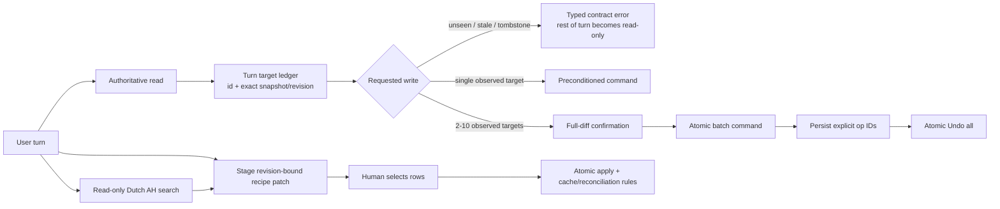

# Assistant Write Safety and Recipe Review

_Status: Shipped - guarded assistant deployed, production incident repaired, and live evidence verified_

## Safety advisory

The known production incident is repaired and the server-side write guards are deployed.
Persistent assistant writes may resume through their normal confirmation and review gates.

## Problem framing

The latest production recipe-refinement conversation exposed a server-side safety failure, not
only weak model behavior.

- Assistant message `92` tried an unsupported recipe-edit field, treated an unmatched recipe role
  as success, then committed six unrelated inventory updates without reading inventory in that
  turn. The resulting inventory operation IDs are `269` through `274`.
- Two of those inventory targets were already soft-deleted, but the ordinary update command still
  accepted them.
- The same turn retried a generic recipe-enhancement generator that receives only a recipe slug,
  so it lost the user's requested corrections and returned unrelated suggestions or validation
  errors.
- Assistant message `94` worked around the missing recipe capability by writing a correction
  checklist into the recipe notes, then claimed progress even though the ingredient list remained
  wrong.
- The live chat showed one Undo action for a six-operation bulk write. The other five compensating
  actions were not exposed.

The local safety tests all pass today, but two of them encode the unsafe contracts:
`bulk_update.test.ts` expects partial bulk commits, while `executors/recipes.test.ts` expects an
unmatched role edit to remain `ok: true`.

The outcome is an assistant whose write safety does not depend on the configured model following
prompt prose. The server must bind writes to exact state observed in the current turn, cap and
confirm fan-out, stop unsafe recovery loops, stage recipe content changes for human review, and
report only committed outcomes.

## Intent brief

- **Objective:** repair the known production damage and make wrong-target or false-success agent
  writes structurally impossible.
- **Primary user:** one household member using the assistant repeatedly on a phone.
- **Success criteria:**
  - the six unrelated inventory changes and the recipe-note workaround are restored without
    touching unrelated live data;
  - guessed, stale, or soft-deleted targets cannot pass an ordinary agent write;
  - a contract or provenance error prevents every later persistent write in that turn;
  - bulk updates are all-or-nothing, explicitly confirmed, capped at a phone-reviewable size, and
    atomically undoable;
  - recipe additions and field corrections appear as revision-bound before/after proposals and
    write only after the user applies selected rows;
  - final assistant copy never claims a no-op, rejected proposal, or failed tool call succeeded.
- **Constraints:** no new dependency, no new service, no schema migration, no plaintext secret,
  no paid provider call in automated tests, and no change to the Dutch-only AH lookup seam.

## Existing-system inventory

| Surface | Current behavior | Evidence |
| --- | --- | --- |
| Inventory updates | `bulk_update_inventory` maps independent writes and intentionally keeps partial success. | `src/lib/server/ai/executors/inventory.ts:182-190`; `src/lib/server/ai/bulk_update.test.ts:58` |
| Write risk | Current-turn state tracks created IDs and destructive count; confirmation classification only covers inventory add/remove. | `src/lib/server/ai/commit_risk.ts:30-102` |
| Command boundary | Ordinary update accepts an ID without an expected snapshot; tombstone handling is not separated from restore intent. | `src/lib/server/domains/inventory/commands.ts:333`, `:434`, `:539` |
| Agent loop | Zod errors flatten to ordinary error strings; the loop can continue for up to 25 iterations and execute later writes. | `src/lib/server/ai/executors/index.ts:98`; `src/routes/api/chat/+server.ts:232`, `:302-311` |
| Recipe roles | Role matching uses ingredient names, writes even when nothing matched, and still returns `ok: true`. | `src/lib/server/ai/executors/recipes.ts:197-301`; `src/lib/server/ai/executors/recipes.test.ts:202-210` |
| Ingredient IDs | Migration `0020` already backfilled stable IDs for legacy ingredient rows. | `drizzle/0020_shopping_source_entries.sql:78` |
| Recipe suggestions | The generator validates additions/substitutes but receives the slug rather than the current user's correction request; empty optional strings fail validation. | `src/lib/server/ai/recipe_enhancement.ts:9-23`, `:78`, `:102`; `src/lib/server/ai/executors/recipes.ts:52` |
| Review UI | The chat card supports additions and substitutes only. | `src/lib/components/chat/RecipeEnhancementReview.svelte:10-50` |
| Undo UI | Chat selects only the first undoable operation from a tool display. | `src/lib/components/ChatView.svelte:143`, `:294`; `src/lib/stores/chat-agent.svelte.ts:222` |
| Confirmation | A pending action stores one precondition and expires after five minutes. | `src/lib/server/ai/pending_actions.ts:21-26` |
| Active model | Production uses `z-ai/glm-5`, balanced reasoning, automatic provider routing. | Authenticated Settings inspection, 2026-07-28 |

## Scoped audit findings

| # | Severity | Dimension | Finding | Evidence | Effort | Risk |
| --- | --- | --- | --- | --- | --- | --- |
| F1 | P0 | Data integrity | A model can guess inventory IDs and commit unrelated updates without an authoritative current-turn read or row-version check. | Production assistant message `92`; ops `269-274`; `commit_risk.ts:58-102` | L | R2 |
| F2 | P0 | Data integrity | Ordinary updates accept soft-deleted rows; two tombstones were modified by the incident. | Production ops `271` and `274`; `commands.ts:333` | M | R2 |
| F3 | P0 | Fan-out safety | A 1-100 item agent batch commits row-by-row, can partially succeed, and has no confirmation route. | `inventory.ts:182-190`; `bulk_update.test.ts:58` | L | R2 |
| F4 | P1 | Recovery | The chat exposes only one undo action for a multi-operation tool result. | Live 938 x 718 review; `ChatView.svelte:143`, `:294` | M | R2 |
| F5 | P1 | Tool truth | Invalid schemas and unmatched role edits do not stop the turn; later writes and false success remain possible. | Production messages `92`, `94`; `executors/index.ts:98`; `recipes.test.ts:202-210` | M | R2 |
| F6 | P1 | Capability fit | The recipe generator loses the user's requested corrections and cannot represent updates to existing ingredient fields. | Production messages `90-94`; `recipe_enhancement.ts:23`; `RecipeEnhancementReview.svelte:41-50` | L | R2 |
| F7 | P1 | Product truth | The assistant claimed AH package sizes without an AH search result. | Production messages `92`, `94`; no AH tool in `tools.ts` | S | R1 |
| F8 | P2 | Test contract | Passing tests preserve partial commits and no-op success rather than preventing the incident. | `bulk_update.test.ts:58`; `recipes.test.ts:209-210` | M | R1 |

Current write-capable production use is **NO-GO**. This plan is **GO** for execution after the
mitigations below were integrated.

## Scope

### In

- Exact, evidence-backed repair of production inventory ops `269-274` and the recipe note changed
  in assistant message `94`.
- Snapshot-bound current-turn provenance for persistent agent writes to existing entities.
- Command-layer ordinary-update rejection for soft-deleted inventory, with an explicit internal
  restore path for undo and incident recovery.
- Typed contract/provenance failures, a rest-of-turn persistent-write latch, and duplicate failure
  suppression.
- Atomic, confirmation-gated inventory batches of at most 10 targets, plus atomic Undo all using
  the explicit operation IDs already persisted in the tool display.
- Stable ingredient-ID role assignment and truthful partial/no-op results.
- A revision-bound recipe patch covering additions, existing ingredient field changes,
  substitutes, and recipe-level servings/directions/notes.
- A bounded, read-only `search_ah_products` tool that returns live Dutch AH product names,
  package sizes, and prices as evidence for recipe proposals; unavailable retailer data fails
  explicitly rather than being guessed.
- Shared phone-first review UI, EN/NL copy, and deterministic regression coverage.
- One tightly capped live provider canary after every structural gate passes; the user approved
  this during `$run`, and the canary must stop before Apply.

### Out

- Changing the configured chat, fallback, vision, or background model by assumption.
- Automatic memory, telemetry, multi-user features, or new dependencies.
- Database schema changes. Atomic batch undo accepts explicit operation IDs and preflights them in
  one transaction; it does not need a batch/group column.
- Replacing the whole live database or replaying a broad backup over newer household changes.

## Option comparison

| Option | Upside | Cost / risk | Decision |
| --- | --- | --- | --- |
| Prompt tightening or model swap | Fast and low-code. | The server would still accept guessed IDs, tombstones, partial batches, and false success. | Rejected. |
| Snapshot-bound writes + human gates + typed recipe patches | Preserves useful agent actions while moving safety into deterministic server boundaries. | Cross-cutting R2 work and one carefully rehearsed R3 repair. | **Chosen.** |
| Make the assistant permanently read-only | Strongest simple safety posture. | Removes a core product benefit and pushes repeated household edits back to manual UI. | Rejected after steelman. |

## Chosen architecture

### Contracts

1. **Snapshot-bound provenance:** the server records the exact snapshot or content revision
   returned by a current-turn authoritative read. The model never supplies or edits the
   precondition. A confirmed replay carrying server-minted preconditions satisfies provenance.
2. **Ordinary update versus restore:** command-layer updates reject tombstones. Only a typed
   internal undo/recovery path may restore or rewrite a soft-deleted row.
3. **Typed failure classes:** invalid tool input, missing provenance, stale state, and prohibited
   target are contract failures. Ordinary domain outcomes such as “not found” remain recoverable
   and do not automatically trip the write latch.
4. **Rest-of-turn latch:** after a contract failure, read tools and in-memory staging tools may
   run, but no persistent tool call can commit. Repeated identical failed calls return the stored
   failure without re-execution.
5. **Batch atomicity:** all target snapshots validate before any row changes. Confirmation and
   Undo all take the exact list of target preconditions/op IDs; any conflict changes nothing.
6. **Recipe patch:** every proposed operation names a stable recipe/ingredient ID, before value,
   after value, reason, and optional evidence. The server snapshots `contentRevision`; selected
   operations apply together or not at all.
7. **Truthful copy:** tool displays are authoritative. The final response distinguishes committed,
   staged, unchanged, and failed work and cannot turn an error/no-op into a success claim.
8. **AH evidence:** `search_ah_products` accepts only bounded Dutch queries and returns the
   existing authenticated AH client's product name, package size, and price fields. The tool
   cannot mutate AH or household state. Without a successful current-turn result, the assistant
   says it could not verify the package size and must not attribute a quantity to AH.

## Phase plan

### Phase 1 - Establish the recovery seam and repair live data

Land the command-level precondition/tombstone distinction and a narrowly scoped recovery utility,
rehearse it against a current live database copy, deploy that recovery-capable build, then repair
the six inventory operations and recipe note before the broader agent guards change runtime
behavior.

### Phase 2 - Make all existing agent writes fail closed

Add snapshot-bound target provenance, the contract-error latch, atomic confirmation/undo for
inventory batches, and stable-ID truthful role classification.

### Phase 3 - Restore recipe-refinement capability through review

Replace direct recipe-content writes with one typed, revision-bound patch seam and a shared
before/after review component. Update the page generator and chat agent together so no old and new
recipe-write paths coexist. Recipe proposals may attach current-turn evidence from the bounded
read-only AH search; the review labels missing or unavailable retailer evidence instead of
accepting unsupported claims.

### Phase 4 - Prove the incident cannot recur and roll out

Rewrite the unsafe tests, replay the production failure sequence without provider spend, run the
complete repository gate, deploy through the beta stage path, and run the separately authorized
live canary.

## Execution tickets

### AWS-1 - Add command-level snapshot and tombstone safety

- **Observable behavior:** an ordinary update to a soft-deleted inventory row fails without a
  write; a stale expected snapshot fails without a write; undo/recovery can still use an explicit
  restore intent.
- **Scope in:** expected-snapshot support on inventory update, active-row target resolution,
  restore-only internal path, command/workflow tests.
- **Scope out:** chat-loop policy, confirmation UI, live repair.
- **Targets:** `src/lib/server/domains/inventory/commands.ts`,
  `src/lib/server/domains/inventory/merge.ts`,
  `src/lib/server/workflows/inventory.ts`, focused command/workflow tests.
- **Risk:** R2.
- **Verification:** active update, stale snapshot, tombstone rejection, undo-remove restore,
  legacy restore, and no-op transaction tests; `npm run check`; focused Vitest.
- **Rollback:** revert the code-only boundary change; no data migration or deployed data rewrite.
- **Dependencies:** none.

### AWS-2 - Rehearse and repair the production incident

- **Observable behavior:** inventory operations `269-274` match their stored before-snapshots and
  the exact grouped tool result stored in assistant message `92`; the recipe note matches the
  pre-incident `get_recipe` snapshot stored in assistant message `94`; no unrelated row changes.
- **Scope in:** generic explicit-op recovery script with dry-run/apply modes, current live DB
  backup, clone rehearsal, reverse operation order, tombstone-aware restoration, recipe
  content-revision precondition, scoped evidence JSON, post-repair translation/cache check.
- **Scope out:** broad database restore, guessed values, provider calls, unrelated review flags.
- **Targets:** `scripts/recover_assistant_incident.ts`,
  `src/lib/server/recovery/assistant_incident.ts`, focused tests, ignored evidence under `output/`,
  and append-only deployment/log records.
- **Risk:** R3. `requires_stage_gate: true`.
- **Verification:** dry-run names exactly six ops and one recipe field; rehearsal on a current DB
  copy produces exact before-snapshots; live apply records compensating operation IDs; fresh
  read-back matches every expected snapshot; full database counts and unrelated sampled rows are
  unchanged; recipe English cache remains pending or is regenerated rather than restored stale.
- **Rollback:** retain pre-repair row snapshots and repair-operation IDs; rehearse a scoped reverse
  repair on the clone. Use the full DB backup only for disaster recovery, never as the normal
  rollback.
- **Dependencies:** AWS-1; explicit live-data go/no-go.

### AWS-3 - Track snapshot-bound targets in each chat turn

- **Observable behavior:** an ID-targeted agent write commits only when the exact entity and state
  came from an authoritative read in the same request; confirmed server-minted replays remain
  valid.
- **Scope in:** a typed target ledger for inventory, meal-plan, and recipe entities; capture read
  snapshots/revisions; derive write preconditions server-side; registry tests for every existing
  ID-targeted persistent tool.
- **Scope out:** semantic intent classification, trusting older conversation history, and a
  not-yet-implemented bound-action bypass.
- **Targets:** add `src/lib/server/ai/turn_safety.ts`;
  `src/lib/server/ai/commit_risk.ts`; `src/lib/server/ai/executors/index.ts`;
  domain executors; `src/routes/api/chat/+server.ts`.
- **Risk:** R2.
- **Verification:** guessed ID, history-only ID, current read, stale-after-read, confirmed replay,
  multi-domain, and cross-user tests; assert zero new operation-log rows on rejection.
- **Rollback:** revert the ledger and precondition plumbing together; command-layer AWS-1 remains
  independently valid.
- **Dependencies:** AWS-1 and completed live repair.

### AWS-4 - Stop persistent recovery loops after contract failure

- **Observable behavior:** invalid tool schema, prohibited target, missing provenance, or stale
  precondition prevents every later persistent write in the same turn; the response states what,
  if anything, committed before the stop.
- **Scope in:** typed `ContractError`/error codes, read-only latch, duplicate failed-call key,
  tool-list filtering or equivalent executor rejection, deterministic final outcome summary.
- **Scope out:** latching on ordinary “not found” outcomes, provider fallback changes, model
  replacement.
- **Targets:** `src/lib/server/ai/executors/index.ts`,
  `src/lib/server/ai/turn_safety.ts`, `src/routes/api/chat/+server.ts`,
  `src/lib/server/ai/tool_display.ts`, client tool-display types and focused tests.
- **Risk:** R2.
- **Verification:** invalid recipe field followed by attempted inventory write; repeated identical
  failure; safe read after failure; one earlier valid write followed by failure; interrupted
  stream; persisted history replay.
- **Rollback:** revert typed loop policy as one unit; AWS-1 and AWS-3 continue to reject unsafe
  writes independently.
- **Dependencies:** AWS-3.

### AWS-5 - Make inventory batches confirmable and atomic

- **Observable behavior:** a 2-10 item update renders every before/after row, writes nothing until
  approval, commits all rows or none, and exposes an all-or-nothing Undo all. A batch above 10 is
  refused.
- **Scope in:** atomic domain command, all target preconditions, multi-precondition pending action,
  full localized diff, approval TTL appropriate for phone review, explicit-op atomic undo.
- **Scope out:** a database group column, partial success, 11-100 item chat batches.
- **Targets:** `src/lib/server/domains/inventory/commands.ts`,
  `src/lib/server/ai/executors/inventory.ts`,
  `src/lib/server/ai/pending_actions.ts`,
  `src/routes/api/chat/confirm/+server.ts`,
  `src/routes/api/inventory/undo/+server.ts`,
  `src/lib/server/ai/tool_display.ts`,
  `src/lib/components/ChatView.svelte`,
  `src/lib/stores/chat-agent.svelte.ts`.
- **Risk:** R2.
- **Verification:** full approval, cancel, expiry, double approval, one stale target, one missing
  target, tombstone, transaction throw, all undo, one undo conflict, narrow-screen long diff, and
  zero partial commits.
- **Rollback:** restore single-target confirmation and remove bulk from exposed chat tools; do not
  restore partial bulk semantics.
- **Dependencies:** AWS-1, AWS-3.

### AWS-6 - Make recipe role classification stable and truthful

- **Observable behavior:** role changes target stable ingredient IDs; ambiguous names are not a
  write path; zero applied roles returns unchanged/failed rather than success; mixed results name
  exactly what changed.
- **Scope in:** ingredient-ID tool schema, migration-0020 compatibility assertion, no-op avoidance,
  conditional recipe/cache/shopping updates, localized status.
- **Scope out:** recipe content additions and amount changes.
- **Targets:** `src/lib/server/ai/tools.ts`,
  `src/lib/server/ai/executors/recipes.ts`,
  `src/lib/server/ai/tool_display.ts`,
  `src/lib/server/ai/prompts/system.md`, focused tests.
- **Risk:** R2.
- **Verification:** duplicate ingredient names, unknown ID, mixed valid/invalid IDs, already-correct
  roles, missing legacy ID fixture, revision conflict, and no reconciliation/cache invalidation on
  no-op.
- **Rollback:** restore name matching only if the stable-ID contract cannot be satisfied; do not
  restore `ok: true` no-op semantics.
- **Dependencies:** AWS-3.

### AWS-7 - Stage all non-role recipe content as typed patches

- **Observable behavior:** the agent can propose an ingredient addition, change an existing
  amount/unit/preparation/role/optional value, add a substitute, or change
  servings/directions/notes; none writes until selected rows are applied against the original
  recipe revision.
- **Scope in:** shared patch schema/store/service, user and TTL scope, selected-operation apply,
  cache invalidation, cook-mode regeneration, shopping reconciliation, page-generator adapter,
  empty optional-field normalization, concise system-prompt migration.
- **Scope out:** recipe deletion, automatic acceptance, persisted proposals across deploys, AH
  product search.
- **Targets:** `src/lib/server/ai/recipe_enhancement.ts`,
  `src/lib/server/workflows/recipe-enhancement.ts`,
  `src/lib/server/ai/executors/recipes.ts`,
  `src/lib/server/ai/tools.ts`,
  `src/lib/server/ai/prompts/recipe_enhance.md`,
  `src/lib/server/ai/prompts/system.md`,
  `src/routes/api/recipes/[slug]/enhance/+server.ts`.
- **Risk:** R2.
- **Verification:** each operation type; all/some/none selected; duplicate name; stable ID;
  stale revision; expiry; cross-user; deploy-lost token message; generator empty strings; Dutch
  ingredient invariant; cache/reconciliation matrix.
- **Rollback:** disable patch generation/apply together and leave the assistant read-only for
  non-role recipe content; no partially migrated caller remains.
- **Dependencies:** AWS-4 and AWS-6.

### AWS-8 - Render one phone-first recipe review

- **Observable behavior:** chat and recipe detail show the same concise review with before/after
  values, reasons, unverified-evidence state, individual selection, apply progress, success,
  stale, error, and retry guidance.
- **Scope in:** shared review component, additions/updates/substitutes/recipe fields, collapsed long
  direction/note diffs, native controls, keyboard/focus/live status, EN/NL copy, 375 and 1280 px.
- **Scope out:** visual redesign of the surrounding chat, recipe editor, or Settings.
- **Targets:** `src/lib/components/chat/RecipeEnhancementReview.svelte`,
  `src/lib/components/recipe-detail/RecipeEnhancementSheet.svelte`,
  `src/lib/components/ChatView.svelte`,
  `src/lib/tool_display.ts`, `messages/en.json`, `messages/nl.json`, focused browser fixtures.
- **Risk:** R2.
- **Verification:** 375/1280 px and 200% layout; long Dutch copy; touch and keyboard selection;
  apply disabled with none selected; stale token; network error; focus after apply; no horizontal
  overflow; no request before Apply.
- **Rollback:** render the typed patch as a read-only summary and keep apply disabled; server
  staging remains non-mutating.
- **Dependencies:** AWS-7.

### AWS-8A - Add bounded read-only AH product evidence

- **Observable behavior:** the assistant can search live AH products by Dutch query and cite the
  returned product name, package size, and price in a recipe proposal; disconnected, failed, or
  empty searches are reported as unverified and never guessed.
- **Scope in:** read-only agent tool, at most 5 Dutch queries and 5 results per query, current-turn
  evidence binding, sanitized display payload, concise system-prompt rules, and mocked tests.
- **Scope out:** AH basket writes, token exposure, background LLM selection, English search keys,
  persistence of retailer results, and network calls in automated tests.
- **Targets:** `src/lib/server/ai/tools.ts`, `src/lib/server/ai/executors/index.ts`, add
  `src/lib/server/ai/executors/ah.ts`, `src/lib/server/ai/turn_safety.ts`,
  `src/lib/server/ai/prompts/system.md`, `src/lib/server/ai/tool_display.ts`, focused tests.
- **Risk:** R1.
- **Verification:** Dutch query forwarding, bounds, result sanitization, disconnected/failure/empty
  outcomes, no mutation surface, current-turn evidence acceptance/rejection, and tool inventory.
- **Rollback:** remove the exposed tool and evidence attachment; recipe review remains available
  with unverified-evidence labels.
- **Dependencies:** AWS-7; reuses the existing `src/lib/server/ah/client.ts` search seam.

### AWS-9 - Rewrite the safety tests and run the beta rollout

- **Observable behavior:** the exact incident sequence cannot create an inventory operation or
  recipe write after the first contract error; all repository and browser gates pass before
  deployment.
- **Scope in:** replace unsafe partial/no-op expectations, scripted incident replay, operation-log
  invariant, complete `npm test`, beta recovery/app rollout records, optional paid canary after
  authorization.
- **Scope out:** choosing a new model without evidence, production AH basket writes, automatic
  tuning.
- **Targets:** `src/lib/server/ai/bulk_update.test.ts`,
  `src/lib/server/ai/executors/recipes.test.ts`, new focused turn-safety/patch tests,
  `tests/` authenticated fixtures, `docs/deploys/2026-07.md`, `docs/log.md`.
- **Risk:** R2 for code/deploy; the separately approved canary is a paid external action.
- **Verification:** replay `get_recipe -> invalid edit_recipe -> unrelated bulk update -> repeated
  enhancement failure -> notes workaround`; assert zero unrelated `inventoryOpsLog` rows and no
  recipe revision; `npm test`; authenticated EN/NL browser stories; deployment health/canary.
- **Rollback:** redeploy the previous healthy code only after confirming the live repair remains
  intact; code rollback must never replay the pre-repair database.
- **Dependencies:** AWS-2 through AWS-8A.

## Failure-mode critique

| Failure mode | Trigger | Impact | Detectability | Mitigation | Residual risk |
| --- | --- | --- | --- | --- | --- |
| A model reads inventory only to unlock a wrong write | Current-turn membership is treated as sufficient provenance | Wrong but fresh target changes | Confirmation/tool logs | Bind exact snapshots, cap fan-out, require confirmation for multi-target changes, retain single-write Undo | Low-medium for a single reversible write |
| New tombstone guard breaks legitimate undo | Ordinary update and restore share one command path | Deleted item cannot be restored | Command tests | Explicit restore intent; permanent undo/legacy-restore regression | Low |
| Batch approval partially commits | One target drifts or a later command throws | Mixed household state | Operation-log audit | Preflight every target and apply inside one transaction | Low |
| Undo all partially reverts | N independent undo calls | Mixed repaired/unrepaired batch | UI/history | Accept explicit op IDs, preflight all current snapshots, one transaction | Low |
| Confirmation expires during phone review | Long diff exceeds five-minute TTL | User loses choices | Visible 410 | Cap at 10 rows, extend only this review TTL, preserve clear regenerate action | Low |
| Contract latch fires on ordinary failure | Errors remain untyped | Safe recovery is blocked | Unit tests | Typed contract/provenance errors; ordinary domain failures stay recoverable | Low |
| Recipe patch invalidates the wrong caches | Field-specific effects drift | Stale translation, cook mode, or shopping list | Focused integration tests | One apply service owns cache/reconciliation matrix | Low |
| Direct recipe edit remains beside patch | Prompt/caller migration is split | Model bypasses review | Tool inventory test | Narrow `edit_recipe` only when every non-role caller is migrated in AWS-7 | Low |
| Old tests pressure implementation back to unsafe behavior | Full gate fails after contract rewrite | Developer restores partial/no-op semantics | High | Rewrite named tests in the same tickets; document expected red-to-green change | Low |
| Live recovery meets post-incident drift | Household changed an affected row | Repair could overwrite valid newer data | Dry-run snapshot mismatch | Stop with no write for that row/batch; manual reconciliation decision | Medium |
| In-memory proposal disappears on deploy | Railway restarts during review | User must regenerate proposal | Visible stale state | Clear localized regenerate path; no persistent schema in this incident plan | Low |
| Model still produces poor suggestions | Structural safety passes but reasoning quality remains weak | Friction, no data corruption before Apply | Review rejection/canary | Human patch gate; one paid canary; benchmark model changes separately if quality remains poor | Low |

## Steelman

The strongest alternative is to make the assistant permanently read-only: it is simpler and
eliminates model-originated writes. The chosen design is still preferable because household
inventory, meal, and recipe updates are the assistant's main repeated value, and the dangerous
parts can be reduced to deterministic boundaries: exact snapshot preconditions, atomic fan-out,
human review for recipe content, and scoped undo. Those controls remain effective across model
changes, while a prompt/model-only fix would not.

## Risk tier and verification matrix

Overall risk is **R3** because Phase 1 repairs real household data. The implementation itself is
code-only R2 with no schema/auth change. Beta staging is advisory for the code, while the live
repair requires an explicit stage/go-no-go gate.

| Boundary | Required proof |
| --- | --- |
| Incident evidence | Backup hash/path, exact six op IDs, exact recipe message/snapshot source, no raw household content in public docs |
| Recovery | Clone dry-run, exact before/after diff, scoped live apply, compensating op IDs, unrelated-row invariance |
| Command safety | Stale snapshot and tombstone reject; undo/restore still works |
| Turn safety | Current-turn exact snapshot required; history/guessed targets reject; contract latch blocks later writes |
| Batch | 2-10 confirmation, full diff, all-or-none commit, all-or-none undo, 11+ refusal |
| Recipe roles | Stable IDs, no-op/partial truth, duplicate names, no unnecessary cache/reconciliation |
| Recipe patch | User/TTL/revision scope, selected apply, all operation types, Dutch invariant, cache matrix |
| AH evidence | Bounded Dutch queries, sanitized live results, explicit unavailable state, no mutation or automated network |
| UI/UX | 375/1280 px, 200%, EN/NL, keyboard/touch, status/recovery, no pre-Apply request |
| Repository | Focused Vitest during tickets; final `npm test`; production build and authenticated Playwright included |
| Paid/live | No paid automated test; one explicit-authorized low-cost canary stages but does not apply a recipe patch |

### Audit record

| Audit | Result |
| --- | --- |
| Harden | Ran scoped data-integrity audit. Three P0s: unbound guessed IDs, tombstone updates, and unconfirmed partial fan-out. |
| UI | Live 938 x 718 history showed irrelevant proposal rows, raw validation errors, and one Undo action for six operations. Plan adds full state/recovery coverage. |
| UX | The recipe-correction journey lost the user's goal, changed another domain, and ended in a manual workaround. Plan restores one reviewable before/after path. |
| Stack discipline | Skipped: no new library, service, auth, queue, or AI provider boundary. |
| Independent critique | Model `opus` (resolved `claude-opus-5`) confirmed snapshot-bound provenance, command-layer tombstone safety, atomic fan-out, and test rewrites. Its proposed op-group migration was rejected because explicit persisted op IDs support transactional Undo all without schema change. Migration `0020` already covers ingredient IDs. |
| Run-time instruction review | Model `opus` was unavailable after two safe-mode attempts; no findings were accepted. Local contract tests and the full repository gate remain the accepted execution evidence. |

## Execution evidence and live repair

- The command, turn-latch, atomic batch/undo, stable recipe-ID, typed patch, AH evidence, and
  scoped-recovery tests pass.
- The complete repository gate passed with 553 unit tests, the authenticated Chromium suite,
  zero Svelte diagnostics, and a production build. A focused recipe-review browser story also
  passed at 375 and 1280 pixels with no horizontal overflow or request before selection.
- Railway production was backed up through SQLite's online backup API to the existing snapshots
  directory. The downloaded copy has SHA-256
  `b6d50b95aa65c95e8ee06c14d454fb31a931f28ca529b0e05ca46b29522fe872`.
- The exact clone dry-run was ready for ops `269-274`, inventory message `92`, and recipe message
  `94`. Clone apply created six compensating operations, restored every expected snapshot and the
  recipe note, preserved inventory/recipe counts, and kept the unrelated-row fingerprint equal.
- Railway deployment `fbbc3ba` passed health, auth-boundary, runtime-log, and capped authenticated
  provider canaries. The provider canary made exactly one Dutch AH search, staged one typed recipe
  patch, and stopped with Apply disabled.
- Immediately before the approved R3 apply, SQLite's online backup API created
  `assistant-safety-immediate-pre-apply-20260728T114410Z.db` with SHA-256
  `ef86534d03349665256afe24931d9869ffd31840dd5859e26efa9488707b72e5`.
- The guarded live transaction restored all six inventory snapshots and the recipe note, created
  compensating inventory operation IDs `275-280`, advanced the recipe to revision `10`, preserved
  the 38-item and 8-recipe counts, and kept the unrelated-row fingerprint equal.
- Independent post-apply inspection returned `ready: false`: none of the six rows still matched the
  incident-after state and the recipe no longer matched incident revision `9`. Litestream replicated
  the transaction, `/api/healthz` returned 200, and Railway showed no runtime errors or HTTP 5xx.
- The post-apply online backup is
  `assistant-safety-post-apply-20260728T114453Z.db`, SHA-256
  `e684a06fa736a2fa34cebf89e84e8fc7b4596d1c261db501568c45c65e0a02a7`.

## Rollout and rollback

1. Land AWS-1 and the recovery utility without changing the exposed agent tool set.
2. Back up the current live SQLite database and rehearse AWS-2 on that exact copy.
3. Deploy the recovery-capable build, pause for the R3 go/no-go, apply the scoped repair, and
   verify before continuing.
4. Land AWS-3 through AWS-8A behind permanent tests. Do not run production write turns during this
   interval.
5. Run `npm test`, deploy through the beta path, verify health/auth/browser states, then request
   approval for one capped provider canary.
6. If code rollout fails, redeploy the prior healthy code while preserving the repaired database.
   If live repair fails precondition checks, write nothing and stop. Never restore the whole
   database over newer household data unless the scoped rollback rehearsal itself fails.

## Run decisions

- Proceed solo and preserve unrelated shopping/mobile-density work.
- Include the bounded, read-only AH product-search capability in this delivery.
- Apply the scoped live repair only after backup, clone rehearsal, and an exact precondition
  report at the beta R3 action-time gate.
- Run one production provider canary capped at EUR 0.05 after deterministic gates pass, stopping
  before Apply so the canary performs no household write.

## Resume pack

- **Goal:** repair the 2026-07-28 assistant write incident and make agent writes snapshot-bound,
  atomic where fanned out, review-gated for recipe content, and truthful.
- **Current state:** shipped and verified in production; the scoped incident repair is complete.
- **Next ticket:** none for this feature.
- **Next files:** none.
- **Pending verification:** none.
- **Open decisions:** none.
