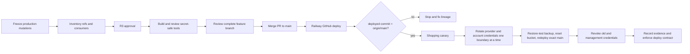

# Feature List: Production Deployment Lineage Recovery

_Status: Shipped - Phase 4 of 4 complete_

## Problem framing

The Shopping refinement is complete in commit `0440545`, but it is not live. Production is
configured to deploy GitHub `main`, while `0440545` exists only on
`codex/assistant-write-safety`. The serving Railway deployment, `96370ca4`, is a successful manual
local upload created before the Shopping commit. An authenticated production probe therefore
shows the old controls and progress track without any browser or runtime error.

This is source-lineage drift, not a Shopping implementation failure and not a browser cache.
Earlier manual uploads also put assistant-write safety and the Linux startup repair into
production without putting those commits on `main`. Promoting only the Shopping commit would make
the next source deployment silently remove live safety behavior.

During diagnosis, a Railway environment-config read returned plaintext production values in
protected tool output. No values are repeated or persisted here. The affected AI-provider,
backup-storage, and household-login credentials must be treated as exposed and replaced before
the next normal production deployment.

## Intent brief

- **Objective:** restore one auditable source of truth for production, safely deliver the finished
  Shopping UI, and make a feature-branch push impossible to report as live.
- **Primary user:** the two-person household using the production PWA.
- **Success criteria:**
  - exposed credentials are replaced through the agent-only secret path and old credentials are
    revoked only after each replacement is proven;
  - production source remains GitHub `main`;
  - the complete reviewed feature branch, not an isolated Shopping cherry-pick, is promoted to
    `main`;
  - Railway reports a successful GitHub deployment whose branch is `main` and whose commit equals
    the merged remote `main` tip;
  - authenticated mobile Shopping has one compact control row and `List options`, while desktop
    keeps direct controls;
  - neither viewport renders a progressbar role or `.market-progress-track`;
  - health, authentication, AI, Litestream replication, browser console, and runtime logs remain
    healthy;
  - runbooks distinguish **pushed** from **live** using an exact revision check.
- **Constraints:** no plaintext secrets in chat, output, files, command arguments, screenshots, or
  logs; no database replacement; no migration; no production branch retarget; no routine
  `railway up`; no publication of household list content.

## Confirmed evidence

| Evidence | Result | Interpretation |
| --- | --- | --- |
| Git ancestry | `0440545` is contained by `origin/codex/assistant-write-safety`, not `origin/main` (`52e0a51`) | The GitHub source branch cannot deploy Shopping yet |
| Railway service source | `freekmetsch/kitchenbrain`, branch `main`, root `/` | A feature-branch push is outside the production trigger |
| Serving deployment | `96370ca4`, `SUCCESS`, manual upload predating `0440545` | Production is a local snapshot, not the current configured-source revision |
| Authenticated `/shopping` | One progressbar/track, old direct mobile tools, zero `List options` triggers | The old UI is genuinely being served |
| Browser/runtime signal | No console errors or warnings | This is not a render crash |
| Feature-branch contents | Safety, startup, recovery documentation, Shopping, and follow-up documentation commits | Whole-branch review is safer than a Shopping-only cherry-pick |
| CI inventory | No `.github/workflows` | Do not enable Railway “wait for CI” until a real required check exists |
| Production auth ownership | Both user rows are `creds_version = 1` | One controlled env-seeding redeploy can rotate both passwords; the password endpoint fallback is not needed |
| Backup provider | Railway bucket `household-brain-litestream`, 245 objects / 6.4 MB; Litestream reports active S3 replication | Use Railway bucket references and its credential-reset operation, not Cloudflare tooling |
| 1Password metadata | Dedicated Household Brain OpenRouter item, household login item, and Litestream item exist; no Anthropic-titled item exists | Rotate the dedicated AI item, create bridge-writable auth replacements, retire copied bucket credentials, and treat Anthropic revocation as a provider-identification gate |

Official Railway behavior matches the evidence: GitHub autodeploys watch the connected branch, and
`railway up` deploys the current local directory as a manual upload.

## Scoped audit findings

| # | Severity | Finding | Required mitigation |
| --- | --- | --- | --- |
| F1 | P0 | Production credential values entered protected diagnostic output. | Replacement-first rotation, bounded verification, revocation, and a value-safe Railway inspection path before normal rollout |
| F2 | P1 | The serving production snapshot is not represented by `main`. | Review and merge the full feature branch, then require deployed-commit equality |
| F3 | P1 | A feature-branch push was treated as delivery although production watches `main`. | Define live completion as merge + terminal deploy + revision match + canary |
| F4 | P1 | A Shopping-only cherry-pick could remove live assistant-safety/startup fixes. | Promote the reviewed branch as one lineage reconciliation |
| F5 | P2 | Raw Railway configuration/variable reads can disclose values and are unnecessary for deploy diagnosis. | Add a names-only metadata helper and prohibit value-returning reads in runbooks |
| F6 | P2 | Production deployment facts are implicit and absent from the repository handoff contract. | Record URL, source branch, safe verification, and rollback invariants in repository instructions |

Overall risk is **R3** because the recovery includes production auth and secret rotation. The branch
review and documentation work are R1/R2, but they do not lower the live cutover tier.

`requires_stage_gate: true`

## Scope

### In

- An inventory of every consumer and 1Password reference for the exposed credential classes,
  without resolving values into model-visible output.
- Audited local producer adapters where an existing provider rotation route is absent.
- A repository-owned `op run --env-file=.env.template -- <cmd>` wrapper for secret-fed production
  operations; committed files contain only `op://` references.
- Replacement-first OpenRouter rotation and migration from copied Litestream credentials to
  Railway Storage Bucket variable references before the bucket credential reset.
- Removal and revocation of the dormant direct-Anthropic key if dependency inventory proves it is
  unused; otherwise replacement-first rotation.
- Rotation of both household passwords, including a guarded authenticated path when
  `creds_version > 1` means environment seeding no longer owns the password.
- Railway updates through stdin/staged changes and verification before old credentials are
  revoked. UI sealing is excluded because this execution must never render or re-enter values.
- Full feature-branch review, PR promotion to `main`, Railway source deployment, authenticated
  canary, and deployment log.
- A safe deployment-lineage helper and precise repository delivery contract.

### Out

- Retargeting Railway to a feature branch.
- Using `railway up` as the normal recovery.
- Replacing or restoring the production database or persistent volume.
- Changing Shopping behavior beyond the already shipped `0440545` contract.
- Adding GitHub Actions only to satisfy a Railway setting.
- Automatic secret rotation, memory, scheduling, or a second secret store.
- Returning any secret value to the model or asking a person to paste it.

## Option comparison

| Option | Benefit | Cost / risk | Decision |
| --- | --- | --- | --- |
| Manually upload the feature branch now | Fastest visible UI change | Preserves drift, bypasses source review, and deploys before credential containment | Rejected |
| Retarget production to the feature branch | Makes future feature pushes deploy | Converts a temporary branch into the production contract | Rejected |
| Cherry-pick only `0440545` to `main` | Small diff for Shopping | Omits safety/startup changes that production already runs | Rejected |
| Approve the complete recovery, reconcile exact `main`, then rotate on that canonical source deployment | Avoids another ambiguous manual snapshot and keeps every live protection | Leaves the already-exposed credentials active through one supervised source reconciliation | **Chosen after independent review** |

## Chosen sequence

Source reconciliation precedes secret rotation because Railway cannot prove that a variable-driven
redeploy of the current manual snapshot would preserve its live-only safety code. Once `main` is
canonical, provider, each household account, and the bucket reset use separate exact-source
deployments so a failure has one owner.

## Phase plan

### Phase 0 - Prove and authorize the recovery

Pause production mutations and deployments. Inventory secret consumers by reference/name only,
restore the current Litestream generation to a scratch database, test the invalid-credential
failure mode, secret-scan the public branch, complete the outside review, and present the adjusted
R3 sequence for explicit approval.

### Phase 1 - Reconcile source history and deploy exact `main`

Review every commit and complete diff between `origin/main` and
`codex/assistant-write-safety`. Run the full repository gates and open a PR for the whole branch.
Do not cherry-pick Shopping and do not change the Railway source branch. Because there is no CI,
merge is a supervised production deployment: wait for `SUCCESS`, prove the deployed commit equals
the merged remote tip, and run the Shopping canary before touching credentials.

### Phase 2 - Rotate credentials on canonical source

Create and independently review the audited OpenRouter, Login-item, password, and Railway-stdin
paths. Bound the old OpenRouter key, rotate provider variables, rotate one household account and
prove it before the other, migrate Litestream to Railway bucket references, restore-test the
latest generation, reset the bucket pair, and redeploy exact `main`. Revoke old credentials only
after their replacements are proven; revoke the short-lived OpenRouter management key last.

### Phase 3 - Prevent recurrence

Document the exact live-completion contract and add a names-only deployment inspector. Record the
degraded and recovered canaries without screenshots or household data. Archive this feature list
only after all credentials are revoked and the exact-main canary is healthy.

## Execution tickets

### PDL-0 - Open the R3 containment gate

- **Observable behavior:** production writes and deployments remain paused until the user
  explicitly authorizes the enumerated credential and auth changes.
- **Scope in:** incident inventory by variable/ref name; affected consumers; proposed operations;
  backup/rollback proof; explicit go/no-go checkpoint.
- **Scope out:** resolving or printing secret values; any mutation before approval.
- **Targets:** this feature list, the current issue, 1Password item metadata, Railway
  service/deployment metadata.
- **Risk:** R3.
- **Dependencies:** none.
- **Verification:** inventory covers the AI provider, dormant provider, Railway bucket access,
  both household logins, their 1Password records, and every known consumer.
- **Rollback:** no mutation has occurred; close the gate and leave production unchanged.

### PDL-1 - Establish audited secret producers and a repository wrapper

- **Observable behavior:** every replacement can flow provider/local generator -> agent-only
  bridge -> 1Password -> child process/Railway stdin without entering model-visible output.
- **Scope in:** provider capability check; minimal OpenRouter management-browser/API and
  local-password producers; tightly scoped bridge support for create/edit of Household Brain
  Login items without changing username or URL; dormant-Anthropic removal/rotation path;
  `.env.template` with `op://` references; a bounded Railway stdin wrapper; tests proving
  stdout/stderr redaction and failure-closed behavior. Railway bucket credentials stay inside
  Railway through service variable references.
- **Scope out:** a plaintext `.env`, clipboard steps, automatic scheduled rotation.
- **Targets:** sibling `freek-machine-setup/bin/secret-producers/` after reading that repository's
  instructions; repository `.env.template`; a small script under `scripts/`; focused tests/docs.
- **Risk:** R2 for command/tool changes; the later provider call is R3.
- **Dependencies:** PDL-0 approval before command-policy expansion or invoking a live provider.
- **Verification:** focused independent review of the exact command diff; adapter and Login-item
  contract tests; bridge dry run with synthetic values; stdin support fails closed with no argv
  fallback; repository scan finds no plaintext result.
- **Rollback:** revert code-only adapters/wrapper; no provider key is revoked in this ticket.

### PDL-2 - Rotate provider, backup, and household credentials

- **Observable behavior:** production runs on replacements; both accounts can log in; one bounded
  OpenRouter call succeeds; Litestream writes a fresh replica generation/checkpoint; old
  credentials no longer authenticate.
- **Scope in:** create a short-lived OpenRouter management key; cap the exposed app key at a
  maximum USD 1 daily limit; mint and store the replacement separately; replace copied Litestream
  values with Railway Storage Bucket references; set dormant Anthropic to an inert sentinel
  without deploying; generate two Login-item passwords; rotate and verify one `PWA_USER_*`
  variable/redeploy before the other; restore-test Litestream immediately before its irreversible
  reset; reset once and immediately redeploy exact `main`; remove/revoke uniquely identifiable old
  provider keys; revoke the management key at the end. Every secret-bearing Railway update uses
  stdin and `--skip-deploys`.
- **Scope out:** model changes, database replacement, broad household-data reads.
- **Targets:** 1Password `Dev-Agents`; Railway production variables and Storage Bucket; provider
  key registries; environment-owned user seeding; Litestream runtime.
- **Risk:** R3.
- **Dependencies:** PDL-0, PDL-1, PDL-4.
- **Verification:** terminal `SUCCESS` and exact-main equality after every redeploy;
  `/api/healthz`; each new login before rotating the next account; each old-login rejection; a
  bounded request whose replacement key usage counter advances; Litestream restore with full
  integrity plus a fresh post-reset object/checkpoint; provider registries show the old app and
  management keys revoked. Never list variable values. Sealing is excluded because Railway has no
  non-browser API and the secret-safe path must not render values.
- **Rollback:** before revocation, restore the old Railway reference and redeploy; after successful
  revocation, mint a new replacement rather than restoring an exposed secret. Persistent data is
  untouched.

### PDL-3 - Review and promote the complete feature branch

- **Observable behavior:** a PR merges the complete reviewed
  `codex/assistant-write-safety` history into `main`; `0440545` and every currently live safety
  commit become ancestors of `origin/main`.
- **Scope in:** commit/diff review; unrelated-worktree preservation; full test gate; PR; merge.
- **Scope out:** Shopping reimplementation, history rewriting, force push, branch retarget.
- **Targets:** Git branch/PR; code and tests already changed on the feature branch.
- **Risk:** R2.
- **Dependencies:** PDL-0 approval and PDL-1's reviewed local tooling.
- **Verification:** public-repository confirmation; Gitleaks scan of the complete branch diff and
  recovery docs; live startup/safety marker comparison; `git diff
  origin/main...origin/codex/assistant-write-safety`; `npm test`; `npm run test:e2e:secondary`;
  `git diff --check`; post-merge ancestry checks for `76494be`, `fbbc3ba`, and `0440545`.
- **Rollback:** close the PR before merge. After merge, revert with a normal reviewed commit; do
  not rewrite `main`.

### PDL-4 - Deploy exact `main` and run the authenticated canary

- **Observable behavior:** Railway reaches `SUCCESS` for the merged `main` tip and production
  Shopping renders the refined mobile/desktop contract.
- **Scope in:** terminal deployment wait; branch/commit equality; health and runtime logs;
  authenticated 375px and 1280px canaries; primary/secondary account smoke; deployment log.
- **Scope out:** manual `railway up`; household-data screenshots; data mutation beyond ordinary
  login/session activity.
- **Targets:** Railway deployment, production `/api/healthz`, `/shopping`, `docs/deploys/2026-07.md`.
- **Risk:** R2 live rollout inside the approved R3 recovery.
- **Dependencies:** PDL-3.
- **Verification:** deployed metadata says branch `main` and commit equals `origin/main`; health is
  `ok`; at 375px `List options` exists and mobile controls stay compact; at 1280px direct controls
  remain; both have zero progressbar roles/tracks; console/network/runtime errors are zero.
- **Rollback:** before secret rotation, use Railway's prior deployment only if its startup/safety
  markers match `76494be` and `fbbc3ba`. After source reconciliation, use the named merged
  `main` SHA or a normal revert that never crosses those safety commits. Retain rotated variables
  and the persistent volume; verify health/auth/AI/replication again.

### PDL-5 - Make deployment truth explicit and value-safe

- **Observable behavior:** future handoffs cannot call a feature live without a revision-matched
  source deployment and can inspect Railway lineage without returning variable values.
- **Scope in:** repository `AGENTS.md` production URL/source/definition-of-live/rollback facts;
  safe names-only deployment helper; explicit prohibition on environment-config/value-list reads;
  focused helper tests; README wording only where public setup facts need clarification.
- **Scope out:** new CI, scheduled monitoring, provider automation.
- **Targets:** `AGENTS.md`, `scripts/`, focused tests, `README.md` only if required.
- **Risk:** R1/R2.
- **Dependencies:** independent instruction/command review, PDL-4 evidence.
- **Verification:** helper output contains project/service/environment/deploy/branch/commit/status
  only; a fixture containing secret-like values cannot reach output; repository instructions
  distinguish pushed, merged, deployed, and canaried.
- **Rollback:** revert documentation/helper changes; production remains on the recovered revision.

## Beta stage contract

Before PDL-1 expands the secret bridge, before any provider call, and before the supervised merge
that triggers production, execution must stop and present:

1. exact source, provider, Railway, bucket, and per-account operations;
2. affected 1Password item/ref names and consumer names, never values;
3. the fact that this public repository has no CI and merging `main` is the production deploy;
4. one-account-at-a-time order, OpenRouter's temporary USD 1 daily cap, and bounded verification;
5. rollback to a named SHA that never crosses `76494be` or `fbbc3ba`;
6. forward recovery after credential revocation;
7. proof that the latest SQLite/Litestream generation restores with full integrity and that a
   temporary bucket 403 leaves the supervised app process running;
8. the Anthropic provider-identification limit and owner if unique revocation is unavailable;
9. the explicit question: **Proceed with the adjusted R3 source, credential, authentication, and
   bucket cutover?**

No prior approval for the Shopping UI or assistant recovery carries over to this gate.

## Failure-mode critique

| Failure mode | Impact | Mitigation | Residual risk |
| --- | --- | --- | --- |
| New key is revoked or old key revoked too early | AI or backup outage | Replacement-first; verify through the deployed app/replica before revoke | Low |
| Bucket reset invalidates the running Litestream pair before replacement reaches the process | Backup replication pauses during redeploy | Move all four Litestream settings to Railway bucket references first; prove them; reset once; immediately redeploy and prove a fresh object/checkpoint | Low |
| Variable-triggered deploy rebuilds from stale `main` | Live safety behavior disappears during containment | Reconcile and canary exact `main` before variable rotation; every later redeploy uses `--from-source` and checks the commit | Low |
| `PWA_USER_*` changes do not reach `HOUSEHOLD_USERS` | Exposed login remains valid | Prove the existing Railway reference structure by rotating one account and testing both new and old credentials before the second | Low |
| New password invalidates the only active session before proof | Account lockout | Rotate one account at a time, prove new login in an isolated session, retain the other session | Low |
| New passwords are stored in a non-autofill item | Household members cannot retrieve/use them safely | Create dedicated Login items through reviewed bridge support with username and production URL fixed as non-secret metadata | Low |
| Whole-branch merge contains an unrelated regression | Production change exceeds Shopping | Review the full commit/diff set and run primary plus secondary complete gates | Medium |
| Shopping-only cherry-pick drops live safety fixes | Safety regression | Forbid partial promotion; assert every live safety commit is on `main` | Low |
| Railway reports success for the wrong revision | Stale UI recurs | Treat branch+commit equality as a hard gate before browser canary | Low |
| Rollback restores exposed credentials | Security regression | Code rollback never rolls back Railway variables or 1Password state | Low |
| Authenticated evidence publishes household content | Privacy incident | Store DOM counts and verdicts only; no live screenshot in this public repo | Low |
| Network evidence stores a cookie, HAR, or response body | Credential or household-data exposure | Ban HAR/cookie artifacts and `Set-Cookie` capture; persist structural counts and verdicts only | Low |
| Diagnostic command leaks values again | Second exposure | Names-only helper and an explicit ban on raw variable/config reads; no UI sealing or value rendering | Low |
| OpenRouter management key survives the incident | A more powerful credential remains active | Never put it in Railway; revoke it after the old app key and verify provider metadata | Low |

**Steelman:** a direct `railway up` would be quicker and the app is single-household. It is still
the wrong default: it caused the current mismatch, provides no durable relationship to `main`, and
would combine an uncontained credential incident with another manual snapshot. The deliberate
source reconciliation plus boundary-by-boundary redeploys cost time but isolate failures and
restore the canonical repository contract.

## Review coverage

| Review | Result |
| --- | --- |
| Root-cause diagnosis | Complete; Git, Railway, and authenticated DOM evidence agree |
| Scoped hardening audit | Complete; one P0, three P1, and two P2 findings are incorporated above |
| UI/UX audit | Not rerun; the Shopping change itself already passed its archived mobile-density plan. Live UI was inspected only to identify the deployed contract |
| External documentation | Complete through current official Railway Storage Bucket, OpenRouter, and Anthropic sources; Context7 was unavailable because its monthly quota was exhausted |
| Independent P0/P1 plan critique | Claude Opus returned GO WITH CHANGES. The source-first order, one-account rotations, Login-item delivery, named rollback, restore proof, management-key lifecycle, public-repo secret scan, and evidence bans above are mandatory |

Plan-readiness result: **GO WITH CHANGES** for local preparation and review; **NO-GO** for provider,
auth, Railway-variable, merge, or production-deploy mutations until the explicit R3 checkpoint is
approved.

## Rollout and rollback

- Keep the current deployment serving while Phase 0 is prepared.
- After R3 approval, build and independently review the exact secret-command changes.
- Promote the complete branch through a supervised PR to `main`; never rewrite history.
- Let the configured GitHub source deploy the merge, require exact commit equality, and canary
  Shopping before credential changes.
- Rotate provider, primary login, secondary login, and bucket reset in separate exact-source
  redeploys; revoke only after the owning verification passes.
- Roll back application code only to the named merged SHA or a prior deployment proven to contain
  `76494be` and `fbbc3ba`, while keeping rotated credentials and the persistent volume.
- If a replacement credential fails after old-key revocation, mint a new replacement and fix
  forward; never restore a known-exposed value.

## Open questions

- The dedicated Household Brain OpenRouter item is present. Execution creates a short-lived
  management credential through a no-output browser adapter, caps the exposed key at USD 1/day,
  and creates the replacement through the documented management API. The exact adapter diff gets
  a second independent review before first use.
- Both household rows have `creds_version = 1`, so env seeding owns this rotation. The existing
  `household-brain` item does not cleanly represent two autofill credentials; create two dedicated
  Login items through tightly scoped, independently reviewed bridge support and rotate one account
  per deployment.
- No Anthropic-titled item or other active repository consumer was found. Remove the dormant
  Railway value from the runtime, then use authenticated provider metadata to revoke only a
  uniquely identifiable Household Brain key. If no unique identity exists, stop at a provider
  capability block and report the remaining exposure instead of revoking a broader account key
  set.

## Primary references

- [Railway GitHub autodeploys](https://docs.railway.com/deployments/github-autodeploys)
- [Railway `up`](https://docs.railway.com/cli/up)
- [Railway variable CLI](https://docs.railway.com/cli/variable) and
  [variable references](https://docs.railway.com/variables)
- [Railway Storage Buckets](https://docs.railway.com/storage-buckets) and
  [bucket credential reset](https://docs.railway.com/cli/bucket)
- [OpenRouter management API keys](https://openrouter.ai/docs/guides/overview/auth/management-api-keys)
- [Anthropic Console API-key management](https://support.anthropic.com/en/articles/8114521-how-can-i-access-the-anthropic-api)

## Resume pack

- **Goal:** contain the credential exposure, make the whole live code lineage an ancestor of
  `main`, deploy exact `main`, and prove the refined Shopping UI is live.
- **Current state:** root cause and credential consumers are confirmed; the public branch and
  recovery docs passed a redacted Gitleaks scan; the latest backup restored with full integrity
  (`22` tables, `994` total rows); an invalid bucket credential produced 403 retries while the
  supervised child stayed running; Opus returned GO WITH CHANGES on the plan; Freek approved the
  adjusted R3 cutover. Secret/railway tooling and dummy-provider tests are locally green, but the
  mandatory exact-diff Opus pass is session-limited until 19:50. Production is healthy but stale
  and no live mutation has been made.
- **First execution action:** retry the independent exact-diff review. Resolve every P0/P1 finding
  before publishing or invoking PDL-1 against 1Password, a provider, GitHub `main`, or Railway.
- **Hard stops:** no provider call, password change, Railway variable change, revocation, merge, or
  deploy before the R3 approval; no secret may enter model-visible output.
- **Dirty worktree:** preserve pre-existing `docs/log.md` edits and untracked recordings/output;
  stage only files created or changed for this recovery.
- **Terminal condition:** all uniquely identifiable old credentials are revoked, any
  provider-identification exception is made inert and recorded, `origin/main` contains the safety
  and Shopping commits, Railway serves that exact `main` commit, the authenticated canary is
  healthy, and the issue/plan are archived.

## Completion evidence

- PRs [#17](https://github.com/freekmetsch/kitchenbrain/pull/17) and
  [#18](https://github.com/freekmetsch/kitchenbrain/pull/18) made the complete safety and Shopping
  lineage canonical on `main`, including the 320 px hidden-scrollbar follow-up.
- Railway deployment `02ecb539-2b1f-4eab-8a2b-eb51a62e6e76` reached `SUCCESS` from GitHub branch
  `main` at exact remote tip `4facaa3f5ce74afc68f93de847bbfd00c59cf4e5`.
- Authenticated Shopping acceptance passed at 320 px and 1280 px: mobile exposes one compact
  44 px options control while desktop keeps direct sort controls; both render zero progressbar
  roles and zero `.market-progress-track` elements; browser console errors were zero.
- Both household Login items were rotated separately and proven replacement-accepted /
  previous-rejected. The OpenRouter application key was replaced, live generation passed, and
  the old application key plus temporary management credentials were revoked.
- One first-use temporary management credential entered model-visible browser evidence. It was
  never used and was immediately revoked; the replacement used the audited write-only bridge and
  was revoked after cutover.
- Litestream moved to Railway Storage Bucket references. Integrity restores passed both before
  and after the bucket credential reset with 24 tables and 1003 rows; the post-reset remote held
  263 objects and a fresh checkpoint. Application and HTTP error logs remained empty.
- The dormant Anthropic runtime variable was replaced with an inert sentinel. No uniquely
  identifiable Household Brain provider credential existed, so no broader account-level
  revocation was attempted.
- No secret value, authenticated screenshot, HAR, cookie, response body, or household list
  content was retained as evidence.
