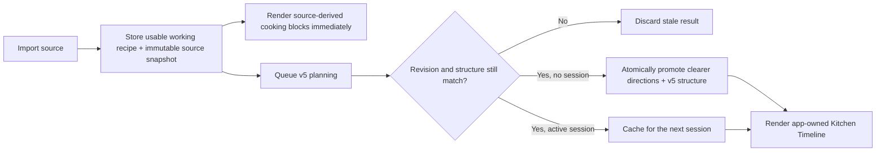
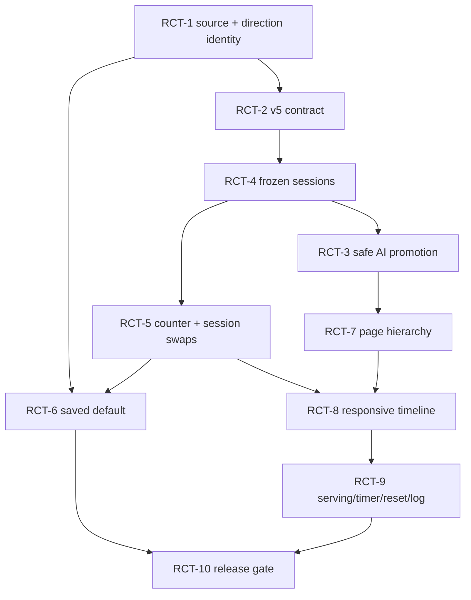

# Recipe Page and Cooking Mode — Kitchen Timeline Plan

_Status: Shipped - 2026-07-23 (Kitchen Timeline cooking, immutable source history, safe AI structure, counter swaps, and responsive app-owned interaction)_

## Outcome

Make the recipe page open as a calm, phone-first cooking surface that is easier to scan than the imported source. Restore counter checks, numbered steps, exact step ingredients, semantic streams, timers, and session swaps without restoring step completion or letting recipe maintenance compete with cooking.

Kitchen Timeline is the selected direction. On wider screens the same information becomes a two-column Mise-en-Place Board and timeline; this is one responsive design, not a second mode.

## Shipped implementation

- Added an immutable source snapshot and stable direction IDs through append-only migration `0021`, including legacy provenance, backup import compatibility, and a database trigger that rejects snapshot replacement.
- Added the validated v5 semantic plan contract: stable step references, constrained ingredient allocations, stream/merge structure, cache-only writes, canonical promotion with revision checks, and v4/v5 fallback.
- Froze recipe context when a cooking session starts, so late AI plans and later recipe edits cannot change an active cook.
- Restored compact counter readiness and session swaps. A saved default resolves through the Dutch canonical substitute before shopping reconciliation; English display data never becomes an AH lookup term.
- Shipped the responsive Kitchen Timeline: numbered whole-card targets, verb-led instructions, exact step quantities, timer controls at the top right, distinct merge colors, current-card centering, serving presets, no step completion, and no finish control.
- Made cooking the same-page default, kept the source snapshot one tap away, and moved recipe maintenance into a quiet secondary section.

Verification completed without provider spend: `npm run check`, 393 unit tests, production build, copied-database migration/hash rehearsal, rollback compatibility rehearsal, and browser stories at phone and wide layouts for current-step centering, counter checks, swaps, servings, source access, and the responsive board.

## Scope

### In

- Same-page cooking as the recipe-page default.
- A read-only, always-usable source snapshot and one editable working recipe.
- AI-authored semantic structure for ordinary recipes and composed meals.
- App-owned counter readiness, numbered timeline, stream and merge rendering, servings, timers, current position, swaps, persistence, fallback, accessibility, and responsive behavior.
- An append-only schema migration, legacy-row treatment, stale-write protection, export/import compatibility, and rollback rehearsal.
- Moving source access and maintenance actions into secondary surfaces.

### Out

- A separate full-screen cooking route.
- Step completion, step checkmarks, strike-through, compacted history, or automatic “done” inference.
- Generated HTML, generated colors, generated interaction behavior, or arbitrary AI layout.
- Permanent mutation from a session swap unless `Use as recipe default` is checked.
- A new LLM provider, UI library, state library, analytics service, or feature-flag service.
- Reverting `e3f997e` wholesale. Useful capabilities will be restored on the current simpler current-position model.

## Resolved product model

1. The cooking state is the same-page default. Source and maintenance are secondary but never hidden behind AI.
2. The imported source is captured as an immutable snapshot. The AI-improved working recipe becomes the household's single editable recipe.
3. Counter readiness contains untouched ingredients only. Chopping, draining, measuring, cubing, and other preparation are numbered cooking steps.
4. Counter ingredients are checkable. A check only records that an ingredient is on the counter; it is not step completion.
5. A session swap updates the counter and every linked step immediately. It changes the working recipe only when explicitly saved as the default.
6. Every step remains readable. Tapping any card changes the current position and centers that card; it never marks another card done.
7. AI selects constrained semantic blocks. The app controls component structure, colors, scaling, interaction, storage, accessibility, fallback, and validation.
8. Stream colors remain stable. When streams merge, the result receives its own distinct color and a text label; the UI never relies on color alone.
9. There is no `Finish cooking` control in the timeline. `Reset cooking` is a secondary action, and optional cook logging remains a separate recipe action.

## Evidence from the current app

The 2026-07-23 browser pass used the same local recipe at 375 px, 768 px, and 1280 px with no console errors.

- On phone, planning, editing, translation status, image, metadata, swaps, enhancement, freezer management, language, and servings all precede the cooking steps. The main task is pushed below maintenance controls. Evidence: `output/playwright/20260723-ui-recipe-current-mobile.png`.
- Counter ingredients are a collapsed reference list, not compact checkable readiness controls. Evidence: `output/playwright/20260723-ui-cooking-ingredients-mobile.png`.
- Stored swaps are an isolated disclosure and cannot be applied as a cooking-session choice. Evidence: `output/playwright/20260723-ux-cooking-swaps-mobile.png`.
- Ordinary-recipe cards lack visible step numbers and semantic stream rails. The current-position behavior is otherwise the right foundation.
- At 1280 px the page remains a narrow centered phone column with large unused sides. Evidence: `output/playwright/20260723-ui-cooking-current-desktop.png`.
- The source view is currently usable and must remain so. Evidence: `output/playwright/20260723-ux-recipe-source-mobile.png`.
- `BenchSheet.svelte` already persists the current position and timers, does not maintain completion, and centers a selected card with `scrollIntoView({ block: 'center' })`.
- `InstructionLines.svelte` already splits sentences and bolds only the leading verb. Ingredient underlining is gone. Preserve this projection.
- `CookStepCard.svelte` already places the timer at the top right. Preserve and test it rather than reimplementing it.
- `palette.ts` contains dormant stream-palette work, while the current card does not consume it.
- Ordinary recipes currently use deterministic one-stream direction cards; only composed meals request AI cook-mode structure.

## UX and UI acceptance rules

These rules are part of the implementation contract, not optional polish:

- **Visual hierarchy:** cooking begins immediately after a compact recipe header and serving control. Maintenance is reachable from a details sheet or overflow.
- **Recognition:** a visible `Step N` label, stream name, ingredient uses, and timer communicate a card's role without explanatory copy.
- **Counter tray:** compact pills use at least a 44 px touch target even when their visual chrome is quiet. Checked and unchecked states have text/icon differences, not color alone.
- **Instructions:** each sentence begins with a bolded leading verb when one can be identified. The rest of the sentence stays normal weight.
- **Step ingredients:** show the scaled amount and unit needed in that step, then the ingredient name, all at normal font weight. They are not underlined.
- **Current position:** the current card gains elevation, outline, and stronger surface contrast. Previous and later cards remain full-size and readable.
- **Focus:** tapping a card updates the URL-independent local session state, moves keyboard focus deliberately, and scrolls the card to the visual center while respecting sticky offsets and reduced motion.
- **Streams:** stream labels accompany colored rails. A merge shows its incoming streams and its newly named result.
- **Responsive composition:** below 768 px, counter tray then timeline; from 768 px, a sticky counter board grouped by stream on the left and the timeline on the right. The content shell grows to approximately `max-w-6xl`.
- **Accessibility:** logical heading order, visible focus, keyboard-operable counter pills and swaps, polite timer announcements, 200% zoom support, no horizontal scrolling at 375/768/1280 px, and no essential motion.
- **Fallback:** pending, invalid, stale, or failed AI output leaves a complete source-derived cooking view on screen.

## Architecture decision

### Chosen: existing recipe row + immutable source snapshot + v5 cooking structure

The existing `recipes` row remains the working recipe. Its Dutch ingredients, directions, translations, revision, and other canonical fields remain the only editable recipe truth.

Add two compatibility fields rather than a second recipe table:

- `source_snapshot_json`: a versioned JSON document containing the imported title, servings, Dutch ingredients, Dutch directions, source URL, capture time, and provenance (`imported_source` or `legacy_baseline`). Application writes are write-once. The migration also installs a SQLite trigger that rejects a non-null snapshot changing to a different value.
- `direction_ids_json`: stable IDs parallel to canonical directions. New rows receive IDs at import; legacy rows receive deterministic IDs during migration. The sole mutation seam maintains cardinality and preserves IDs for copy edits and reorders while creating/removing IDs with directions.

`cook_mode_json` moves to a validated v5 cooking-structure document. It is a projection of the working recipe, not a second copy:

- stable semantic `step_id`;
- `direction_id` reference into the working recipe;
- stream IDs and labels;
- incoming stream IDs and a distinct merge-result stream ID;
- timer duration and purpose;
- ingredient uses that reference stable Dutch ingredient IDs;
- a structure fingerprint and the `content_revision` it was planned from.

Direction IDs are necessary. Direction indices alone would either break after reorder/insert/delete or force every harmless copy edit to regenerate the plan.

### Ingredient-use allocation

Each v5 ingredient use has one app-scalable allocation:

- `all`: use the full source amount in this step;
- `fraction`: a validated numerator/denominator of the source amount;
- `remaining`: use what remains after earlier validated allocations;
- `reference`: amount is genuinely non-numeric or the source gives insufficient evidence.

The AI may choose among these constrained values, but it may not emit free-form display quantities. Validation rejects missing ingredient IDs, zero or negative fractions, fractions whose cumulative total exceeds one, multiple `remaining` uses, and a `remaining` use before explicit allocations. The app computes the displayed amount with existing recipe-scaling utilities. `reference` displays the truthful source amount rather than inventing precision.

### Alternatives rejected

| Alternative | Why it is not selected |
| --- | --- |
| Separate source and working-recipe tables | Duplicates almost every recipe field and expands all edit, shopping, freezer, meal, import/export, and translation joins. |
| Make `cook_mode_json` the editable recipe | Turns a regenerable cache into canonical truth and creates conflicting ingredient/direction copies. |
| Keep direction indices only | Reorder and insertion are unsafe; distinguishing a harmless copy edit from a structural change becomes unreliable. |
| Keep the current app-only one-stream projection | Safe fallback, but cannot express ordinary-recipe streams, merge points, or exact ingredient use. |

## Import, improvement, edit, and session lifecycle

### New imports

1. Parse and validate the source.
2. Insert the immediately usable source-derived working recipe, source snapshot, ingredient IDs, and direction IDs in one transaction.
3. Queue v5 planning for every recipe type, not only composed meals.
4. Generate clearer working directions and semantic structure.
5. Re-read the recipe and promote directions, translated directions, direction IDs, and v5 structure through a canonical-promotion compare-and-swap only when the expected `contentRevision` and structural fingerprint still match.
6. The server cannot know whether a browser has an active cooking session. Therefore canonical promotion is not enabled until the frozen-session reader in RCT-4 is shipped. An already-open session keeps its frozen projection; the new working recipe is eligible only for a new session.
7. On timeout, malformed output, cost cap, or provider error, keep the source-derived recipe without a blocking loader.

### Existing recipes

- Backfill a snapshot from the current canonical fields with provenance `legacy_baseline`; the UI must say that the original imported source was unavailable.
- Backfill direction IDs without changing visible recipe content.
- Generate v5 structure lazily or in bounded background work. Do not make a provider call for every recipe during migration.
- Never silently rewrite an established recipe's directions. A secondary `Improve instructions` action may preview and explicitly promote clearer directions.

### Edit classification

- Preserve v5 structure for servings, quantity, notes, tags, photo, rating, and same-direction copy edits.
- Invalidate and queue v5 planning for direction add/remove, ingredient add/remove, a direction's ingredient-use meaning changing, meal composition changing, or an explicit improvement request.
- Direction reorder preserves direction IDs but invalidates order/merge metadata and queues planning.
- Ingredient name or default-swap changes preserve the stable ingredient ID and update all app projections; they invalidate translation and shopping derivations through the existing canonical mutation seam.
- Split AI writes into two explicit mutation APIs:
  - **canonical promotion CAS** validates the expected revision/fingerprint, writes improved canonical directions plus structure atomically, and increments `contentRevision`;
  - **structure-cache CAS** validates the expected revision/fingerprint, writes only v5 structure metadata, and does not increment `contentRevision`.
- Neither path may perform an unguarded raw `db.update(recipes)` by slug.

### Active cooking session

Persist a versioned session payload keyed by recipe ID and structure fingerprint:

- frozen step projection/generation ID;
- current step ID;
- timer end times and order;
- counter checks keyed by ingredient ID;
- session swaps keyed by ingredient ID with both canonical Dutch choice and localized display choice.

Changing servings reprojects quantities without resetting the current card, checks, swaps, or timers. A structurally incompatible working-recipe update remains outside the active session. `Reset cooking` clears current position, timers, counter checks, swaps, and the frozen projection after a confirmation that names what will be lost.

## Swap behavior and Dutch shopping invariant

Session swaps are app-owned and cost no model call:

1. Open available substitutes from the affected counter ingredient.
2. Select a substitute for this session.
3. Replace the display name in the counter tray and every v5 ingredient use with the same ingredient ID.
4. Leave the stored working recipe, shopping list, and AH search untouched.

When `Use as recipe default` is checked, call a shared canonical ingredient-swap service extracted from `src/lib/server/shopping_recipe_choice.ts`. That existing path already promotes a stored Dutch substitute, retains the old Dutch name as the reverse substitute, invalidates English translation, and writes through `updateCanonicalRecipe`. The cooking endpoint must reuse that behavior instead of implementing a second swap algorithm.

The saved Dutch name remains the source for shopping generation and `src/lib/server/ah/`. English names are display/cache data only. Tests must prove that an English cooking view cannot write an English display name into the Dutch canonical ingredient.

## App-owned and AI-owned boundary

| App owns | AI may author |
| --- | --- |
| Source snapshot access and provenance labels | Clearer working direction wording |
| Responsive layout and component composition | Semantic stream labels and relationships |
| Stable stream and merge-result colors | Direction-to-stream assignment |
| Step numbers and current-card behavior | Ingredient-to-step allocation mode |
| Counter checks and session swaps | Missing but necessary cooking actions |
| Serving projection and displayed quantities | Timer purpose and context |
| Timer runtime and notification behavior | Substitute and missing-ingredient suggestions |
| Persistence, reset, fallback, accessibility | Constrained v5 JSON only |
| Validation, stale-write rejection, promotion | Never HTML, CSS, colors, or runtime state |

## Execution plan

Do the phases in order. Each ticket must end in the named observable behavior and verification; do not batch all schema, AI, and UI changes into one diff.

### Phase 1 — Protect recipe truth

#### RCT-1 — Add immutable source snapshots and stable direction IDs

- **Risk:** R3 — append-only migration and canonical recipe shape.
- **Observable behavior:** a new import has a read-only `imported_source` snapshot; a legacy recipe has a labeled `legacy_baseline`; direction IDs survive copy edits and reorder.
- **Implementation:** add schema columns and the next append-only Drizzle migration; add versioned Zod schemas; capture snapshots in every recipe-creation path; maintain direction IDs inside the canonical mutation seam; reject snapshot replacement at the database boundary.
- **Primary files:** `drizzle/0021_*.sql`, `drizzle/meta/_journal.json`, `src/lib/server/db/schema.ts`, `src/lib/server/ai/recipe_ingest.ts`, `src/lib/server/ai/executors/recipes.ts`, `src/lib/server/meal_recipes.ts`, `src/lib/server/recipe_mutations.ts`, `src/routes/recipes/[slug]/edit/+page.server.ts`.
- **Compatibility files:** `src/lib/server/settings/import.ts`, `src/routes/api/settings/export/+server.ts`, reset/backup fixtures, and recipe normalization.
- **Verification:** fresh database, copied legacy database, repeated migration, immutable-trigger test, URL-import and chat-created snapshot tests, snapshot provenance test, direction-ID add/remove/reorder/copy tests, old export with absent new fields, and new export/import round trip. Add focused coverage in `src/lib/server/ai/recipe_ingest.test.ts`, `src/lib/server/recipe_mutations.test.ts`, and `src/lib/server/settings/import.test.ts`.
- **Rollback:** deploy older code without a down migration; it ignores the new nullable columns. The preserved source snapshot and IDs remain available for a forward fix.
- **Estimate:** M. **Confidence:** high after copy-DB rehearsal.

#### RCT-2 — Define and dual-read the v5 cooking-structure contract

- **Risk:** R2 — shared data contract with existing v4 fallback.
- **Observable behavior:** v4 plans still render; valid v5 plans render the same working directions with stable steps, streams, merges, timers, and exact app-scaled ingredient uses; invalid v5 data falls back safely.
- **Implementation:** add the v5 type/schema, allocation validator, structure fingerprint, v4/v5 parser, projection, and deterministic fallback. Keep v4 readers.
- **Primary files:** `src/lib/types.ts`, `src/lib/components/cook-mode/staleness.ts`, `src/lib/components/cook-mode/cooking_steps.ts`, `src/lib/components/cook-mode/palette.ts`, `src/lib/recipe_scale.ts`.
- **Verification:** contract fixtures for all/fraction/remaining/reference, scaling, invalid totals, missing IDs, multiple remainder, merge-result color collision avoidance, v4 compatibility, and malformed-cache fallback in `src/lib/components/cook-mode/staleness.test.ts` and `src/lib/components/cook-mode/cooking_steps.test.ts`.
- **Rollback:** v5 writes can be disabled while the dual reader and fallback remain; no canonical recipe data is lost.
- **Estimate:** M. **Confidence:** medium.

### Phase 2 — Freeze sessions before AI can promote directions

#### RCT-4 — Freeze active-session adoption

- **Risk:** R2 — local persistence and late background results.
- **Observable behavior:** a plan or canonical working-recipe update that becomes ready while cooking never changes the visible cards; a new session adopts it.
- **Implementation:** version the local session payload; persist the generation/structure fingerprint and frozen projection; define compatibility and reset rules; migrate or discard the old current/timer payload safely. Remove the current incoming-plan adoption path that resets progress. This ticket must ship before RCT-3 enables canonical promotion because the server cannot observe active browser sessions.
- **Primary files:** `src/lib/components/BenchSheet.svelte`, `src/lib/components/cook-mode/cook_progress.ts`, a focused app-owned session-state module, and their tests.
- **Verification:** old-storage migration, pending-to-ready before start, pending-to-ready after start, stale plan, canonical directions changing after start, serving change, reload, two timers, reset, and reduced-motion focus behavior.
- **Rollback:** ignore the new session version and restore the prior current/timer payload parser; server data is unaffected. Keep canonical promotion disabled while rolled back.
- **Estimate:** M. **Confidence:** high.

### Phase 3 — Make AI planning safe and non-blocking

#### RCT-3 — Generate v5 structure for all recipes and promote with compare-and-swap

- **Risk:** R3 — AI output can propose canonical direction changes.
- **Observable behavior:** a newly imported ordinary recipe is usable immediately, then gains an improved working recipe and semantic plan only if no newer edit or active session makes that promotion stale.
- **Implementation:** update the prompt and validator; generate directions plus v5 structure; add separate canonical-promotion and structure-cache compare-and-swap mutations with the revision behavior defined above; remove unguarded raw AI cache writes; schedule ordinary recipes after import; bound retries and background concurrency; record pending/error/stale states without blocking. Do not enable promotion until RCT-4 is present.
- **Primary files:** `src/lib/server/ai/prompts/cook_mode.md`, `src/lib/server/ai/cook_mode.ts`, `src/lib/server/recipe_mutations.ts`, `src/lib/server/ai/recipe_ingest.ts`, `src/routes/recipes/[slug]/edit/+page.server.ts`.
- **Verification:** provider-mocked unit tests for valid output, malformed output, revision race, structure race, cache-only revision preservation, canonical-promotion revision increment, retry cap, legacy no-silent-rewrite, ordinary recipe scheduling, composed meal scheduling, and no regeneration on serving projection. Extend `src/lib/server/recipe_mutations.test.ts` and `src/lib/server/ai/cook_mode_fingerprint.test.ts`.
- **Rollback:** stop v5 scheduling and continue rendering source-derived or cached v4 blocks; already promoted directions remain a valid editable working recipe.
- **Estimate:** L. **Confidence:** medium.

### Phase 4 — Restore app-owned cooking interactions

#### RCT-5 — Add counter checks and live session swaps

- **Risk:** R2 — linked projection across counter and steps.
- **Observable behavior:** untouched ingredients appear as compact checkable counter pills; a session swap updates every linked step and survives reload without changing the working recipe.
- **Implementation:** create an app-owned counter/swap reducer keyed by ingredient ID; move substitute choices into the affected ingredient; project localized session choices into step uses; keep preparation out of counter labels.
- **Primary files:** `src/lib/components/BenchSheet.svelte`, new focused components under `src/lib/components/cook-mode/`, `src/lib/components/recipe-detail/SubstituteSuggestions.svelte`, `src/lib/recipe_ingredient.ts`.
- **Verification:** check/uncheck, no step completion side effect, swap propagation across multiple steps, EN/NL display, no substitutes, optional ingredients, reload, keyboard/touch, and zero model calls.
- **Rollback:** omit the counter session controls and retain the plain ingredient fallback.
- **Estimate:** M. **Confidence:** high.

#### RCT-6 — Save an optional swap as the working default

- **Risk:** R3 — canonical Dutch recipe and downstream shopping data.
- **Observable behavior:** checking `Use as recipe default` promotes the selected Dutch substitute, keeps the former ingredient as a reverse substitute, refreshes the page, and leaves AH/shopping derivation on Dutch fields.
- **Implementation:** extract/reuse the canonical swap behavior in `src/lib/server/shopping_recipe_choice.ts`; expose a recipe-scoped authenticated endpoint/action; validate recipe ID, ingredient ID, current revision, and stored substitute membership; invalidate/requeue English translation and relevant structure without losing the ingredient ID.
- **Primary files:** `src/lib/server/shopping_recipe_choice.ts`, `src/lib/server/recipe_mutations.ts`, a recipe swap endpoint, `src/lib/server/shopping_needs.ts`, and the recipe page loader.
- **Verification:** optimistic-revision conflict, non-member rejection, Dutch canonical write from an English UI, reverse substitute, translation invalidation, AH/search source, shopping refresh, session-only no-op, and rollback on failure. Extend `src/lib/server/shopping_recipe_choice.test.ts` with the English-UI/Dutch-canonical case.
- **Rollback:** remove the endpoint and leave session swaps local; prior canonical writes remain ordinary valid recipe edits.
- **Estimate:** M. **Confidence:** high because the existing shopping-choice path proves the core mutation.

### Phase 5 — Apply the selected Kitchen Timeline

#### RCT-7 — Rebuild recipe-page hierarchy around cooking

- **Risk:** R2 — primary page composition and navigation.
- **Observable behavior:** the recipe page opens on the cooking surface. Source, edit, plan, enhancement, freezer, photo, roles, notes, and metadata remain reachable from a compact header/details sheet without preceding the first cooking controls.
- **Implementation:** reorder the page composition; replace peer source/cooking tabs with a secondary `Source` action and accessible sheet/drawer; group maintenance into recipe details/actions; widen the responsive shell; preserve direct edit and planning routes.
- **Primary files:** `src/routes/recipes/[slug]/+page.svelte`, `src/lib/components/recipe-detail/RecipeHeader.svelte`, `RecipeViewToolbar.svelte`, `OriginalRecipeView.svelte`, and the existing maintenance components.
- **Verification:** phone task order, keyboard/source access, pending/error source fallback, browser back/forward, translated source, no hydration shift, and 375/768/1280 layouts.
- **Rollback:** restore the current composition while leaving data/session changes intact.
- **Estimate:** M. **Confidence:** high.

#### RCT-8 — Render the responsive counter board and numbered timeline

- **Risk:** R2 — responsive layout, visual semantics, and accessibility.
- **Observable behavior:** phone shows a quiet compact counter tray above a numbered timeline; wider screens show a sticky stream-grouped counter board beside the same timeline. Every step has a visible number and stream rail; merges produce a distinct result color and label; the current card is raised.
- **Implementation:** consume v5 streams and palette projection in owned components; add deterministic merge-result color generation with contrast/collision checks; make the whole step card current-selectable; center it with sticky-offset compensation; keep all cards full-sized.
- **Primary files:** `src/lib/components/BenchSheet.svelte`, `src/lib/components/cook-mode/CookStepCard.svelte`, `InstructionLines.svelte`, `palette.ts`, and new counter/stream components.
- **Verification:** the Summer berry layer cake fixture with three streams, eight steps, two merges, one long step, and one timer; single-stream and no-AI fallbacks; focus order; screen-reader labels; reduced motion; 200% zoom; no overflow.
- **Rollback:** render the v5 projection in the existing single-column card list.
- **Estimate:** L. **Confidence:** medium.

#### RCT-9 — Finish serving, timer, focus, reset, and logging behavior

- **Risk:** R2 — kitchen-session ergonomics.
- **Observable behavior:** servings have `−`/`+` controls in steps of one plus `1×`, `1½×`, and `2×` presets; ingredient uses scale immediately; timer stays at the card's top right; selecting any card centers it; there is no finish button; Reset and Log cooked are separate secondary actions.
- **Implementation:** extend existing serving projection rather than regenerating AI; preserve timer/wake-lock behavior; remove the timeline bottom completion bar; place Reset in overflow with confirmation; retain `Already cooked`/`Log cooked` through recipe actions.
- **Primary files:** `src/lib/components/BenchSheet.svelte`, `src/lib/components/cook-mode/CookStepCard.svelte`, `src/lib/components/FixedBottomBar.svelte` call sites, `src/routes/api/recipes/[slug]/cook/+server.ts`, and messages.
- **Verification:** 1–99 serving bounds, fixed-batch behavior, each preset, fractional units, timer position at narrow widths, scroll centering, no completion copy/state, reset scope, logging, rating, and freezer follow-up reachability.
- **Rollback:** restore the prior serving buttons and logging entry point without changing stored recipe data.
- **Estimate:** S–M. **Confidence:** high.

### Phase 6 — Prove migration, fallback, and the whole page

#### RCT-10 — Run the release gate

- **Risk:** R3 — evidence gate for the combined migration and AI write path.
- **Observable behavior:** the migrated app preserves every recipe, imports/exports the new fields, rejects stale AI writes, remains usable without AI, and matches the selected design across target widths.
- **Implementation:** rehearse migration on a copy of the local legacy database; compare recipe counts, IDs, canonical ingredient/direction hashes, snapshot provenance counts, and foreign-key checks; run all automated and browser checks; record evidence without provider spend.
- **Primary files:** tests beside each changed module, `src/lib/server/settings/import.test.ts`, migration tests/fixtures, and `output/` evidence.
- **Verification commands:** `npm run check`, `npm run test:unit`, `npm run build`, then the repository `verify` workflow at 375/768/1280 px in Dutch and English.
- **Required browser stories:** new import pending/ready/error; legacy baseline; source access; ordinary and composed recipes; counter checks; session swap; saved default; two merges; timer/reload; servings; active-session late plan; structural edit; stale response; reset; cook log.
- **Release condition:** no schema/data diff beyond the declared columns/trigger/backfill; no AH English-field regression; no additional model call for checks, swaps, servings, timers, current selection, or layout.
- **Rollback:** retain the append-only columns, disable v5 scheduling and UI consumption, and render the prior source/v4 fallback. Restore the database copy only if rehearsal—not deployment—finds corruption.
- **Estimate:** M. **Confidence:** high once the prior tickets pass.

## Dependency order

## Verification matrix

| Boundary | Required proof |
| --- | --- |
| Schema | Fresh migrate, legacy-copy migrate, repeat migrate, trigger immutability, foreign-key check, no canonical hash drift |
| Import/export | New fields round-trip; old exports still import with safe defaults; legacy provenance stays explicit |
| AI | Zod rejection, retry cap, revision race, structure race, active-session freeze, no legacy silent rewrite |
| Quantities | All/fraction/remaining/reference, servings, fixed batch, mixed units, no over-allocation |
| Swaps | Session propagation, reload, optional save, conflict, reverse substitute, translation invalidation |
| AH/shopping | Dutch canonical names only; English display never becomes an AH query; session choice does not alter shopping |
| UI | 375/768/1280 px, Dutch/English, 200% zoom, keyboard, touch, visible focus, reduced motion, no horizontal overflow |
| Fallback | Pending/error/invalid/stale AI always leaves complete numbered source-derived cards |
| Timers/session | Reload, multiple timers, wake lock, serving change, late plan, reset |
| Repository | `npm run check`, `npm run test:unit`, `npm run build` |

## Failure-mode critique

| Failure mode | User-visible harm | Prevention in this plan |
| --- | --- | --- |
| Late AI overwrites an edit | Carefully edited directions disappear | Atomic expected-revision and expected-structure compare-and-swap |
| Active cards change mid-cook | The cook loses their place | Frozen session generation; adoption only on a new session |
| Cache write increments canonical revision | Harmless planning invalidates edits or loops generation | Separate cache-only CAS and canonical-promotion CAS APIs |
| Legacy snapshot is presented as original | False provenance | Explicit `legacy_baseline` label and copy |
| Direction index shifts | Ingredient/timer metadata attaches to the wrong step | Stable persisted direction IDs |
| AI invents step quantities | Incorrect cooking amounts | Constrained allocations, mathematical validation, truthful reference fallback |
| Merge inherits one input color | Two streams appear not to have combined | Separate result stream ID, distinct generated color, and text relationship |
| English swap is saved to Dutch source | AH searches the wrong term | Reuse Dutch canonical swap service and test from English UI |
| Migration triggers a provider burst | Unexpected cost and rate-limit errors | Lazy/bounded legacy generation; no AI in the migration itself |
| Removing Finish loses cook logging | History becomes inaccessible | Keep Log cooked/Already cooked as a separate recipe action |
| New desktop board forks behavior | Phone and desktop drift | One projection and interaction model, responsive composition only |

## Rollout and rollback

1. Ship the append-only fields, trigger, backfill, and dual reader first.
2. Rehearse the migration on a copied database and compare canonical content hashes before enabling v5 writes.
3. Ship the frozen-session reader and remove the current automatic incoming-plan reset behavior.
4. Enable v5 generation and canonical promotion for new imports and explicit improvement; keep legacy generation lazy and bounded.
5. Ship the responsive UI after v4/v5 fallback is proven.
6. Keep v4 parsing and deterministic source projection for at least the entire first release.
7. If production behavior regresses, stop v5 scheduling and return to the prior projection. Do not run a destructive down migration. The working recipe and source snapshots remain readable.

This is an **R3 change** because it adds an immutable data boundary and permits validated AI output to promote canonical directions. `/run` must not apply the migration until the copy-database rehearsal and backup/export compatibility tests pass.

## Delivered defaults

These defaults were accepted through `/run`:

1. **Serving presets:** `1×`, `1½×`, and `2×`, plus `−`/`+` by one serving. Fixed-batch recipes show the controls disabled with a short reason.
2. **Cook logging:** keep `Log cooked`/`Already cooked` in secondary recipe actions; do not infer cooking completion from the current card.
3. **Legacy planning:** generate structure lazily, but require an explicit preview/accept step before replacing established directions.

## Design decision record

### Selected direction

Kitchen Timeline best balances scanability, semantic streams, counter readiness, and phone ergonomics. Mise-en-Place Board is adopted as the responsive composition for wider screens. Cook's Notebook is not selected.

### User notes reproduced verbatim

> For the ingredients in 'on the counter' they can be a little more compact.
>
> For the ingredients in the recipe steps itself these need to have the exact amounts required for that step included and can be in non-bold font. Get rid of the 'No done state' text.
>
> The number of servings/portions should be a +/- counter with steps of 1, 2 and x1.5 etc.
>
> The colored rails olook good, but when two streams combine it should create a new color (not adopt only 1 of the colors).
>
> I also don't nthink we need a finish cooking button (maybe a reset cooking button?)
>
> ALso put the timer pill on the top rigth of the step instead of on the bottom.
>
> When clicking current step it should move the screen to center that step.
>
> adopt the mise en place board for wider screens.

## Archived visual artifacts

- [Selected-direction design shotgun](../../artifacts/archive/2026-07-23-design-shotgun-recipe-cooking.html)
- [Execution-plan presentation](../../artifacts/archive/2026-07-23-plan-recipe-kitchen-timeline.html)
